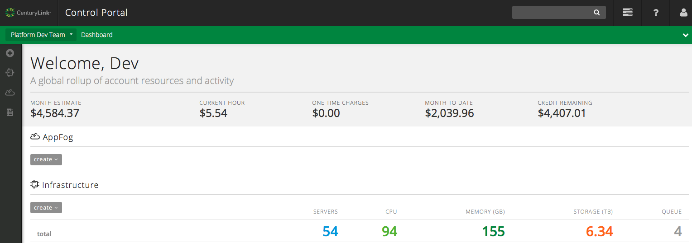
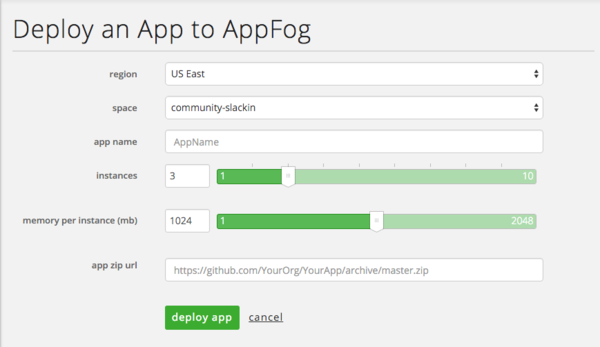
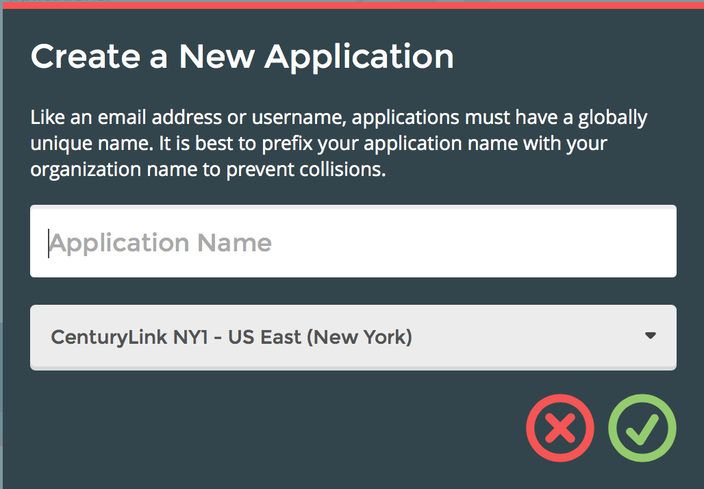
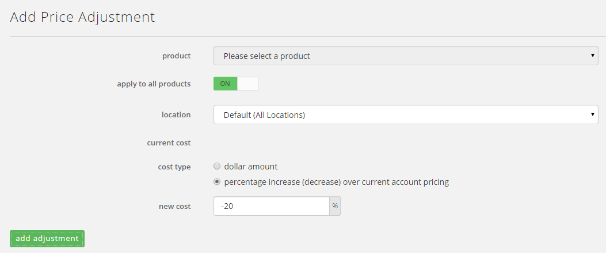
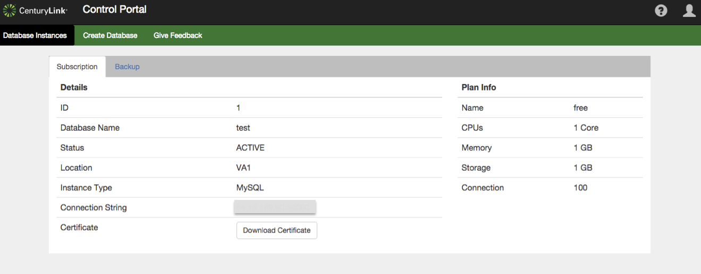
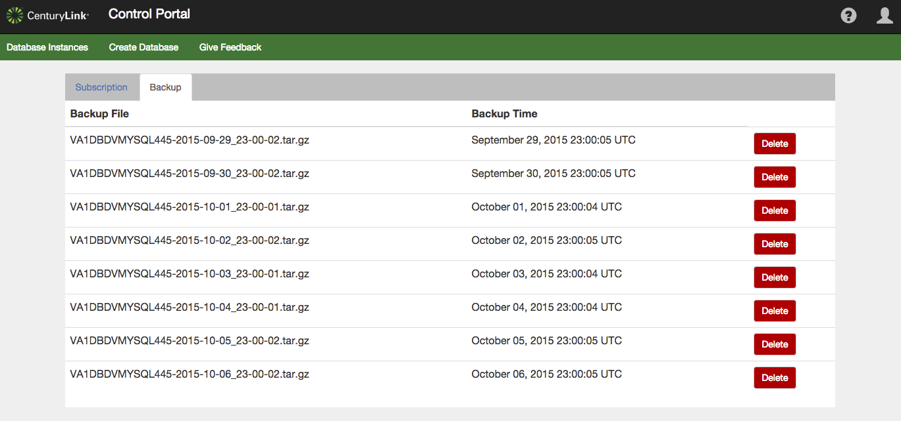
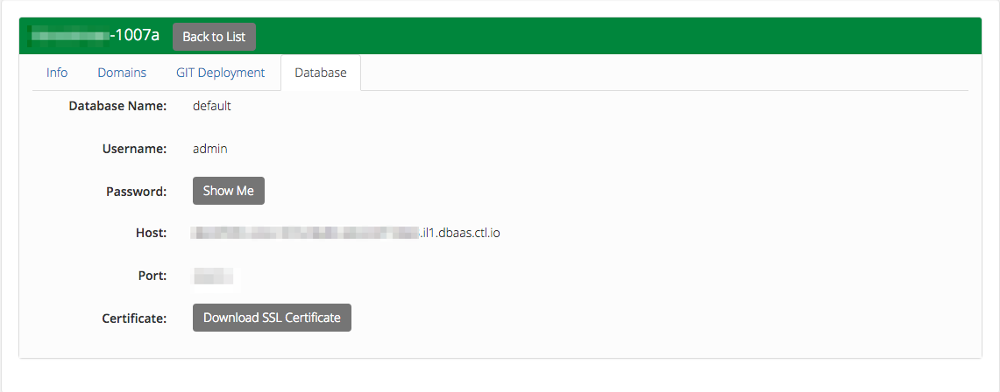
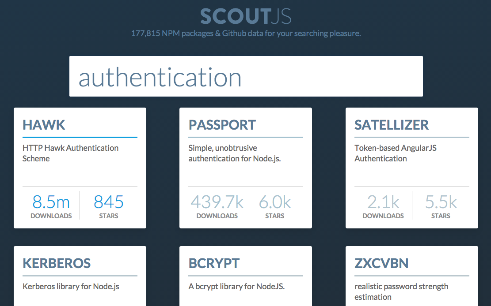

{{{
"title": "Cloud Platform - Release Notes: October 13, 2015",
"date": "10-13-2015",
"author": "Anthony Hakim",
"attachments": [],
"contentIsHTML": false
}}}

### New Features (8)

* __Promotional usage integrated with dashboards & usage estimates:__ Users that have signed up for Lumen Cloud services using a promotional code via [www.ctl.io](https://www.ctl.io) will now see that promotional usage captured on the Dashboard and in account usage estimate screens.

    

* __Default data center based off of user's account location (online channel only).__  A customer activating online at [www.ctl.io](https://www.ctl.io) will now be assigned a default data center based on their account geography.  They will retain the ability to override that default in the activation process.

* __Deploy apps directly from the Control Portal.__ Users can deploy apps to AppFog from the Control Portal. Provide a ZIP archive of your app, select how many instances, how much RAM you require, and click deploy app.

    

* __Multi-NIC for Bare Metal machines.__ Add up to four virtual network interfaces to a single bare metal machine, via API. Use this feature to programmatically add or remove vNICs in separate VLANs - especially useful for virtual appliances and advanced topologies. Multi-NIC configuration details will appear in the Control Portal and in API calls. For more information, refer to the API documentation for adding secondary network adapters and removing secondary network adapters.

* __Orchestrate:__

  * __NY1 data center now available.__ [Orchestrate](https://www.orchestrate.io/) is now available in Lumen Cloud's NY1 Data Center.

    

  * __Add properties to graph relations.__ Graph relations can now have properties. When creating or updating a graph relation, simply include a JSON object describing the relation. For more information, [visit our product page](https://orchestrate.io/docs/apiref#graph-put-with-value).

  * __Search and aggregate graph relations and their properties.__ Graph relation properties are now indexed for search. They can be searched for by including "@path.kind:relationship" in queries. These relations are also available for all types of aggregations.

* __SDKs: Go & Node.js.__ SDK for Node.js and CLI for Go. Use these open-source tools to work with Lumen Cloud APIs more effectively. Get the [Node SDK here](https://github.com/CenturyLinkCloud/clc-node-sdk); the [CLI for Go is available here](https://github.com/CenturyLinkCloud/clc-go-cli).

### Enhancements (3)

* __Bare Metal servers now support Windows 2012 R2 Datacenter Edition.__ When creating Bare Metal servers, you can now select Windows Server 2012 R2 Datacenter as an operating system option, in addition to the choices that are already supported (CentOS 6, Red Hat Enterprise Linux 6, Windows Server 2012 R2 Standard, and Ubuntu 14).

* __Set your own price with flat percentage adjustments.__ Now you can adjust all products on our price list by a flat percentage with the click of a button.

    

* __OS template updates:__ The following templates were updated with the latest vendor recommended patches. These enhancements add functions and make servers less susceptible to security vulnerabilities. The updates are live for the following operating systems:

  * CentOS 5 64-bit
  * CentOS 6 64-bit
  * Debian 7 64-bit
  * Ubuntu 12 64-bit
  * Ubuntu 14 64-bit
  * Windows 2008 R2 Datacenter 64-bit
  * Windows 2008 R2 Enterprise 64-bit
  * Windows 2008 R2 Standard 64-bit
  * Windows 2012 R2 Datacenter 64-bit

### Early Adopter Program Updates (5)

* __Ability to send IPS event data to a syslog server.__ The Intrusion Prevention Beta program is still in progress. Participants now have the ability to send their IPS event data to a syslog server.

  Updated documentation for setting notification destinations can be found at https://www.ctl.io/knowledge-base/security/configuring-ips-notifications/

  For more information on the IPS product or our Beta, visit our [product page on the Lumen Cloud website](https://www.ctl.io/intrusion-prevention-service/).

* __MySQL DBaaS:__

  * __Ability to view additional plan details.__ Customers can now click on a subscription from their list on the "Database Instances" screen and view additional details.

    

  * __List backups in the UI.__ Beta customers can now view a list of their backups in the UI by clicking on a subscription from their list on the "Database Instances" screen. Backups will include a date and timestamp. To restore from a backup, customers should open a ticket with [dbaas-support@ctl.io](mailto:dbaas-support@ctl.io).

    

  * __Ability to download certificate from Internet Explorer, Firefox And Safari (bug fix).__ Certificate downloads were previously only working through Chrome. A bug fix has been implemented to allow the certificate download from Internet Explorer, Firefox and Safari.

* __Every WordPress microsite now includes our new DBaaS for MySQL database support.__ We've incorporated our new MySQL database-as-a-service product into every WordPress microsite. Now you can access your WordPress database using commercial SQL clients, and rest assured that the connection is secured by SSL encryption. As a result, we've also eliminated PHPMyAdmin from our solution in favor of more robust, secure database connectivity options. For more information on how to get connected, check out our new [KB article](https://www.ctl.io/knowledge-base/wordpress/wordpress-database-access-with-external-tools/).

  

### Ecosystem (3)

* __Zoomdata:__ Zoomdata enables business users to visually consume and interact with all their data in the modern enterprise. While specifically built for modern data sources -- including Cloudera -- Zoomdata also works with relational databases and popular cloud applications. Using patented Data Sharpening and Micro-query technologies, Zoomdata empowers business users to visually consume data in seconds, even across billions of rows of data. Zoomdata brings visual analytics to all business users -- not just data analysts -- via an intuitive user interface that can be [provisioned via blueprint on the Lumen platform today.](https://www.ctl.io/knowledge-base/ecosystem-partners/marketplace-guides/getting-started-with-zoomdata-blueprint/)

* __Heirloom Computing:__ Heirloom Computing helps business applications migrate their legacy mainframe applications into an enterprise-friendly Java model while preserving business logic, thereby reducing cost and providing integration with modern systems. Through patented advanced language transformation and open architecture, Heirloom software complies and translates COBOL to Java in one-step, eliminating complexity and risk without vendor lock-in. Java programmers on our platform are empowered to [get started with Heirloom via single-click blueprint](https://www.ctl.io/knowledge-base/ecosystem-partners/marketplace-guides/getting-started-with-elastic-cobol/), reducing their costly dependency on mainframe skill-sets.

* __Microsoft TFS:__ Team Foundation Server 2013 enables team rooms, comprehensive reporting, and dashboards that provide historical trending, full traceability, and real-time visibility into software quality. By automating the software delivery process, entire teams can collaborate across roles and track team actions and project artifacts such as requirements, tasks, bugs, source code, build results, and test results. [Get started with the TFS blueprint today](https://www.ctl.io/knowledge-base/ecosystem-partners/marketplace-guides/getting-started-with-microsoft-tfs/).

### Open Source Contributions (1)

* __ScoutJS tool for searching/sorting NPM modules.__  Node developers have a new method to find the best modules using [Scout JS](http://scoutjs.com/), which combines GitHub and NPM data with an intelligent sorting algorithm. The [tool is open source](https://www.ctl.io/developers/blog/post/scoutjs-search-npm) and serves as an example Orchestrate and AppFog application.

  
