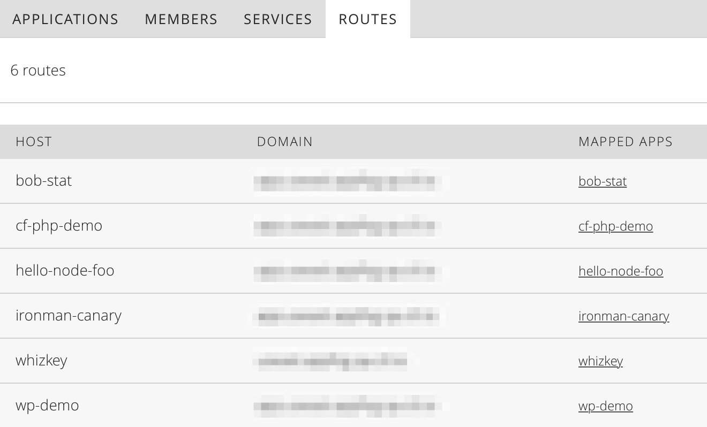
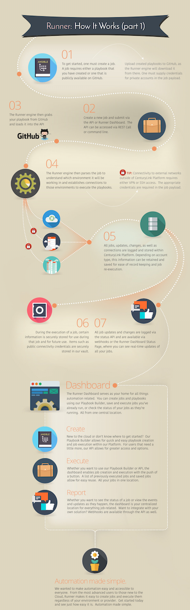

{{{
"title": "Cloud Platform - Release Notes: November 3, 2015",
"date": "11-03-2015",
"author": "Chris Sterling",
"attachments": [],
"contentIsHTML": false
}}}

### New Features (3)

* __Intrusion Prevention has been released for General Availability.__ The [Intrusion Prevention or IPS Product](https://www.ctl.io/intrusion-prevention-service/) is now available in all Lumen Cloud Data Centers.  

  The product installs a Trend Micro Agent on a host machine to protect that host against known and unknown vulnerabilities to operating systems and over 100 applications. The IPS agent automatically scans the host for newly installed applications every 24 hours, and if any are found, the protection policy is updated accordingly. The agent is also automatically updated with new Trend Micro patches to protect against new vulnerabilities. Details on installing IPS and configuring your event notification destinations are available in the Security section of our [Knowledge Base](https://www.ctl.io/knowledge-base/security/#1).

  Other Service Highlights:
  * Installation via Blueprints
  * Supports event notifications via WebHook and Email
  * Event data captured and forwarded to a syslog server
  * 13-week data retention of all event data, to help audits and compliance

* __AppFog Control Portal UI Enhancements.__ [AppFog](https://www.ctl.io/appfog/) Developers can now perform common actions in the Control Portal UI:

  * __Scale apps from Control__. AppFog apps can be scaled up or down from the Control Portal. Select the amount of memory, number of instances, and see a cost estimate for the change.

    

  * __Delete apps from Control.__ Easily delete defunct AppFog applications from the Control Portal.

    

  * __List all of an application's routes.__ All the routes for a given an AppFog space can now be displayed in the Control Portal.

    

  Previously, these features were only available via the CLI or API.

* __Orchestrate Enhancements.__ [Orchestrate](https://www.orchestrate.io/) made the following improvements:

  * __Cross collection search.__. Orchestrate's search can now query across collections in the same application. Simply provide a search query at the root endpoint, for example: `api.orchestrate.io/v0?query=*`.

  * __"api.orchestrate.io" now directs requests to the correct data center, automatically.__ Clients no longer need to be configured to connect to the appropriate node. The "api.orchestrate.io" is now intelligent and will route your request to your Orchestrate app.

### Early Adopter Program Updates (2)

* __Runner Beta Launched.__ The Runner service is now available in beta to select customers.

  

  Runner enables teams, developers, and engineers to quickly provision, manage, and modify their environment in not only the Lumen Cloud Platform, but other cloud services, as well as on-premise deployments. Runner brings together state-based and massive parallel job execution, with multi-cloud and multi-data center support, all in a single interface.

    

  Our goal was to make automation easy and accessible to everyone. From the most advanced users to those new to cloud computing, Runner makes it easy to create jobs and execute them regardless of your environment or provider.

    

  * __Runner Job Service.__ The Job Service is the primary component of the Runner product. Users can create, modify, and execute jobs at anytime. The Job Service accepts a payload that references a playbook, Ansible’s configuration, deployment, and orchestration language file to be used, whether that is using a public GitHub repository or private (GitHub credentials required), as well as other information like login or bearer token, environments, and so on.

  * __Runner SSH Service.__ The SSH Service supports Key Pair management within Lumen Cloud. Users can create, retrieve, deploy, and import Key Pairs, as well a remove or "undeploy." The SSH Service can be used as a standalone feature as well.

  * __Runner VPN Service.__ The VPN Service creates connection definitions to be used in parallel with jobs.  The VPN Service allows for the Job Service to access remote hosts and establish connections during job execution.

  * __Runner Status Service.__ The Status Service retrieves the status of jobs they have executed.  This status will return the information of the latest update.  For completed jobs, this will return the entire history. The statuses are accessible via webhooks for real-time status reporting and updating.

  * __Runner Scheduling Service.__ The Schedule Service schedules jobs, as well as runs any endpoint, using `cron` expressions. The service accepts URLS and endpoints, so the service is not tightly coupled with job service (but does integrate seamlessly). The Service also allows for schedule modification, which includes discontinuing (deleting).

* __MySQL Beta Configurable Database Subscriptions.__ Database as a Service customers provisioning service through the UI can now select the specific amount of CPU, RAM and Storage to fit their needs. Previously, users were limited to pre-defined plans.  

  *Note: AppFog users will continue to select pre-defined plans through the AppFog Add-On Engine marketplace.*

### Enhancements (3)

* __Object Storage - Performance Enhancements & New Pricing.__ The object storage service in Canada now offers improved performance and reliability, while continuing to provide the familiar S3 interface. Existing customers will automatically receive these new capabilities. More details are available on the [Object Storage product page](https://www.ctl.io/object-storage/), including new pricing, and the [Knowledge Base](https://www.ctl.io/knowledge-base/object-storage).

* __Added Year to Activity History.__ The Control Portal now shows the year for each event in the Activity History.

* __Additional Server Group APIs.__ The following Server Group APIs have been added to our public API documentation:

  * __Server Group Horizontal Autoscale Policy__. Retrieve and set the details of a horizontal autoscale policy associated with a group.
    - https://www.ctl.io/api-docs/v2/#groups-get-group-horizontal-autoscale-policy
    - https://www.ctl.io/api-docs/v2/#groups-set-group-horizontal-autoscale-policy

  * __Server Group Scheduled Activities.__ Gets the scheduled activities associated with a group.
    - https://www.ctl.io/api-docs/v2/#groups-get-group-scheduled-activities

  * __Server Group Defaults.__ Sets the default settings to be used when building servers in a group.
    - https://www.ctl.io/api-docs/v2/#groups-set-group-defaults

### Open Source Contributions (3)

* __CLC-Ansible Cloud Module clc_server_snapshot.__ Ansible module for managing server snapshots in Lumen Cloud - (http://docs.ansible.com/ansible/clc_server_snapshot_module.html)

* __CLC-Ansible Cloud Module: clc_alert_policy.__ Ansible module to manage alert policies in Lumen Cloud - (http://docs.ansible.com/ansible/clc_alert_policy_module.html)

* __CLC-Ansible Cloud Module: clc_aa_policy.__ Ansible module to manage anti affinity policies in Lumen Cloud -  (http://docs.ansible.com/ansible/clc_aa_policy_module.html)

### Announcements (1)

* __Retirement of IPMonitor Service.__ IPMonitor is a legacy tool used to monitor legacy Tier 3 managed servers. This service will be shut down on December 1, 2015 and servers will no longer be monitored with this service.

  Customers should consider using the built-in CPU/memory/storage monitoring available in the Control Portal (https://www.ctl.io/knowledge-base/network/monitors-that-are-supported/).

  Additional options include managed servers (https://www.ctl.io/knowledge-base/managed-services/managed-operating-system-frequently-asked-questions/) or any number of our powerful ecosystem options (https://www.ctl.io/knowledge-base/ecosystem-partners/general/ecosystem-partner-list/#management-and-monitoring).

### Selected Bug Fixes (1)

* __CLC-Ansible Cloud Module Fixes and Enhancements.__ Bug fixes and minor enhancements:
  - Added RETURN doc string for all modules
  - Fixed few typos
  - Fixed a bug with clc_group module to return the right group dict
  - Added the capability to create/update/delete bare metal servers with clc_server module
