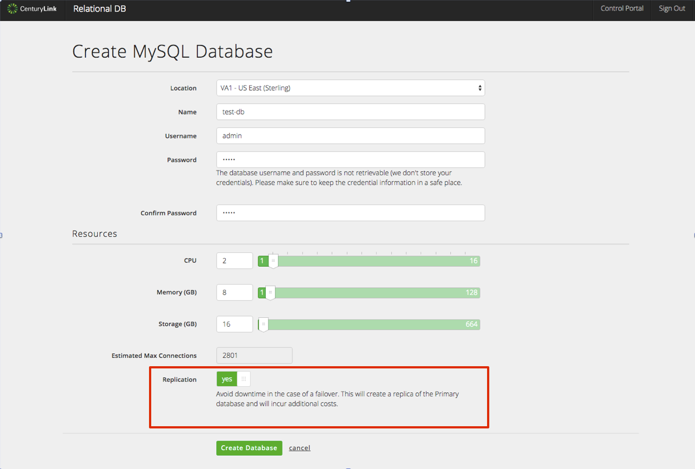
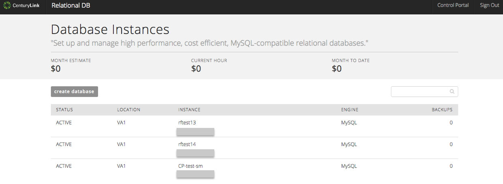
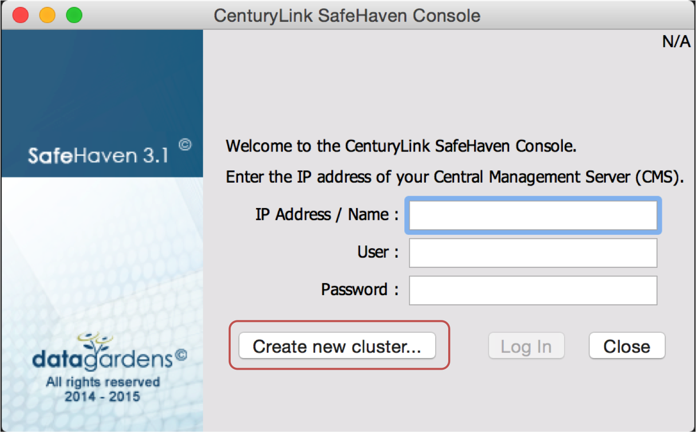

{{{
"title": "Cloud Platform - Release Notes: November 24, 2015",
"date": "11-24-2015",
"author": "Mary Cadera",
"attachments": [],
"contentIsHTML": false
}}}

### New Features (1)

* __CentOS 7 - New Supported OS Template.__ Customers may now create VMs based on the CentOS 7 operating system from the Control Portal and the API. This latest OS offers the same features as RHEL 7, but at no charge. In addition, this OS template will be managed and maintained by our OS team ongoing, so new features and capabilities will be included as they are vetted by our team.  

### Early Adopter Program Updates (1)

* __MySQL DBaaS.__ The MySQL-compatible Database-as-a-Service is currently [in beta and is available to select customers](https://www.ctl.io/dbaas/).   

  * __In-datacenter replication.__ Coming November 30th, customers can enjoy a more highly available solution by choosing to replicate their database instance within datacenter with logic that ensures the primary and replica instances do not share the same host or storage infrastructure.
  

  * __New UI.__ Starting November 30th, customers will notice a change in the look, feel, and functionality of the MySQL DBaaS user interface. The UI will be more consistent with the CenturyLink Cloud Control Portal.
  

### Enhancements (3)

* __Intrusion Prevention/IPS.__ Installation of the [Intrusion Prevention Service (IPS)](https://www.ctl.io/intrusion-prevention-service/) can be done via Blueprint. Details on the installation process and other [information on Intrusion Prevention](https://www.ctl.io/knowledge-base/security/#1) can be found in the Security section of our Knowledge Base.

  * __Now Available in UC1.__ IPS is now available in all CenturyLink Cloud Data Centers, including UC1.

  * __Intrusion Prevention API Documentation Released.__ [Details for utilizing the API for the IPS](https://www.ctl.io/knowledge-base/security/ips-api/) are now publicly available.

* __SafeHaven__. Two enhancements are now available:

  * __Cluster Installer Integration with SafeHaven Console.__ The integration makes it is easier for users to create a SafeHaven cluster by streamlining the user experience.
  

  * __Disk Mapping Structure Updates.__ This change brings performance improvements to guest VMs.

* __Bare Metal Support for Execute Package.__ Packages can now be executed on Bare Metal servers using the [Execute Package](https://www.ctl.io/knowledge-base/servers/using-group-tasks-to-install-software-and-run-scripts-on-groups/) action available at the server group level.

### Announcements & Reminders (2)

* __New Policy: Automatic Removal of "Under Construction" Resources.__ Occasionally, requests for new resources in CenturyLink Cloud will not complete successfully, and appear as "Under Construction" indefinitely. Effective January 1, 2016, requests that remain "Under Construction" state for 14 days will be automatically deleted from the platform. The removal of resources will be done automatically every two weeks, so the first such removal will be January 15, 2016.

  Customers do not get billed for resources in an "Under Construction" state, so this new policy does not have a commercial impact to billing and usage.

* __Reminder: No Automated Backup for Custom VMs Larger than 4 TB.__ The Standard and Premium backup features do not function on VMs with more than 4 TB of block storage. Customers are responsible for their own backups on these servers.
