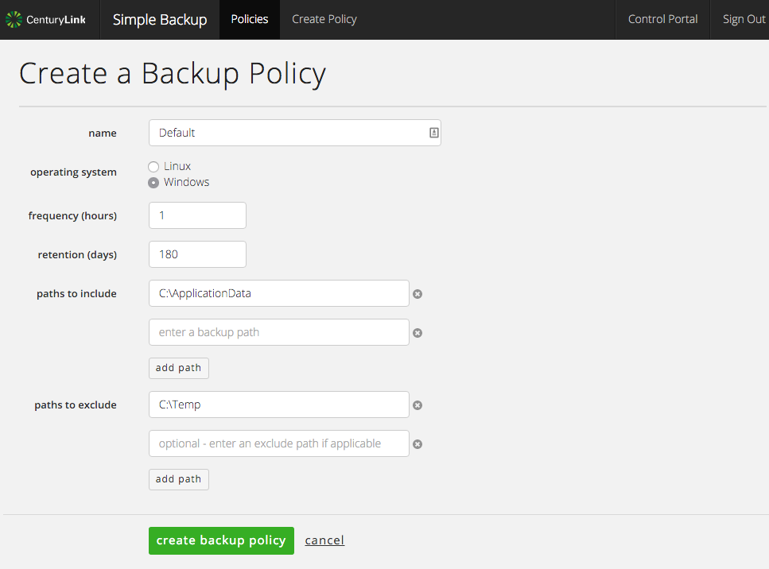
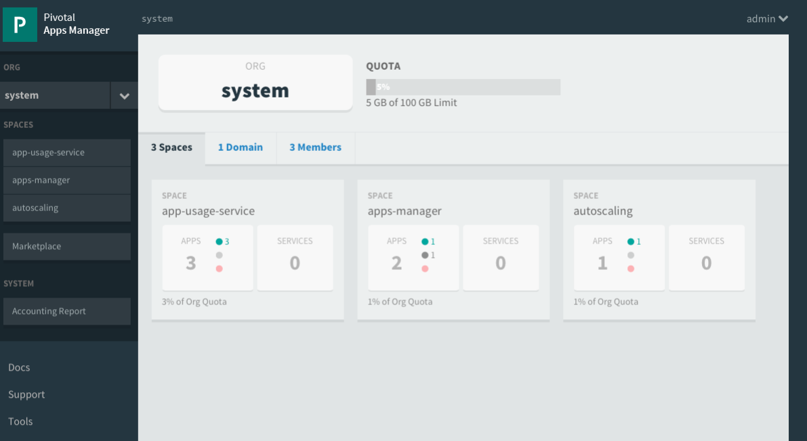
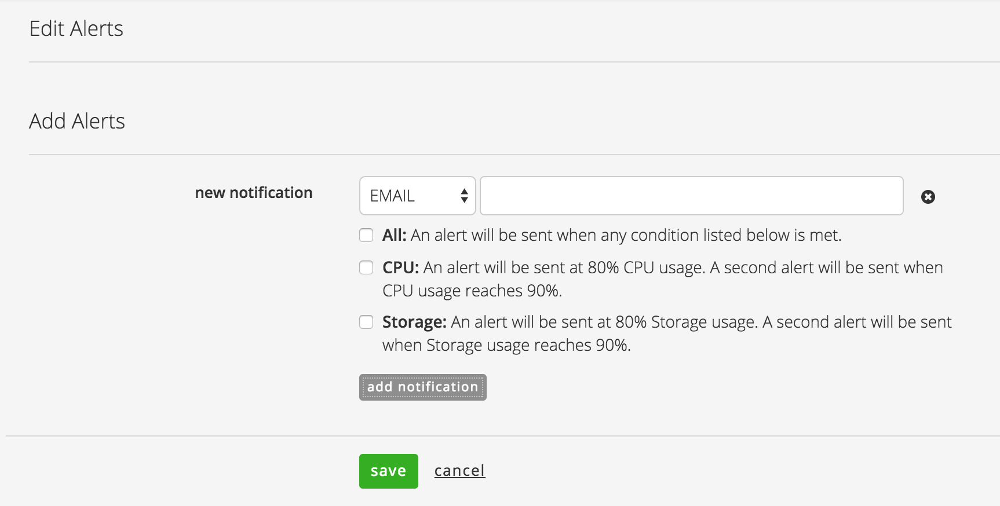

{{{
"title": "Cloud Platform - Release Notes: December 15, 2015",
"date": "12-15-2015",
"author": "Jared Ruckle",
"attachments": [],
"contentIsHTML": false
}}}

### New Features (1)

* __Orchestrate.io - Randomized Sorting.__ Now, equally scored results can show up in different orders. By adding `sort=_random` to the URL query string, the search results will now have an equal chance at being displayed first. Users can choose to randomize sort within an existing search query, i.e. randomize the results of searching for "last name Twain, first name Mark" `sort=value.last_name,value.first_name,_random`. Also, users have the option to randomize results with a predictable seed (by setting `sort=_random:somevalue`), and any subsequent calls to the same seed will result in the same random ordering.

### Early Adopter Program Updates (4)

* __NEW - Simple Backup Service Beta Launch.__ This new self-service product offers protection for your data with file-level backups hosted in secure object storage. Control every aspect of your backups - including retention period, frequency of backup, and location - with policies you create and manage. The service is now in beta and is available to select customers. To request an invitation to the beta program, [visit the product page](https://www.ctl.io/simple-backup-service/) or send an email to [help@ctl.io](mailto:help@ctl.io). Note that this service will replace the Standard and Premium storage services in Q1 2016.

* __NEW - Managed Pivotal Cloud Foundry Beta Launch.__ Many enterprises are building cloud native applications with Cloud Foundry. With this [new managed service](https://www.ctl.io/managed-services/pivotal-cloud-foundry/), the experts at CenturyLink will administer and maintain important elements of Cloud Foundry clusters running on CenturyLink Cloud. To request an invitation to the beta program, send an email to [help@ctl.io](mailto:help@ctl.io).

* __MySQL DBaaS Notification Subscription.__ Beta users can now select to receive email notifications when CPU or Storage exceed defined thresholds. This can be done at the time of provisioning; notifications can also be added or changed from within the details page your subscription.

* __Runner Beta.__ Several new capabilities are available for the agent-less automation service:

  * **Job Execution Expiration time** - Added ability for users to set an expiration time for a job. This helps users to stop any unexpected long-running executions and look at the detailed status logs to know which task was running, and for how long. Refer our latest documentation for Job Service available to beta users [Create Job - Password Protected](http://info.runner.ctl.io/job-service/#createJob) and [Update Job - Password Protected](http://info.runner.ctl.io/job-service/#updateJob) for details. The execution will move to a new state `EXPIRED` after it reaches the specified time.
  * **New default status of job execution** - When a job is executed, the default state will be `INITIALIZING` (previously, the default state was `PENDING`), since the various tasks in your playbook are being processed before they are actually executed. Further, you can stop and kill job executions that are in `PENDING` state.

### Enhancements (1)

* __Private routing of traffic between servers using public IPs provided by CenturyLink Cloud.__ Traffic between servers using public IPs provided by CenturyLink Cloud are now routed over our private MPLS network between CenturyLink Cloud Data Centers. This approach offers increased performance and reliability compared to using the public Internet.

### Announcements (1)

* __Intrusion Prevention/IPS Price Drop.__ CenturyLink is constantly reviewing the market to remain competitive with our features and pricing. Based on current research, we have lowered the price for our Intrusion Prevention/IPS product from $0.25 per VM/hr to $0.18 per vm/hr. We are continuing to add new features and review the pricing. If you would like to try IPS with a promo code, please contact [securityproduct-feedback@ctl.io](mailto:securityproduct-feedback@ctl.io) for more information.

### Ecosystem (4)

* __Mesosphere:__ [Mesosphere](https://mesosphere.com/) offers a new way to think about infrastructure, creating an operating system for the cloud. With native support for containerized workloads as well as traditional application deployment, mesosphere facilitates orchestration of your applications on a modern, scalable stack. CenturyLink Cloud is proud to offer an integrated solution for getting up and running with mesosphere, [get started now](https://www.ctl.io/knowledge-base/ecosystem-partners/marketplace-guides/getting-started-with-mesosphere-blueprint/).

* __Ruxit:__ [Ruxit](https://ruxit.com/) provides an all-in-one full-stack monitoring capability with automatic discovery of your complete application environment. It identifies processes and their dependent services. Using proprietary artificial intelligence technology, Ruxit enables companies to manage thousands of servers with less than a single full-time resource.  Ruxit is now available to CenturyLink customers [via Blueprint deployment](https://www.ctl.io/knowledge-base/ecosystem-partners/marketplace-guides/getting-started-with-ruxit-blueprint/).

* __FortyCloud:__ [FortyCloud](http://www.fortycloud.com) secures your public cloud deployment by managing security end-to-end: VPN, firewall, servers and networking. Customers can now control and monitor their multi-vendor cloud network and improve network security compliance.  Try it yourself with an [easy Blueprint deployment](https://www.ctl.io/knowledge-base/ecosystem-partners/marketplace-guides/getting-started-with-fortycloud-appliance/).

* __VDIWorks:__ [VDIWorks](http://www.vdiworks.com) is an industry leader in providing virtual secure, economical desktop management solutions.  Customers can implement large sets of desktop clients easily in the CenturyLink Cloud, using some of the cloud-ready operating systems already in place. VDIworks and CenturyLink are partnering on a number of desktop solutions, you can [try the first certified blueprint today](https://www.ctl.io/knowledge-base/ecosystem-partners/marketplace-guides/getting-started-with-vdiworks-console/).
