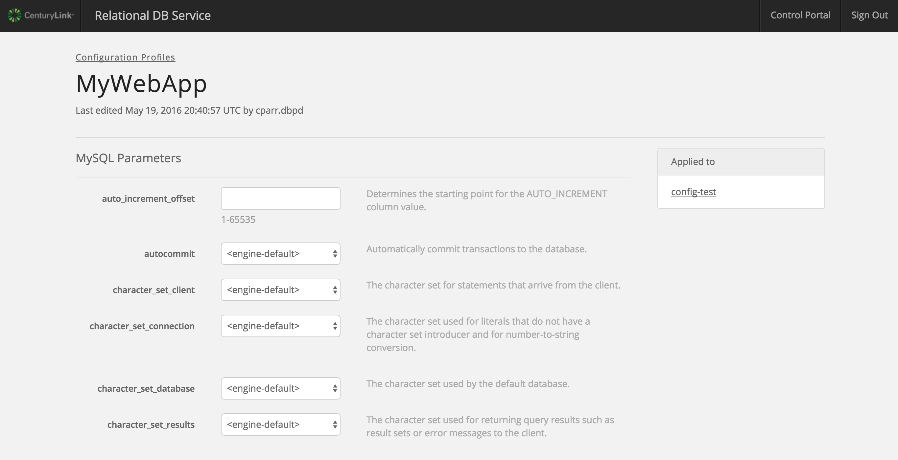
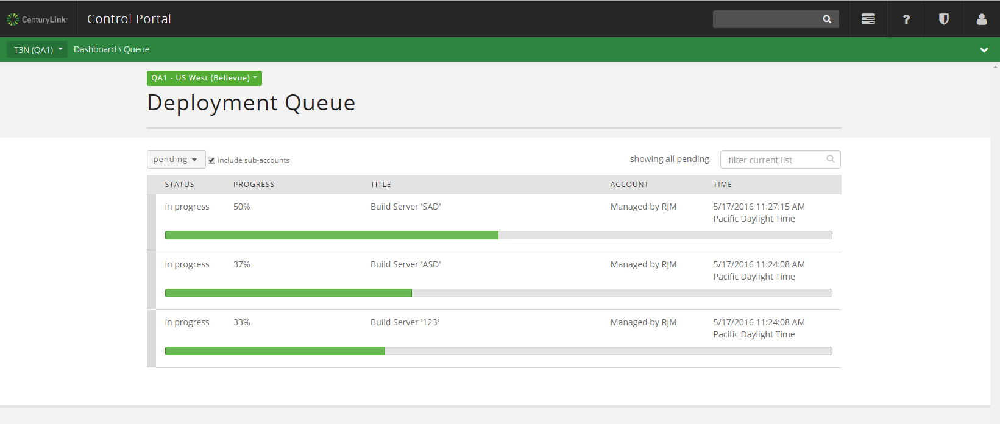

{{{
"title": "Cloud Platform - Release Notes: May 24, 2016",
"date": "05-24-2016",
"author": "Chris Kent",
"attachments": [],
"contentIsHTML": false
}}}

### New Features (5)
* __RelationalDB__. Our MySQL-compatible database-as-a-service  offering has been updated with these new features:
	- **New Flexible Plans Available in AppFog Marketplace.** Thursday, May 19, we launched our new, flexible database plans - mysql_single and mysql_replicated. These new plans enable users to independently configure vCPU, Memory, Storage and Backup settings to their preferred configuration, instead of choosing between fixed “t-shirt” size plans.  

    	All existing database instances provisioned via AppFog (e.g. micro, small, medium, and large plans) were automatically converted to the new mysql_single plan, retaining their configuration settings. The new mysql plans can be configured in the Relational DB dashboard, from either the link on the AppFog Application dashboard, or direct navigation to https://rdbs.ctl.io. NOTE: This conversion will not affect pricing or database availability. Application connectivity will NOT be impacted.

    	**Key Benefits**

    	The RelationalDB dashboard allows for fine-grained control and configuration of your mysql database, including:
	
	    - Scale vCPU, RAM and/or storage of your instance through automation (API or UI)
	    - Define your backup frequency (daily, weekly, etc) and retention period (up to 35 days)
	    - Take an ad hoc backup, view existing backups, or restore from an available backup
	    - Configure usage alerts and get notified when vCPU or Storage is nearing capacity
	    - Customize MySQL configuration options
	    - API access [Please see API documentation](https://www.ctl.io/api-docs/v2/#relational-database-rdbs)
	
     
		Going forward, new RelationalDB instances will start with 1vCPU, 1GB Memory, and 1GB Storage. You can immediately adjust your instance configuration via the Relational DB dashboard or API. Pricing for instances with the same configuration as the prior t-shirt sized plans remains the same. The complete price breakdown is available in the RelationalDB dashboard and at [https://www.ctl.io/pricing/#/](https://www.ctl.io/pricing/#/).

	- **Ability to Create Custom Configuration Profiles.**  Starting on May 25th, Relational DB customers will be able to customize their MySQL configuration settings.  Users will simply modify the default MySQL settings in the UI and save them as a new Configuration Profile under their account.  Once created, the Configuration Profiles can be used when creating a new Relational DB instance or applied to an existing Relational DB instance.  This enables users to customize their Relational DB instance to meet their applications' unique requirements.
	
	
	
* __Runner__. Our automated infrastructure management service has added the following new features: 
	- **CLC Ansible Module.**
	*version: 1.1.10*  
	Support has been added for mapping a public ip to the existing internal ip of the sytem when adding a new public ip.
	- **Runner/CLC-Ansible-Module Support.** Runner has been updated to use the most current version of the CLC-Ansible-Modules.
	- **Added wait_for Support.** Added support for the Ansible wait-for operation.  This tasks allows playbooks to wait for certain ips and ports to become available before moving onto the next task. 

### Enhancements (2)
* __Blueprint Queue Page__
	* **UI and Search Updates.** We have updated the UI on the Blueprint Queue Page. We removed the account drop down and replaced it with a feature allowing you to filter on title or account alias. 
	
* __API V2 Experimental__
	* **Cross Data Center Firewall Policy.** Use the Cross Data Center Firewall Policy when you need a Firewall Policy between networks in different Data Centers.

### Announcements (2)
* __Minor change to the Server Operator role in Control.__ Effective May 24, 2016, the Server Operator role now has the ability to CREATE, EDIT and DELETE Vertical Autoscale, Horizontal Autoscale, and Alert Policies in Control (previously VIEW only). This is a minor change which has no impact on cost or other features within the Control Portal.

*  __Retirement Date for Standard & Premium Backup Features on May 31, 2016__. Effective June 1, 2016, Standard and Premium backup features will reach end of life in CenturyLink Cloud in all locations. Late last year, CenturyLink notified customers that the backup features associated with “Standard” and “Premium” storage were to be retired in early 2016. As a result of this platform change, customers will no longer have access to their backup data from Standard and Premium storage features after May 31, 2016. Data from Standard and Premium backups are not carried over or otherwise migrated to the Simple Backup Service, or any other backup product. Customers requiring access to this data should request backup restores as soon as possible via ticket at [help@ctl.io](mailto:help@ctl.io). There is no impact to the persistent storage attached to servers, but your data will no longer be automatically backed up unless you take action.