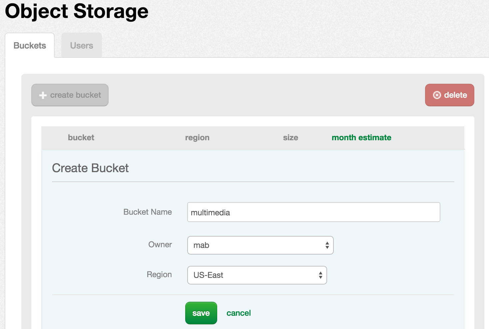
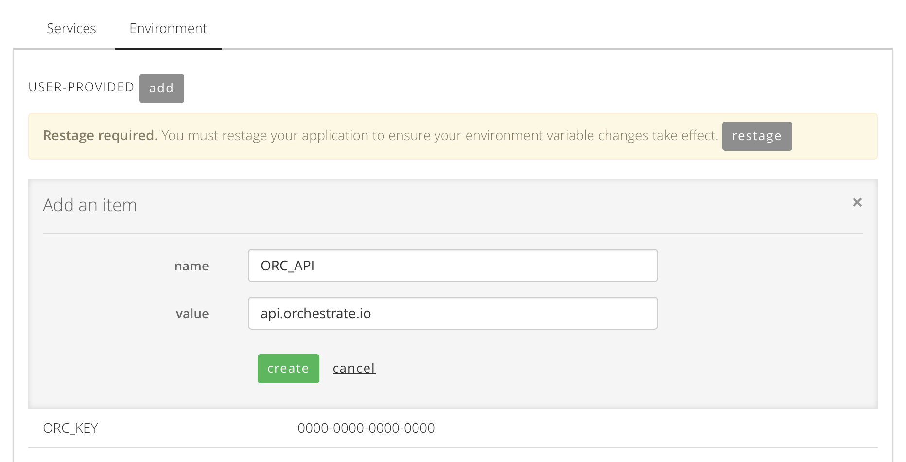

{{{
"title": "Cloud Platform - Release Notes: January 19, 2016",
"date": "1-19-2016",
"author": "Jared Ruckle",
"attachments": [],
"contentIsHTML": false
}}}

### New Features (4)

* __Object Storage now available in US-East.__ CenturyLink's [object storage service](https://www.ctl.io/object-storage/) is now available in the US East region. Like our improved Canadian offering, object storage in US East will provide high availability and redundancy over the familiar S3 interface.  More details are available on the [object storage product page (including pricing)](https://www.ctl.io/object-storage/), as well as the [Knowledge Base](https://www.ctl.io/knowledge-base/object-storage).

* __Managed MS SQL: Bring Your Own License.__ A new [Managed MS SQL Blueprint](https://www.ctl.io/managed-services/ms-sql/) that supports "bring your own license" is now available for managed CenturyLink Cloud customers. Customers who deploy this Blueprint will pay for the management of their MS SQL instance only, at a rate of $0.48/hr. The features of the managed service remain unchanged.

* __"IPS Anywhere" for Any Server Running Selected Versions of Red Hat, CentOS, Ubuntu, and SUSE.__ CenturyLink Cloud users may now install instances of host-based [Intrusion Prevention Service](https://www.ctl.io/intrusion-prevention-service/) on any server running one of these 64-bit operating systems: RHEL 5/6/7, CentOS 5/6/7, Ubuntu 12/14, and SUSE 11. The server can be located on-premises, in CenturyLink Cloud, or off-site with another hosting provider - the only requirement is connectivity to CenturyLink's management network. To configure access to this network, refer to [Getting Started with IPS - prerequisites](https://www.ctl.io/knowledge-base/security/getting-started-with-ips/#prerequisites).

  Installing IPS Anywhere is a simple API call - to learn more, [refer to this KB article](https://www.ctl.io/knowledge-base/security/#1).

* __AppFog: View & Edit Environmental Variables from the Control Portal.__ Application environmental variables, the primary mechanism for managing configuration in [AppFog](https://www.ctl.io/appfog/), can now be viewed and edited via the Control Portal. The new viewer/editor feature allows users to update, add, and remove environment variables.

### Early Adopter Program Updates (5)

* __NEW - Load Balancer as a Service.__ [Load Balancer as a Service (LBaaS)](https://www.ctl.io/load-balancing/) is a new shared load balancer service that offers more capabilities than our current production service, including, TCP load balancing, support for load balancing on any port, and configurable health checks.

  These features, and more, are now available in beta via API. For more details, and to sign-up for the beta service, please visit [the product page](https://www.ctl.io/load-balancing/).

* __DBaaS Beta Conclusion.__ The [DBaaS beta](https://www.ctl.io/dbaas/) ends January 25; the service will then become generally available as the "Relational DB Service". This new service supports rapid software delivery by providing instant access to a high performance, enterprise-hardened MySQL-compatible database instances. The service is hosted on CenturyLink Cloud's [Hyperscale service](https://www.ctl.io/hyperscale/), with 100% flash storage. The service will be GA at launch in three CenturyLink Cloud locations: IL1, VA1 and UC1.

* __Runner.__ Several new capabilities are available for [the agent-less automation service](http://info.runner.ctl.io/):

 * **Job Execution Expiration time** – Users now have the ability to set expiration times for a job. This helps users stop unexpected long-running executions; further, users can view detailed status logs to better troubleshoot long-running tasks. The execution will move to a new state `EXPIRED` after it reaches the specified time. Refer our latest documentation for Job Service [Create Job - Password Protected](http://info.runner.ctl.io/job-service/#createJob) and [Update Job - Password Protected](http://info.runner.ctl.io/job-service/#updateJob) for details.

 * **New default status of job execution** – When a job is executed, the default state is now `INITIALIZING`. Previously, the default state was `PENDING`. The new status indicates that various initialization tasks (setting up your inventory, SSH connection setup with the target host, and network setup) are underway, before job execution.

 * **More actions for jobs in a `PENDING` state** -  now you can `STOP` and `KILL` job executions that are in a `PENDING` state.

* __Wordpress.__ Several improvements to the hosted Git repositories for [Wordpress sites](https://www.ctl.io/wordpress/) are now available. Highlights include:

  * **Backup and Restore Reliability** - Process improvements have been made to eliminate customer data loss in the event of component failure.

  * **Host-level Security Enhancements** - Additional intrusion prevention and DDoS protection has been added at the host level to further harden the environment against threats.

  * **Service Availability** - Additional infrastructure redundancy has been added to improve uptime.

  * **Software Upgrades** - The core Gitlab software has been upgraded to take advantage of new features.

* __Managed Pivotal Cloud Foundry.__ Three important services are now available to beta users of the managed service: Redis, MySQL and RabbitMQ.

### Announcements (1)

* __Experimental API Change: Claim Network Response.__ The `POST` operation to ["Claim Network" API](https://www.ctl.io/api-docs/v2/#networks-claim-network) now returns an array of links related to the status of the job and the network itself. Previously, the call returned detailed information about the network.

### Ecosystem (2)

* __Silver Peak:__ [Silver Peak](http://www.silver-peak.com/) WAN Optimization appliances make global distributed applications more accessible than ever. Using their "Set it and forget it" configuration, off-premise IT is delivered to corporate headquarters and branch sites without administration overhead. [Try this partner template](https://www.ctl.io/knowledge-base/ecosystem-partners/marketplace-guides/getting-started-with-silver-peak-partner-template/) with your own applications today.

* __Clusterpoint:__ [Clusterpoint's](https://www.clusterpoint.com/) ACID compliant distributed database solution offers NoSQL and SQL interfaces - including a first of its kind stored procedure execution on NoSQL transactions. [Accelerate your business with a private installation](https://www.ctl.io/knowledge-base/ecosystem-partners/marketplace-guides/getting-started-with-clusterpoint-blueprint/) on CenturyLink Cloud.

### Open Source Contributions (1)

* __[CenturyLink Cloud Chef Knife Plug-In](https://github.com/CenturyLinkCloud/clc-knife/).__ Chef users can now perform key configuration management functions using CenturyLink Cloud and Knife, with this open-source plug-in. Over a dozen commands related to servers, data centers, groups, and power operations are supported. Fork [the repo on Github](https://github.com/CenturyLinkCloud/clc-knife) to get started.
