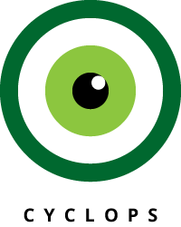

{{{
"title": "Cloud Platform - Release Notes: February 2, 2016",
"date": "2-2-2016",
"author": "Mary Cadera",
"attachments": [],
"contentIsHTML": false
}}}

### New Features (1)

* __Relational DB Service.__ The DBaaS beta has come to a close with the release of our GA product, [Relational DB Service](https://www.ctl.io/relational-database/).  

	Our Relational DB Service supports your rapid software delivery needs by providing instant access to a high performance, enterprise-hardened MySQL-compatible database instance built on our hyperscale platform with 100% flash storage.  

	Features include:

	- Availablity in UC1, VA1 and IL1; global expansion throughout 2016
	- Choose any combination of CPU/RAM and storage within platform limits
	- Replication option for High Availability: In-datacenter replication with auto-failover and a manual failover option
	- Ability to scale CPU, RAM and storage independently of each other with a click of a button or API call
	- SSL certificate provided to encrypt your connection and data in transit
	- Daily backups with configurable backup times
	- Sign up to be notified when CPU and storage thresholds are exceeded

	For more information visit: https://www.ctl.io/relational-database/

### Early Adopter Program (1)

* __Simple Backup Service.__ [Simple Backup](https://www.ctl.io/simple-backup-service/) now supports account switching functionality within the Control Portal. With account switching, users may now provision backup policies for servers that reside under different sub accounts without having to login to each sub account directly.

### Announcements (1)

* __Sub-Accounts Disabled for Self-Sign Up Customers.__ Effective February 16, 2016 customers who have activated online will no longer have access to create new sub-accounts by default. This feature can be re-enabled upon request by creating a ticket via an email to help@ctl.io.

	Please [refer to our KB](https://www.ctl.io/knowledge-base/accounts-&-users/subaccounts-web-signup/) for additional information.

### Ecosystem (2)

* __MapR.__ We've added another top-tier player in the Hadoop space - MapR joins the ranks of Cloudera and Pivotal HD as yet another organization that recognizes the opportunity Lumen Cloud virtual and bare metal IaaS offers to the Big Data space.  [Deploy MapR Community Edition today.](https://www.ctl.io/knowledge-base/ecosystem-partners/marketplace-guides/getting-started-with-mapr-blueprint/)
* __CouchBase and OrientDB.__ Whether it be a greenfield build on Lumen Cloud or an existing application migration, we are the place for NoSQL database engines.  We've also added  [CouchBase](https://www.ctl.io/knowledge-base/ecosystem-partners/marketplace-guides/getting-started-with-couchbase/) and [OrientDB](https://www.ctl.io/knowledge-base/ecosystem-partners/marketplace-guides/getting-started-with-orientdb/#audience) for instant deployment from our marketplace.  Find the best software for your application - or compare the performance and reliability of the underlying IaaS.

### Open Source Contributions (1)

* __Cyclops.__ [Cyclops](https://github.com/CenturyLinkCloud/Cyclops) is an open source collection of UX/UI patterns that make up the Lumen Cloud user interface. It's our way to showing how focused we are on creating a delightful and responsive user experience.

	

	Browse the pattern library here: http://assets.ctl.io/cyclops

	Source: https://github.com/CenturyLinkCloud/Cyclops
