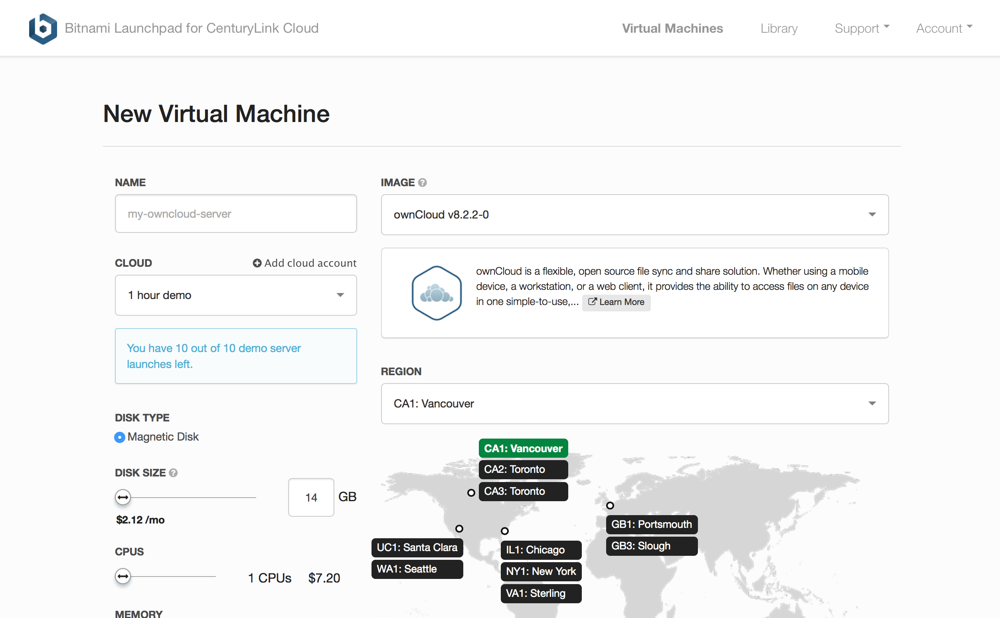

{{{
"title": "Cloud Platform - Release Notes: February 16, 2016",
"date": "2-16-2016",
"author": "Anthony Hakim",
"attachments": [],
"contentIsHTML": false
}}}

### New Features (1)

* __"IPS Anywhere" for Any Server Running Selected Versions of Windows.__ Lumen Cloud users may now additionally implement host-based Intrusion Prevention Service on Windows servers located on-premises, in Lumen Cloud, or off-site with another hosting provider. The only requirement is connectivity to Lumen's management network. To configure access to this network, refer to [Getting Started with IPS - prerequisites](https://www.ctl.io/knowledge-base/security/getting-started-with-ips/#prerequisites).

	Installing IPS Anywhere is a simple API call - to learn more, refer to this [KB article](https://www.ctl.io/knowledge-base/security/ipsanywhere/).

	The full list of supported Operating Systems can be found in this [KB article](https://www.ctl.io/knowledge-base/security/supported-ips-oses/).

### Announcements (1)

* __Sub-Accounts Disabled for Self-Sign Up Customers.__ As announced in the release notes from February 2, 2016, customers who have activated online no longer have the ability to create new sub-accounts by default. This feature can be re-enabled upon request by creating a ticket via an email to [help@ctl.io](mailto:help@ctl.io).

	Please refer to our [release notes for February 2, 2016](https://www.ctl.io/knowledge-base/release-notes/2016-02-02-cloud-platform-release-notes/#announcements-1) and this [KB article](https://www.ctl.io/knowledge-base/accounts-&-users/subaccounts-web-signup/) for additional information.

### Ecosystem (1)

* __Bitnami Launchpad.__ [Bitnami](https://bitnami.com/) is a software service that packages popular applications into cloud-friendly installers and integrates them with the major cloud service platforms. Especially focused on open source projects, Bitnami makes it easy for an enterprise cloud user to evaluate open source alternatives for different tools and functions. A number of Blueprints in the [Lumen Cloud Marketplace](https://www.ctl.io/knowledge-base/ecosystem-partners/general/ecosystem-partner-list/) are based on Bitnami installers, and you can now get started quickly by deploying applications to Lumen directly from the [Lumen-Bitnami Launchpad site](https://centurylink.bitnami.com/).

	
