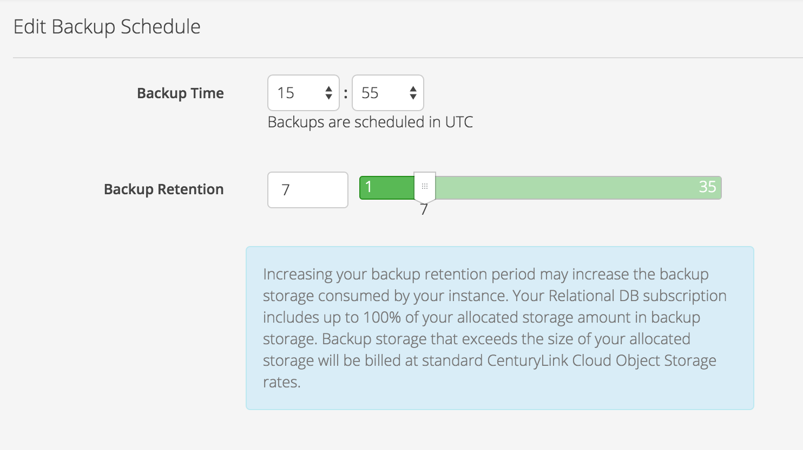

{{{
"title": "Cloud Platform - Release Notes: March 1, 2016",
"date": "03-01-2016",
"author": "Anthony Hakim",
"attachments": [],
"contentIsHTML": false
}}}

### New Features (1)

* __Relational Database: Configurable Backup Retention.__ Customers may now configure their backup retention policy to be anywhere between 1 and 35 days. Your Relational DB subscription includes up to 100% of your allocated storage amount in backup storage. Backup storage that exceeds the size of your allocated storage will be billed at an "Additional Backup Storage" rate of $0.04/GB per month.

### Announcements (1)

* __Update on the Retirement of Standard & Premium Backup Features - Introducing New Options for Backups, Plus an Update on the Retirement of Standard & Premium Backup Features.__

	Late last year, Lumen notified customers that the backup features associated with “Standard” and “Premium” storage were to be retired in early 2016.

	We can now offer more clarity on this timing. Effective May 1, 2016 Standard and Premium backup features will reach end of life in Lumen Cloud in all locations. There is no impact to the persistent storage attached to servers, but the 5-day and 14-day backup capabilities will no longer function after this date.

	For more information - including alternatives you may want to consider for backup and disaster recovery, [please refer to this Knowledge Base article.](https://www.ctl.io/knowledge-base/support/introducing-new-options-for-backups/)

### Ecosystem (2)

* __HP Enterprise - Load Runner.__ Performance is key! Users can now deploy [HPE Load Runner](http://www8.hp.com/us/en/software-solutions/loadrunner-load-testing/) via Blueprint to perform a load test on cloud applications. Testing applications and environment performance is important to learn if your app is going to continue deliver under resource load. [Prove your apps perform](https://www.ctl.io/knowledge-base/ecosystem-partners/marketplace-guides/getting-started-with-hp-loadrunner-blueprint/) by load testing them with HPE Load Runner.

* __RuxIt - Full Stack Availability and Performance Monitoring.__ All in one performance management is here with [RuxIt](https://ruxit.com/). Deploy the RuxIt agent via Blueprint to monitor full stack availability and performance of your applications and server. RuxIt's dashboards are beautiful and provide great information through their artificial intelligence smart analysis. [Get immediate results](https://www.ctl.io/knowledge-base/ecosystem-partners/marketplace-guides/getting-started-with-ruxit-blueprint/) with RuxIt.

### Open Source Contributions (2)

* __Hashicorp Terraform.__ [Terraform](https://www.terraform.io/) by Hashicorp accelerates the DevOps cycle by realizing declarative configuration of infrastructure, converging changes to it and scaling it in a repeatable way. We are excited to announce the partnership with and inclusion of Lumen Cloud into the terraform ecosystem. Today, the clc plugin is available as a preview for integration into an upcoming terraform release. Start automating your infrastructure buildout today by [test-driving the plugin here](https://www.ctl.io/knowledge-base/ecosystem-partners/marketplace-guides/getting-started-with-hashicorp-terraform/).

* __Docker Machine.__ In cased you missed it, [Docker 1.10](https://github.com/docker/docker/blob/master/CHANGELOG.md) was released last month. This release brings stabilization and enhancements to the network stack, better integration with compose, and optimizations to the image transport engine. You can use [docker-machine](https://www.docker.com/products/docker-machine) to create and manage your docker instances on Lumen Cloud. The CLC driver for docker-machine allows you to start building your swarm cluster via simple command-line flags. [You can fork the repo here](https://github.com/CenturyLinkCloud/docker-machine-driver-clc). Also, check out our [getting started guide](https://www.ctl.io/knowledge-base/ecosystem-partners/marketplace-guides/getting-started-with-docker-machine/) for details.
