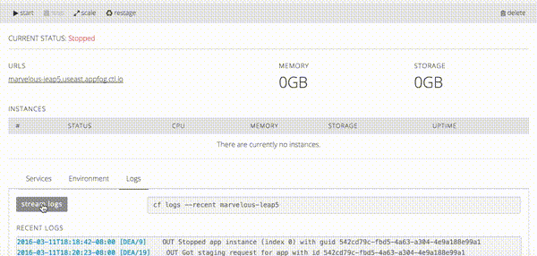

{{{
"title": "Cloud Platform - Release Notes: March 15, 2016",
"date": "03-15-2016",
"author": "Anthony Hakim",
"attachments": [],
"contentIsHTML": false
}}}
### New Features (1)

* __AppFog: View Streaming Logs in the UI.__

	AppFog users can now stream aggregated logs (Cloud Foundry platform and application) in the Control Portal UI. Select the Logs tab on the application dashboard and click the “stream logs” button to activate log streaming. Up to 750 lines or 6MB of logs (whichever comes first) are available.

	

### Early Adopter Program - Updates (1)

* __Simple Backup Service Beta Agent Updates.__

	Simple Backup Service has added additional security features to the backup agent's UI. There is now password protection, and selectable UI availability modes. For more information on the features, and instructions to configure it, [please refer to this KB article](https://www.ctl.io/knowledge-base/backup/sbs-agent-security/).

### Announcements (2)

* __We Have Containers!__

	Lumen Cloud now offers turn-key installations of Kubernetes, the open source Container Orchestration System. For more information, [please refer to this blog post](https://www.ctl.io/blog/post/kubernetes-on-centurylink-cloud/).

* __AppFog Diego Beta Release.__

	Diego is the next generation of Cloud Foundry’s distributed runtime architecture, [replacing the v1.5, DEA-based architecture](http://docs.run.pivotal.io/concepts/diego/dea-vs-diego.html). Diego provides faster performance, more efficient job allocation, ssh for app instance containers, and future support for Docker and non-Linux OS’s. To join the AppFog Diego Beta, [please refer to these instructions](https://www.ctl.io/knowledge-base/appfog/using-diego/).
