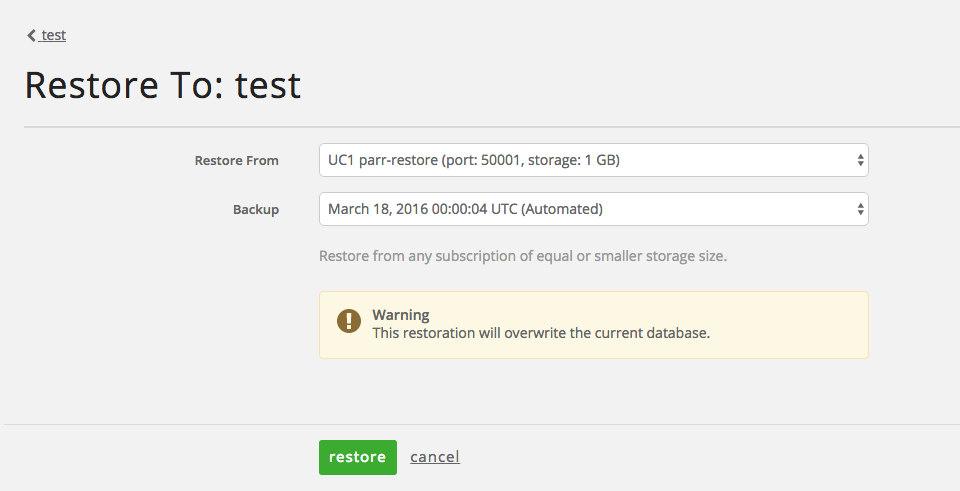
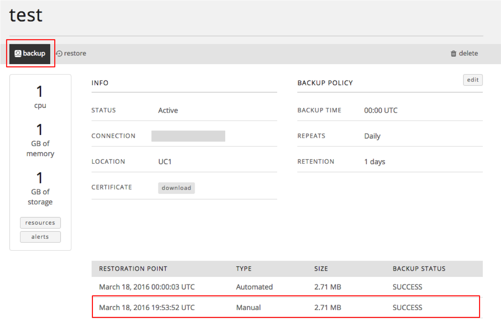

{{{
"title": "Cloud Platform - Release Notes: March 29, 2016",
"date": "03-29-2016",
"author": "Dana Bowlin",
"attachments": [],
"contentIsHTML": false
}}}
### New Features (4)

* __Relational DB: Restore from Backup.__

  Effective 3/30, Relational DB instances can be restored through the UI or API from any available backup within the same account of equal or smaller storage size.  This important new feature not only supports disaster recovery objectives, but enables developers to easily migrate from development to production through a simple backup and restore or to easily pull back production data into test environment on a regular basis.

  

* __Relational DB: Manual Backup Functionality.__

  Effective 3/30, Relational DB customers can perform a manual backup of their database instance any time they need.  Manual backups will follow the same backup retention policy as automated backups.

  

* __Relational DB: Reseller Branding Support.__

  Effective 3/30, Resellers will be able to access Relational DB as a branded site within the Lumen Cloud Control Portal.

* __Simple Backup: Announcing Simple Backup Service: A Simple Solution for Enterprise Data Protection.__

	The Lumen Cloud team is excited to announce the General Availability of [Simple Backup Service (SBS)](https://www.ctl.io/simple-backup-service/), a new Internet-based cloud backup product that rethinks the “traditional” approach to enterprise data protection:
	- **Flexible:** No more “one size fits all” approach to backups.  Create backup policies that match the precise location, frequency, and retention period required for your business.
	- **Global Coverage:** Store your backups in a separate region from your servers, or adhere to international data sovereignty guidelines with global backup storage regions: US East, US West, Canada, EU (N. Ireland), EU (Germany), and APAC (Singapore).
	- **Self Service:** Use an intuitive, web based Control Portal to manage your backups.  Or, use our REST API for programmatic access.
	- **Cost Effective:** Avoid the high upfront licensing costs of traditional enterprise backup software, with utility-style, consumption based pricing.  Pricing for the service will be $0.10/GB for backups, and $0.10/GB for restores.  The service utilizes incremental backups to help minimize ongoing storage expenses and data transfer costs.
	- **Secure:** Backups are encrypted in transit by TLS v1.2, and encrypted at rest in the object store with 256-bit AES encryption.
	- **Fully Automated:** “Set it and forget it” protection. Data is automatically backed up in secure object storage and retained according to the policy. Restores are simple too—just click on a “point-in-time” backup event, and the data will be automatically restored within minutes.

	Simple Backup Service offers comprehensive protection against file-level corruption for users of Lumen Cloud, including support for Standard, Hyperscale, and Bare Metal servers, all supported 64-bit Windows and Linux operating systems, and global reach. Available in all Lumen Cloud nodes globally.

	For more information on Simple Backup Service, you can visit our [product page](https://www.ctl.io/simple-backup-service/) or our [Knowledge Base](https://www.ctl.io/knowledge-base/backup/).

### Open Source Contributions (1)

* __Lumen Cloud Puppet Module.__

	Puppet users can now perform key configuration management functions on Lumen Cloud with this open-source module. Over a dozen commands related to servers, data centers, groups, and power operations are supported. [Fork the repo on Github to get started.](https://github.com/CenturyLinkCloud/clc-puppet)

### Announcements (1)

* __Update on the Retirement of Standard & Premium Backup Features -__ Introducing New Options for Backups, Plus an Update on the Retirement of Standard & Premium Backup Features.

 	Late last year, Lumen notified customers that the backup features associated with “Standard” and “Premium” storage were to be retired in early 2016.
	We can now offer more clarity on this timing. Effective May 1, 2016 Standard and Premium backup features will reach end of life in Lumen Cloud in all locations. There is no impact to the persistent storage attached to servers, but the 5-day and 14-day backup capabilities will no longer function after this date.

  For more information - including alternatives you may want to consider for backup and disaster recovery, [please refer to this Knowledge Base article.](https://www.ctl.io/knowledge-base/support/introducing-new-options-for-backups/)
