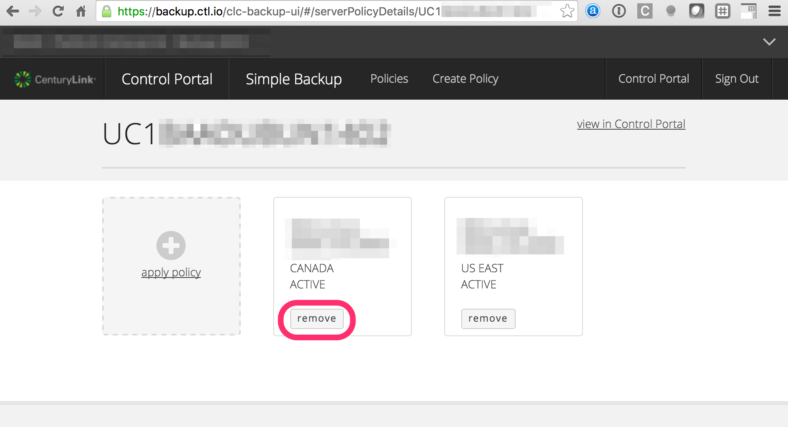
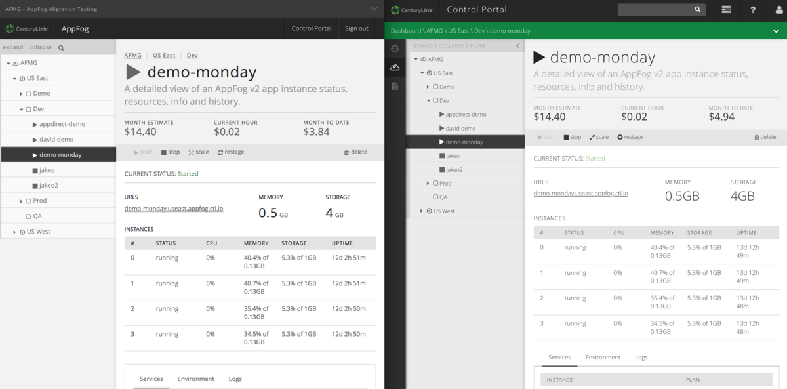

{{{
"title": "Cloud Platform - Release Notes: April 12, 2016",
"date": "04-12-2016",
"author": "Shasha Zhu",
"attachments": [],
"contentIsHTML": false
}}}
### New Features (3)
* __New Lumen Cloud Data Center - AU1 APAC (Sydney) Now Live.__
* __Simple Backup Service__. Effective April 12, 2016, Simple Backup Service has added multiple new features.
  - Simple Backup Agent UI now provides a path to a new log file which contains failed or partially successful SBS jobs. 
  - Now it is possible to fully remove a server from a Backup Policy using both the Control Portal and API.  In the Control Portal, simply navigate to the Server Policy Details screen, and use the "Remove" button to remove the server from the backup policy. To accomplish this programmatically via the Simple Backup API, refer to the [Delete Server Policy](https://www.ctl.io/api-docs/v2/#simple-backup-delete-server-policy) documentation.   
  - We have added Simple Backup Service to the Lumen Cloud API v2.0.  Developers can now interact with Simple Backup programatically in addition to the Control Portal interface. Documentation for the Simple Backup API can be found [here](https://www.ctl.io/api-docs/v2/#simple-backup). 

* __AppFog__. Effective April 12, 2016, although functions are unchanged, several updates has been added to AppFog Control Portal to improve user experience.
  - Larger font and Larger left-nav tree-view are adopted for improved readability.
  - Top-nav dropdown menu replaced by link to Control Portal.
  - Breadcrumb trail placement shifted.
  - Account dropdown at top of page lists all AppFog accounts so that current user can access.

### Enhancements (2)
* __Lumen Developer Center__. Our [Developer Center](https://www.ctl.io/developers/) now includes [language-specific resources](https://www.ctl.io/developers/sdks-tools) to help you code against Lumen Cloud platform. We have gathered SDKs, tutorials, and other documentation for AppFog, Orchestrate, Infrastructure, and more. We currently feature Java, .NET, Python, NodeJS, Go, and PHP.
* __OS Template__. Several security patches has been added on RHEL 7,  Ubuntu 12 and Ubuntu 14 OS templates to avoid potential exploit.

### Announcements (3)
* __Standard and Premium Block Storage Price Reduction__. Effective April 1, 2016, list pricing for Standard and Premium have been reduced. Both services are now priced at $0.12 GB per month in North America, refer to our [Pricing Catalog](https://www.ctl.io/pricing/) for other regions.
* __Reminder: Standard and Premium Backup Features Retire__. Effective May 1, 2016, Standard and Premium backup features will reach end of life in Lumen Cloud in all locations.
  Late last year, Lumen notified customers that the backup features associated with “Standard” and “Premium” storage were to be retired in early 2016. As a result of this platform change, customers will no longer have access to their backup data from Standard and Premium storage features after April 30, 2016. Data from Standard and Premium backups are not carried over or otherwise migrated to the Simple Backup Service, or any other backup product. Customers requiring access to this data should request backup restores as soon as possible via ticket at help@ctl.io. There is no impact to the persistent storage attached to servers, but your data will no longer be automatically backed up unless you take action.
* __Intrusion Prevention/IPS Price Reduction__. Lumen is constantly reviewing the market to remain competitive with our features and pricing. Based on current research, we have lowered the price for our Intrusion Prevention/IPS product to $0.07 per VM per hour. For approximately only $50 a month per server, add an extra layer of security to your servers and help eliminate one avenue for hackers to take down your servers. If you would like to try IPS for 30 days for free, please sign up at our product page [Intrusion Prevention Service](https://www.ctl.io/intrusion-prevention-service/)
