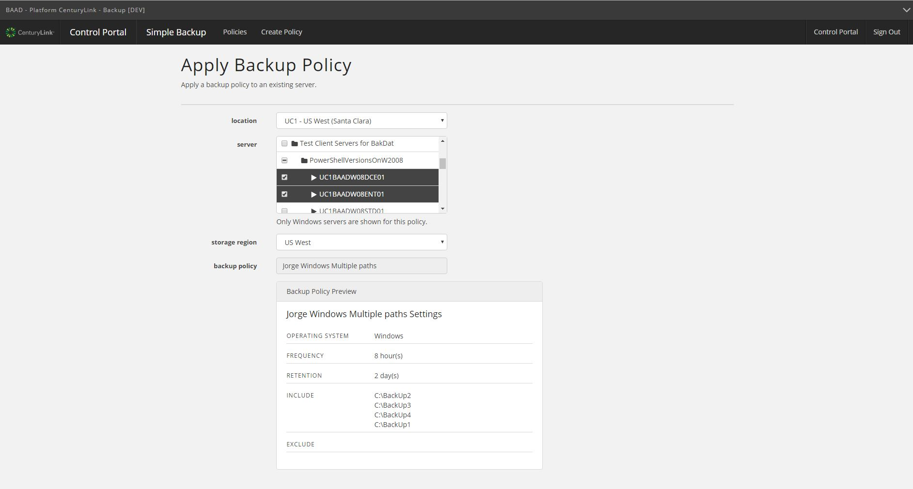
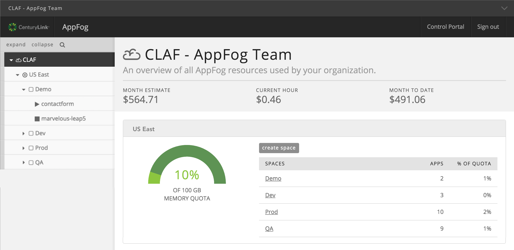

{{{
"title": "Cloud Platform - Release Notes: April 26, 2016",
"date": "04-26-2016",
"author": "Jared Ruckle",
"attachments": [],
"contentIsHTML": false
}}}
### New Features (4)
* __Simple Backup Service__. Effective April 26, 2016, Simple Backup Service has added multiple new features.
  - **Add multiple servers and server groups to a backup policy.** Now, when applying a backup policy, users may select a server, multiple servers, or server groups can be selected. This UI enhancement makes it easier to add policies to large quantities of servers at once.   

  - ** Estimated billing and stored data metrics for server policies.** The Simple Backup interface now shows estimated billing and stored usage metrics to assist users with understanding their backup related costs. The Simple Backup Policies screen now displays the Month Estimate, Current Hour, and Month To Date billing for all policies associated with an account. Additionally, the Policy Details and Server Details screens display the Month To Date and total stored data that's been consumed for a particular backup policy or server.

* __Integrated Load Balancing Support for Kubernetes__. Lumen's container service based on [Kubernetes](https://www.ctl.io/kubernetes/) now supports integrated load balancing. This update further simplifies the workflow for users looking to launch publicly available Kubernetes clusters.

* __AppFog: New Dashboard Location__. The account summary dashboard from the Control Portal has been moved to the AppFog homepage. For each region, the consumption gauge displays the memory quota remaining, alongside a listing of the deployment Spaces with total app count and quota percentage consumed.

  

### Announcements (3)
* __Price Reductions for Compute, RAM and Hyperscale Storage__. Effective April 1, 2016, list pricing for CPU and RAM pricing have been reduced in US & Canada locations. Hyperscale pricing for storage drops by 20% in North America and APAC, and by 10% in EMEA. Refer to our [Pricing Catalog](https://www.ctl.io/pricing/) for an updated list of prices as well as [this blog post](https://www.ctl.io/blog/post/price-reduction-hybrid-it/) explaining the changes.

* __Reminder: Standard and Premium Backup Features Retire__. Effective June 1, 2016, Standard and Premium backup features will reach end of life in Lumen Cloud in all locations.
  Late last year, Lumen notified customers that the backup features associated with “Standard” and “Premium” storage were to be retired in early 2016. As a result of this platform change, customers will no longer have access to their backup data from Standard and Premium storage features after May 31, 2016. Data from Standard and Premium backups are not carried over or otherwise migrated to the Simple Backup Service, or any other backup product. Customers requiring access to this data should request backup restores as soon as possible via ticket at help@ctl.io. There is no impact to the persistent storage attached to servers, but your data will no longer be automatically backed up unless you take action.

* __Simple Backup Service: Bulk Application of Policies VMs via Powershell__. To help customers adopt the new Simple Backup Service, Lumen engineers have developed a PowerShell script to automate the creation - and subsequent application of - Simple Backup Service policies for a given account alias. Only three lines of code need to be adjusted before running the script. [View it on Github](https://github.com/MattSchwabbyCLC/CLCSBSDeployment)
