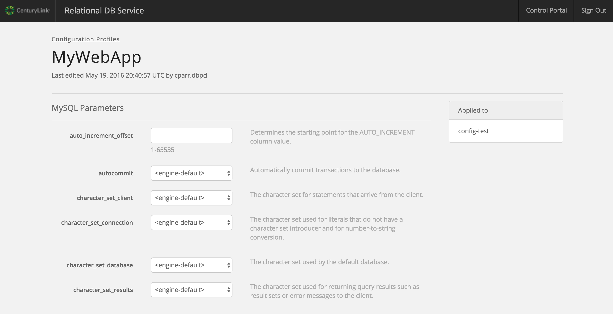
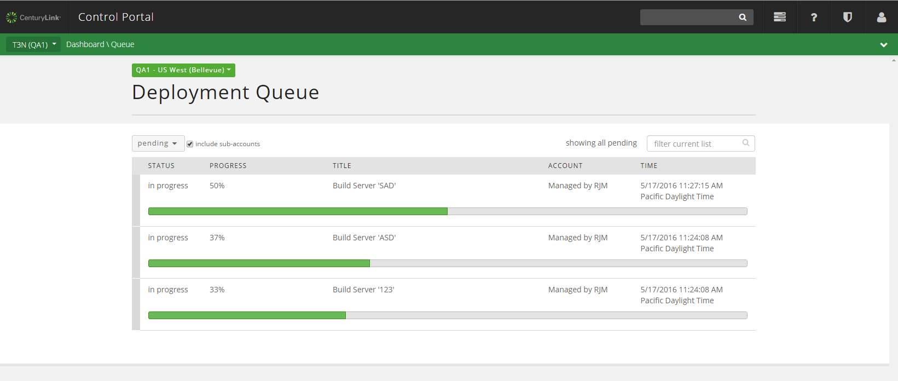

{{{
"title": "Cloud Platform - Release Notes: May 24, 2016",
"date": "05-24-2016",
"author": "Chris Kent",
"attachments": [],
"contentIsHTML": false
}}}

### New Features (5)
* __RelationalDB__. Our [MySQL database-as-a-service offering](https://www.ctl.io/relational-database/) has been updated with these new features:
	- **Flexible Plans for the AppFog Marketplace.** We recently launched new, flexible database plans - `mysql_single` and `mysql_replicated`. Now, users can independently configure vCPU, Memory, Storage and Backup settings to their preferred configuration, instead of choosing between fixed “t-shirt” size plans.

    	All existing database instances provisioned via AppFog (e.g. micro, small, medium, and large plans) were automatically converted to the new `mysql_single` plan, retaining their configuration settings. The new MySQL plans can be configured in the RelationalDB dashboard, from either the link on the AppFog dashboard, or direct navigation to https://rdbs.ctl.io. NOTE: This conversion will not affect pricing or database availability. Application connectivity will NOT be impacted.

    	**Key Benefits**

    	The RelationalDB dashboard provides fine-grained control and configuration of your MySQL database, including:

	    - Scale vCPU, RAM and/or storage of your instance through automation (API or UI)
	    - Define your backup frequency (daily, weekly, etc) and retention period (up to 35 days)
	    - Take an ad hoc backup, view existing backups, or restore from an available backup
	    - Configure usage alerts and get notified when vCPU or Storage is nearing capacity
	    - Customize MySQL configuration options
	    - API access [Please see API documentation](https://www.ctl.io/api-docs/v2/#relational-database-rdbs)

	New RelationalDB instances now start at 1 vCPU, 1GB Memory, and 1GB Storage. You can immediately adjust your instance configuration via the RelationalDB dashboard or API. Pricing for instances with the same configuration as the prior t-shirt sized plans remains the same. The complete price breakdown is available in the RelationalDB dashboard and at [https://www.ctl.io/pricing/#/](https://www.ctl.io/pricing/#/).

	- **Custom Configuration Profiles.**  Effective May 25th, RelationalDB customers will be able to customize their MySQL configuration settings. Users will simply modify the default MySQL settings in the UI and save them as a new Configuration Profile under their account. Once created, the Configuration Profiles can be used when creating a new Relational DB instance or applied to an existing Relational DB instance. This enables users to customize their Relational DB instance to meet their applications' unique requirements.
	

* __Runner__. Our [automated infrastructure management service](https://www.ctl.io/runner/) has added the following new features:
	- **CLC Ansible Module.**
	*version: 1.1.10*  
	Users can now map a public IP to an existing internal IP of a server when performing the add public IP function.
	- **Runner/CLC-Ansible-Module Support.** Runner has been updated to use the most current version of the CLC-Ansible-Module.
	- **`wait_for` Operation.** Runner now supports the Ansible feature `wait_for` - this allows playbooks to wait for certain IPs and ports to become available before moving onto the next task.

### Enhancements (2)
* __Blueprint Queue Page__
	* **UI and Search Updates.** The UI on the Blueprint Queue Page has been updated to improve usability. We removed the account drop down and replaced it with a new control that filters based on title or account alias.
	
* __API V2 Experimental__
	* **Cross Data Center Firewall Policy.** Use the Cross Data Center Firewall Policy when you need a Firewall Policy between networks in different Data Centers.

### Announcements (2)
* __Minor change to the Server Operator role in Control.__ The Server Operator role now has the ability to CREATE, EDIT and DELETE Vertical Autoscale, Horizontal Autoscale, Anti-Affinity and Alert Policies in Control (previously, it was VIEW only). This is a minor change which has no impact on cost or other features within the Control Portal.

*  __Retirement Date for Standard & Premium Backup Features: May 31, 2016__. Effective June 1, 2016, Standard and Premium backup features will reach end of life in Lumen Cloud in all locations. Late last year, Lumen notified customers that the backup features associated with “Standard” and “Premium” storage were to be retired in early 2016. As a result of this platform change, customers will no longer have access to their backup data from Standard and Premium storage features after May 31, 2016. Data from Standard and Premium backups are not carried over or otherwise migrated to the Simple Backup Service, or any other backup product. Customers requiring access to this data should request backup restores as soon as possible via ticket at [help@ctl.io](mailto:help@ctl.io). There is no impact to the persistent storage attached to servers, but your data will no longer be automatically backed up unless you take action.
