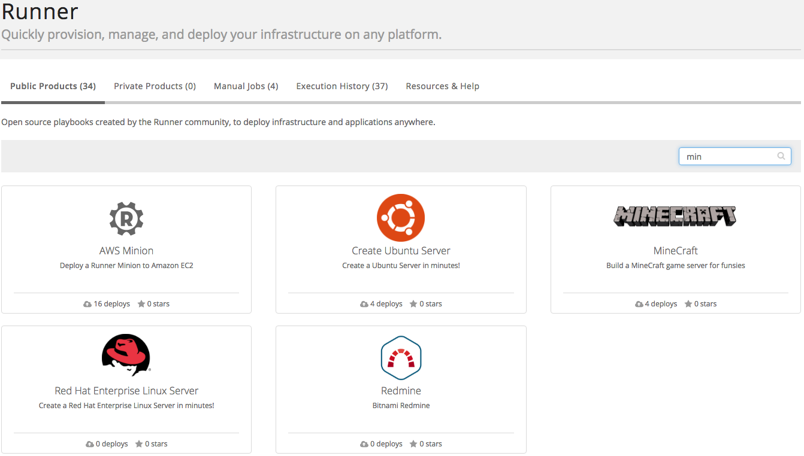

{{{
"title": "Cloud Platform - Release Notes: June 7, 2016",
"date": "06-07-2016",
"author": "Thomas Broadwell",
"attachments": [],
"contentIsHTML": false
}}}

### New Features (1)
* __Runner:__ Our [automated infrastructure management service](https://www.ctl.io/runner/) has added the following new features:
	- Added support for Ansible wait_for module.
	- Set default fork count to 5 to align with Ansible conventions.  Users can still specify a value greater than 5.
	- Runner Job API now supports the passing of Ansible options (i.e. list-tasks, list-hosts, etc.).  
	- Additional level of control regarding public products.  Public products are now white-listed.  Users are no longer able to simply make a product public by setting the visibility to 'public'.
	- Added basic search by name capability on the jobs view page in the Runner UI. (image is for this bullet)
	

### Enhancements (1)
* __Control Portal:__
	* **UI Updates -** We continue to make updates to our UI. You will see small changes to fonts, spacing and alignment to the network and administration pages.

### Announcements (1)
* __Retirement of Standard & Premium Storage backup completed, effective June 1, 2016:__ As communicated previously, Standard and Premium backup features have now been retired in the Platform effective June 1, 2016. Users can no longer select Standard or Premium when creating a server. Further, the backup level field on the server detail screen is no longer displayed. Customers should continue to ensure their data is backed up as required.

### Ecosystem (1)
* __New Blueprints:__  Server General - [Server General](https://www.servergeneral.com/) is an easy to use encryption service that will protect your data in the cloud. Users can encrypt their data through self service in under 30 minutes. Lumen has integrated the Server General encryption agent with our platforms automation services. Customers can use this pay as you go service to achieve HIPAA compliance, reduce audit costs and more, all while controlling their own encryption keys. Check out our [Knowledge Base article](https://www.ctl.io/knowledge-base/ecosystem-partners/marketplace-guides/getting-started-with-server-general-blueprint/) to get started.

### Bug Fixes (1)
* __Runner Bug Fixes:__
	- Corrected User Interface navigation to prevent the 404 error page.
	- Corrected issue where users weren't able to save a job without selecting 'run immediately’.
