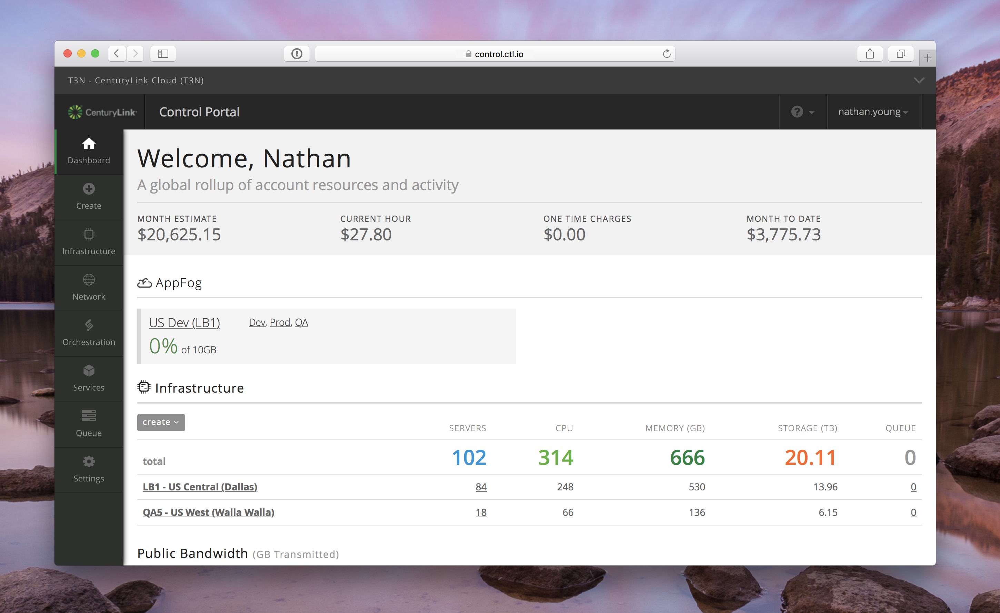

{{{
"title": "Cloud Platform - Release Notes: July 19, 2016",
"date": "07-19-2016",
"author": "Chris Meyer",
"attachments": [],
"contentIsHTML": false
}}}

### New Features (2)
* __Control Portal: Updated Main Navigation Experience in the Control Portal__

	We’ve redesigned our [Control Portal](https://control.ctl.io) experience with our users in mind. The new enhancements make navigation faster, more intuitive, and mobile-friendly. Additionally, we also want to give you consistent, high-quality experience when interacting with the flagship Lumen Cloud Control Portal, and our cloud-related services. For additional details on this update, please read [this KB from our creative director](https://www.ctl.io/knowledge-base/general/control-portal-navigation-update/).

	

* __Runner__

  Our [automated infrastructure management service](https://www.ctl.io/runner/) has added the following new features:
	- __BitBucket Support__ - Runner now supports BitBucket, in addition to GitHub and GitLab, as a repository for Playbooks and Products. Users can now reference their Playbooks or Products from any publicly accessible BitBucket repository.
	- __Advanced Ansible Support__ - Advanced Ansible features such as wait_for, tags, and flags are now available.
	- __Data Center Expansion__ - Runner is now available in the AU1 Datacenter in Sydney, Australia.

  

### Enhancements (1)
* __Lumen Cloud Command-line Interface (CLI): Additional Service Available__

	The Lumen Cloud CLI has been enhanced to include additional API calls for several of our advanced services. Users can use the CLI to operate their compute, storage, and networking services as well as these new features:
  - [RelationalDB](https://www.ctl.io/relational-database/)
  - [Simple Backup](https://www.ctl.io/simple-backup-service/)
  - [Intrusion Prevention Service (IPS)](https://www.ctl.io/intrusion-prevention-service/)
  - [Patching-as-a-Service](https://www.ctl.io/knowledge-base/servers/patching-as-a-service/)
  - [Site-to-Site VPN](https://www.ctl.io/vpn/)
  - [Cross Data Center Firewalls](https://www.ctl.io/cloud-firewall/)

  The [CTL Cloud CLI is available on github](https://github.com/CenturyLinkCloud/clc-go-cli/releases). For more information on using the CLI, refer to the [KB article CTL Cloud Guide to the CLI](https://www.ctl.io/knowledge-base/servers/centurylink-cloud-guide-to-cli/).

### Open Source Contributions (1)

* __Cyclops: Version 1.5 Release__

  [Cyclops](https://github.com/CenturyLinkCloud/Cyclops) is an open source collection of UX/UI patterns that make up the Lumen Cloud user interface. It's our way to showing how focused we are on creating a delightful and responsive user experience.

  __New Features__

  - [Alert Banner](http://assets.ctl.io/cyclops/1.5.0/components.html#alertBanner)
  - [Comma-Separated List](http://assets.ctl.io/cyclops/1.5.0/lists.html#comma)
  - [Update the appearance of nav-local](http://assets.ctl.io/cyclops/1.5.0/navigation.html#navLocal)
  - Responsive text [alignment](http://assets.ctl.io/cyclops/1.5.0/typography.html#alignment), truncate, justify, no wrap text
  - [Main-Nav](http://assets.ctl.io/cyclops/1.5.0/navigation.html#mainNav)
  - Updated documentation Pages
  - Navbar widget to support dynamic insertion of navbars

  __Bug Fixes__

  - [Slider minDefault Error](https://github.com/CenturyLinkCloud/Cyclops/issues/38)
  - [Need colors for line/area graphs](https://github.com/CenturyLinkCloud/Cyclops/issues/39)
  - [Inline confirm on a btn-sm button will generate a Yes and a No button of different sizes]( https://github.com/CenturyLinkCloud/Cyclops/issues/48)
  - [Main-Nav Box shadow](https://github.com/CenturyLinkCloud/Cyclops/issues/50)
  - [Main-nav loading state](https://github.com/CenturyLinkCloud/Cyclops/issues/51)
  - [Chart color series sequence documentation](https://github.com/CenturyLinkCloud/Cyclops/issues/53)

  Browse the pattern library here: http://assets.ctl.io/cyclops

	Source: https://github.com/CenturyLinkCloud/Cyclops

	Compare between last release: https://github.com/CenturyLinkCloud/Cyclops/compare/v1.4.0...v1.5.0

  

### Announcements (1)
* __Upcoming Enhancements to Authentication & Changes for Your SAML Configuration__ - In the coming months, Lumen Cloud will be upgrading its authentication service. Many customers will not experience any material changes as a result of this upgrade. However, customers that have enabled SAML for their Lumen Cloud accounts will be required to make configuration changes to ensure that authentication continues to function.  Please review this [FAQ](https://www.ctl.io/knowledge-base/support/authentication-updates-faq/)  to understand the action required on your part, if any.
