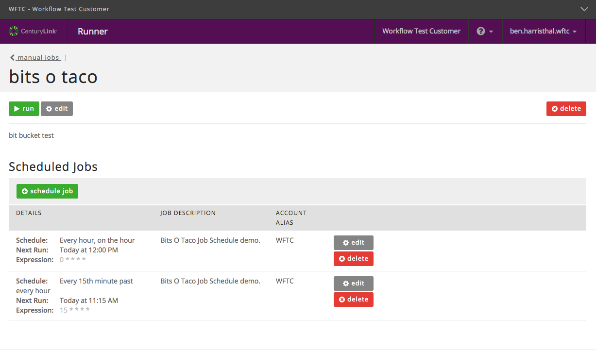

{{{
"title": "Cloud Platform - Release Notes: August 16, 2016",
"date": "08-16-2016",
"author": "Ben Swoboda",
"attachments": [],
"contentIsHTML": false
}}}

### New Features (1)

* __Runner__

  Runner Schedules - Users now have the ability to create and manage job-specific schedules through the UI.

  

### Enhancements (1)
* __Lumen Cloud Platform: Additional Inventory Protection__

	The Lumen Cloud Platform has augmented our protection algorithms that enforce resource limits on Virtual and Bare Metal Servers. This change will help prevent situations in which a single account utilizes more capacity than desired.

### Announcements (2)
* __Relational DB now available in Runner!__ - Users can now incorporate Relational DB into a Runner job to deploy a MySQL-compatible Relational DB instance to IL1, VA1, NY1, UC1, GB3, SG1 or CA3. Visit https://runner.ctl.io to view Relational DB in the marketplace and https://www.ctl.io/relational-database/ for additional product information.

	[Standard pricing applies](https://www.ctl.io/pricing/)

* __Upcoming Enhancements to Authentication & Changes for Your SAML Configuration__ - In the coming months, Lumen Cloud will be upgrading its authentication service. Many customers will not experience any material changes as a result of this upgrade. However, customers that have enabled SAML for their Lumen Cloud accounts will be required to make configuration changes to ensure that authentication continues to function.  Please review this [FAQ](https://www.ctl.io/knowledge-base/support/authentication-updates-faq/)  to understand the action required on your part, if any.

