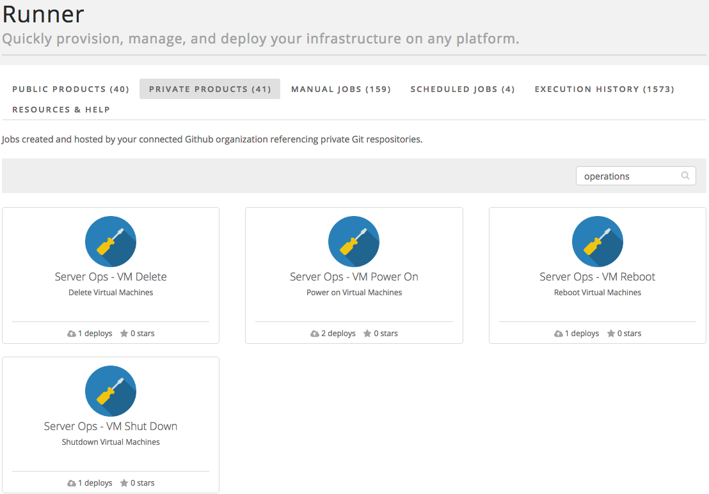
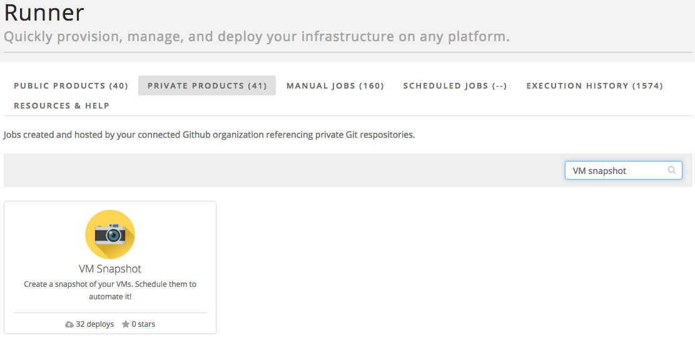

{{{
"title": "Cloud Platform - Release Notes: August 30, 2016",
"date": "08-30-2016",
"author": "Bob Jackson",
"attachments": [],
"contentIsHTML": false
}}}

### New Features (5)

* __Runner__

  * New Server Operation Products - Runner now gives you the ability to control server operations like Delete, Reboot, Power On, and Shutdown.
    
  * Status Email Notifications - Allows customers to be emailed notifications of status updates.
  * Windows Server Products:
    * Windows Server - Provisions Windows 2012 Server in CLC
  * Microsoft Database Products:
    * Microsoft SQL Server - Provisions Windows 2012 Server with SQL server.  Supports the following SQL editions:
      * SQL Server 2012 Web Edition
      * SQL Server 2012 Standard Edition
      * SQL Server 2012 Enterprise Edition
      * SQL Server 2014 Web Edition
      * SQL Server 2014 Standard Edition
      * SQL Server 2014 Enterprise Edition
    * Microsoft SQL Server Evaluation Edition - Provisions Windows 2012 Server with SQL Server evaluation edition.  Customers can elect between version 2014 or 2016.  Evaluation edition provides customers the ability to test Enterprise features.
  * VM Snapshot Product - Create a snapshot of your servers, by Group or by Server. Existing VM snapshot is automatically deleted prior to creating the new one.
    
  * Scheduled Products - Users now have the ability to create and manage schedules for products.

### Enhancements (1)

* __Simple Backup Service - New Version of the SBS agent will be deployed starting Aug 31st, 2016__

  Starting on Aug 31st, Simple Backup Service will begin upgrading customer servers to a new version of the SBS Agent. There will be no interruption in service to Simple Backup during this time, and no customer action is required as part of the upgrade. The new agent will offer better service reliability and improved performance of backup and restore operations.

  Agents will automatically upgrade themselves on a rolling schedule, given that the server is powered on, agent is running and the server is connected to the internet. Additionally, the Agent will download a new manifest file to its application directory that will be used for normal backup record keeping and maintenance.

### Announcements (1)

* __Load Balancer as a Service (LBaaS) is now available in UC1 and VA1!__

CenturyLink Cloud is excited to release a new load balancer service in our UC1 and VA1 Data Centers.   We’re calling it Load Balancer as a Service (LBaaS) since we’ll be adding in more features that allow you to focus on your business, while we help you to service your infrastructure. You get to keep all of the features that are available in the current Shared Load Balancer service, but we’ve added a few new things to get excited about, too.

- TCP load balancing!
- Load balance on any port!
- Configurable health checks!

We’re also excited to announce new pricing for our Load Balancer as a Service.  A single instance hour of the LBaaS service will be priced at $0.025.  In addition, each GB of data processed by the load balancing service will be priced at $0.008.  No incremental cost is associated with the data processing by the load balancing service.

These new features are presently available in our UC1 and VA1 Data Centers with plans to enable additional data centers in the coming months!  Be on the lookout for future announcements regarding service expansion!  

Please note, our Shared Load Balancing service will continue to be available in all other data centers until they are LBaaS enabled.  Shared Load Balancer customers in those data centers that do not yet have LBaaS will continue with pricing set at $0.04/instance hour.

For additional information please check out our [FAQ](../../General/LBaaS/LBaaSFAQ.md) as well as our [getting started guide] (../../LBaaS/getting-started-with-load-balancer-as-a-service.md).  As always, feel free to contact us directly should you have unanswered questions or feedback!  We look forward to hearing from you!
