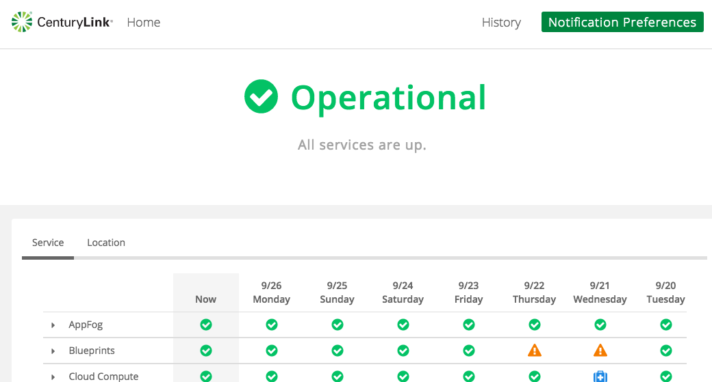

{{{
"title": "Cloud Platform - Release Notes: September 27, 2016",
"date": "09-27-2016",
"author": "Mark Lee",
"attachments": [],
"contentIsHTML": false
}}}

### Enhancements (2)

* __Bare Metal servers - New locations and configurations__

Get the isolation and performance you need by building and managing physical machines in the Lumen Platform. Pay by-the-hour for modern hardware and build servers using the same UI and API available for virtual machines.

The service is available this week in 3 new data centers: Sydney, Australia (AU1), Vancouver, Canada (CA1) and Secaucus, NJ (NY1). At the same time, 5 new server configurations will be launched, providing users with different options - more CPUs, more memory, SSDs, more local storage with configurable RAID. Simple Backup Services and Runner are supported. Plus, prices will be lowered on some of our original server configurations.

For additional details see our [Product Page](https://www.ctl.io/bare-metal/) and [FAQ](https://www.ctl.io/knowledge-base/servers/bare-metal-faq/).

* __SMTP Relay Service - End of Life__

Lumen will be deactivating the SMTP Relay Service on December 1st, 2016.

We are making this change in order to ensure our customers have a fast, scalable, and reliable email delivery service.

We realize that this will require existing customers migrate off of this service and we apologize for the inconvenience.

For more information about this change, please see this [document](https://www.ctl.io/knowledge-base/support/smtp-relay-deactivation-faq/).

### Announcements (1)

* __New Look & Features for Status Page__

[Status.ctl.io](https://status.ctl.io/) has a new look and we have added new features. Check out our 
[FAQ](https://www.ctl.io/knowledge-base/general/centurylink-cloud-status-faq/) for more information.

  
