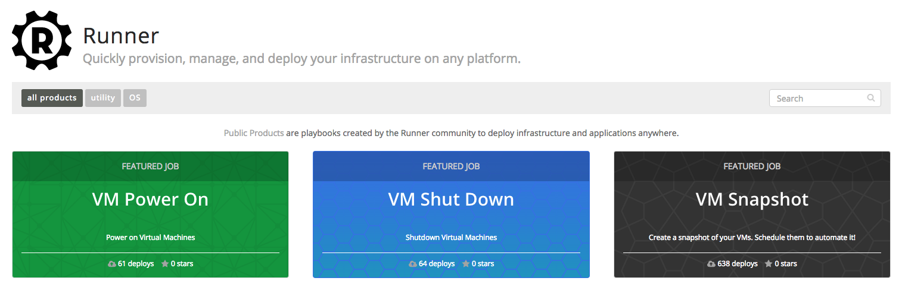

{{{
"title": "Cloud Platform - Release Notes: October 25, 2016",
"date": "10-25-2016",
"author": "David Gardner",
"attachments": [],
"contentIsHTML": false
}}}

### Features (2)

* __New Runner Features__

Service Account Management - Now users can create and delete services accounts via the Runner dashboard. You can find Service Accounts under Help & Settings

Catalog Management - Users can now instantly create, modify, and delete catalogs via the Runner dashboard. You can find Catalogs under Help & Settings

### Enhancements (3)

* __Runner Product Enhancements__

VM Snapshot — Users can now schedule or instantly backup VMs or a Group of VMs; batch group and VM backup groups

VM Power Off — Users can now schedule or instantly power off VMs or a Group of VMs; batch power off groups and VMs

VM Power On — Users can now schedule or instantly power on VMs or a Group of VMs; batch power off groups and VMs

### Announcements (1)

* __MSSQL Relational DB Beta Program Launches!__

MSSQL Relational DB Beta Program will go live on Friday, October 28th. Beta service is currently limited to IL1 and includes a single instance of MSSQL with private routing, daily backups held for 7 days and configurable backup time. Keep watching release notes for announcements on when new beta features and locations are added. If you are interested in joining the beta program, please visit https://www.ctl.io/relational-database/.

### Bug Fixes (2)

* __Platform__

Released several bug fixes that increase the success rate and reliability of our infrastructure automation blueprint system, which handles infrastructure delivery to customers through the API and UI.

* __Runner__

Released several API and Dashboard bug fixes and improvements.
