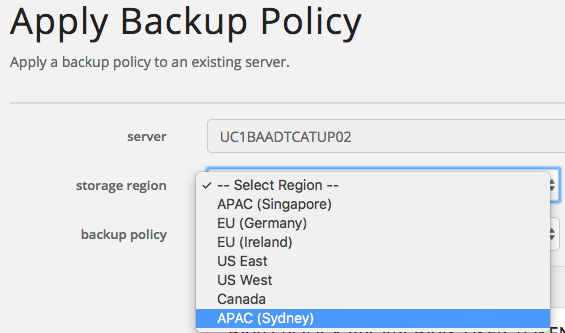
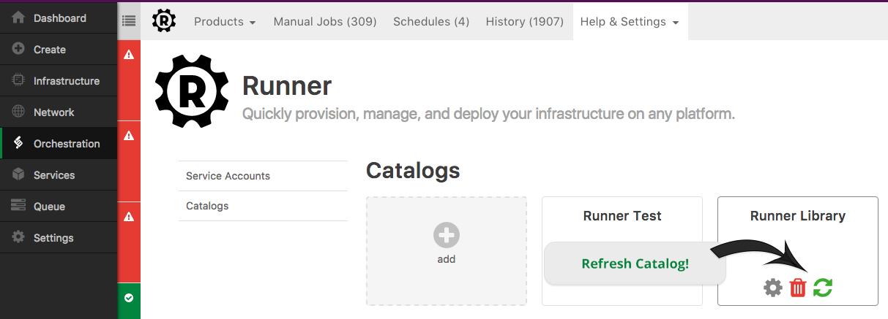

{{{
"title": "Cloud Platform - Release Notes: November 22nd, 2016",
"date": "11-22-2016",
"author": "Chris Kleban",
"attachments": [],
"contentIsHTML": false
}}}

### Early Adopter Program (1)

* __MSSQL Relational DB Beta Program:__

We are still accepting beta customer requests for our MSSQL Relational DB Beta. The beta service is currently limited to IL1 and includes a single instance of MSSQL with private routing, daily backups held for 7 days and configurable backup time. Keep watching release notes for announcements on when new beta features and locations are added. If you are interested in joining the beta program, please visit [https://www.ctl.io/relational-database/#MSSQLbeta](https://www.ctl.io/relational-database/#MSSQLbeta) .

### Enhancements (2)

* __Simple Backup Service - New Storage Destination (Australia) :__

 * The Simple Backup Service has added a new target destination for the backed up files, Australia (APAC). 
 * We also are implementing several backup agent improvements and bug fixes
 
 

* __Runner - UI Improvements__

Made the following user interface improvements to the Runner product:

- Added navigation banner to all pages.
- Updated APIs and refactored UI for better performance.
- Product Group field now supports in-line group creation.
- Recent Executions are now available on all pages.
- Users can now refresh catalogs directly from the settings/catalog page.

### Announcements (1)

* __Orchestrate - End of Life:__

Lumen has announced that it will be retiring the Orchestrate NoSQL Database service. We want to help make this transition as smooth as possible, so we are providing our customers a 120 day transition period. In the coming days, a best practices guide for migrating data will be sent to current Orchestrate users.

Effective March 17, 2017, the Orchestrate NoSQL Database service (“Orchestrate”) will be retired. On this date, existing free and paid accounts will be deactivated. Until then it will remain fully supported and customers will continue to have access to any applicable data in order to migrate and/or backup any applicable content prior to deactivation.

After March 17, customers will no longer have access to any data or content within the Orchestrate NoSQL Database service. For assistance with this transition, contact Lumen Cloud support by opening a ticket via help@ctl.io or reach out to your account manager.

