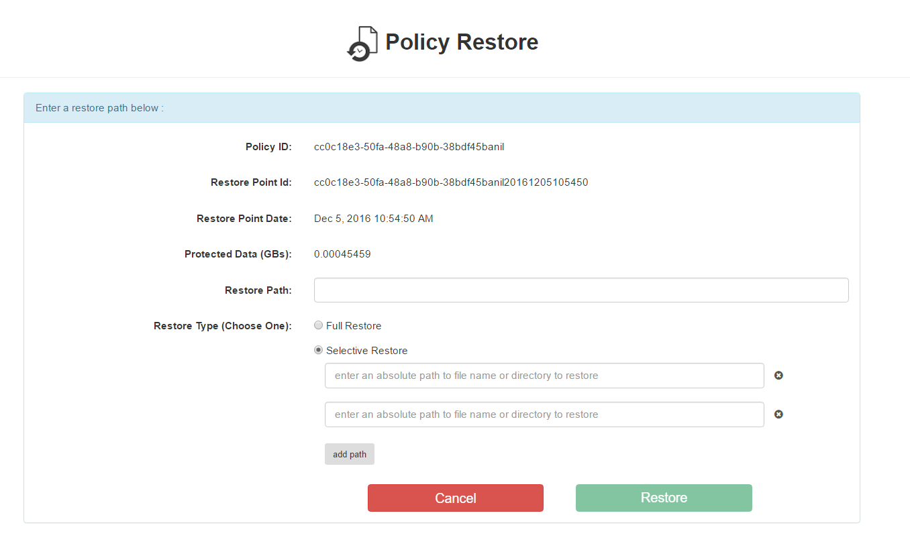
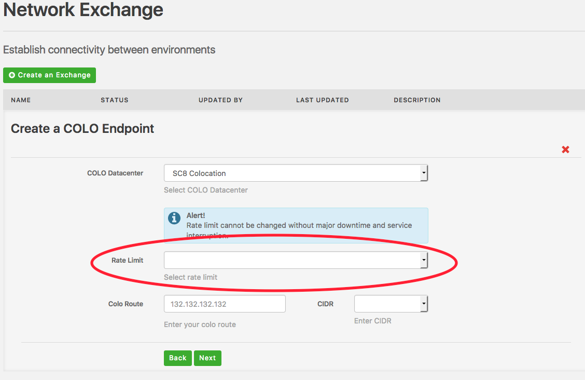

{{{
"title": "Cloud Platform - Release Notes: December 20, 2016",
"date": "12-20-2016",
"author": "Chris Meyer",
"attachments": [],
"contentIsHTML": false
}}}

### New Features (5)
* __Simple Backup Service (SBS): Selective File Restore__

	The [Simple Backup Service (SBS)](https://www.ctl.io/simple-backup-service/) has released the ability to selectively restore files and folders. This feature allows users to restore single or multiple paths at the same time for a given server that is being backed up with Simple Backup.

	

*	__Network Exchange (NetX)__

  - __DC2 Data Center Operational__ - [NetX](https://www.ctl.io/network-exchange/) is now available in our DC2 data center.

  - __Interface Rate Limiting__ - Users are now able to rate limit an endpoint, virtual or physical, to either 100Mbps, 500Mbps, 1Gbps, or 10Gbps.

  

* __CTL.IO__

	- __Alternative Activation__ - For new customers who do not have credit card for online sign up, please contact your sales representative to proceed without a credit card.

### Early Adopter Program (1)

* __MSSQL Relational DB (Beta)__

  Our [MSSQL Relational DB](https://www.ctl.io/relational-database/relational-db-mssql/) service has added the following new features:
	- Database Restores
	- Point in Time Database Restores
	- Manual Restarts
	- Queued Action History Viewable in UI

 If you are interested in becoming a beta user, please sign-up [here](https://www.ctl.io/relational-database/relational-db-mssql/)
