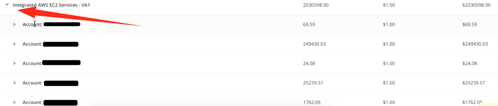

{{{
"title": "Cloud Platform - Release Notes: January 2, 2018",
"date": "01-02-2018",
"author": "Mahima Kumar",
"attachments": [],
"contentIsHTML": false
}}}

### New Features (2)

##### Cloud Application Manager

###### Billing History

__Invoice Detail Reporting for Optimization and Analytics__

Cloud Application Manager Organization Administrators can navigate to the billing usage history to get more detail about what they were charged for optimized AWS or Azure provides. By clicking the drop-down for the Optimization SKUs, it will explain how each AWS account or Azure subscription contributed to that SKU's total. In addition, those charges can be further broken out by Service and Region. (Screenshots below)

###### Application Lifecycle Management

__Public Boxes__

Users can now send a request to publish a box version that he or she owns to make it public for any other Cloud Application Manager user to consume through the Boxes Catalog. The box requested to be made public will pass through an approval process in order to review that the box is well designed and it does not contain any malicious script, and the review result will be informed to the box owner who requested to publish it. If the review is passed, the box version will be made public and available through the Boxes Catalog. The published box in the Boxes Catalog will provide Box public variables and would allow anyone to deploy the box and change the values of any public variable when deploying.

### Enhancements (1)

##### Cloud Application Manager

###### Application Lifecycle Management

Instances List now also shows the instance IP adresses (either public or private) in the instances list, as well as the Support ID if present, to better find this important information of each instance at a glance in the list view, not having to get into the details view of each instance to find it, where it was already available.

### Announcements (1)

##### SafeHaven 5.0.0 - Technical Release

###### SafeHaven 5.0.0 Release Notes

- SafeHaven Version: 5.0.0
- Release Date: December 29, 2017
- Release Notes Link: [SafeHaven 5.0.0 Release Notes](../../Disaster Recovery/SafeHaven 5 General/SafeHaven5.0.0-Release-Notes.md)

##### New Use Case: Use of Amazon Web Services(AWS) as a Disaster Recovery Datacenter

One of the major feature's of this release is the capability to protect production servers on **multiple hypervisors** to failover to **AWS**. Examples of validated hypervisors are

* VMware: including VMware based cloud platforms such as CLC, CenturyLink Private Cloud on VMware Cloud Foundation, etc.
* Hyper-V Generation 1
* Xen(AWS)
* KVM
* Physical servers: all the available baremetal servers provided by CLC have been validated

**NOTE**: Please refer to [SafeHaven-5.0-Use-Case-and-Support-Matrix](../../Disaster Recovery/SafeHaven 5 General/SafeHaven-5.0-Use-Case-and-Support-Matrix.md) for more information on all the use cases and support matrix.

##### Microsoft Virtual Shadow Copy (VSS) Enabled Checkpoints

Another major feature is the introduction of Microsoft Virtual Shadow Copy (VSS) enabled checkpoint for single Windows server protection groups.

**NOTE**:This feature is available for both recovery into AWS as well as CenturyLink Cloud(CLC).

##### Built-in network isolation capability via GUI

Introduction of the built-in network isolation capability via GUI for recovery servers running on the same subnet as the recovery SRN.

**NOTE**:This feature is ONLY available for use cases with recovery into CenturyLink Cloud(CLC).
