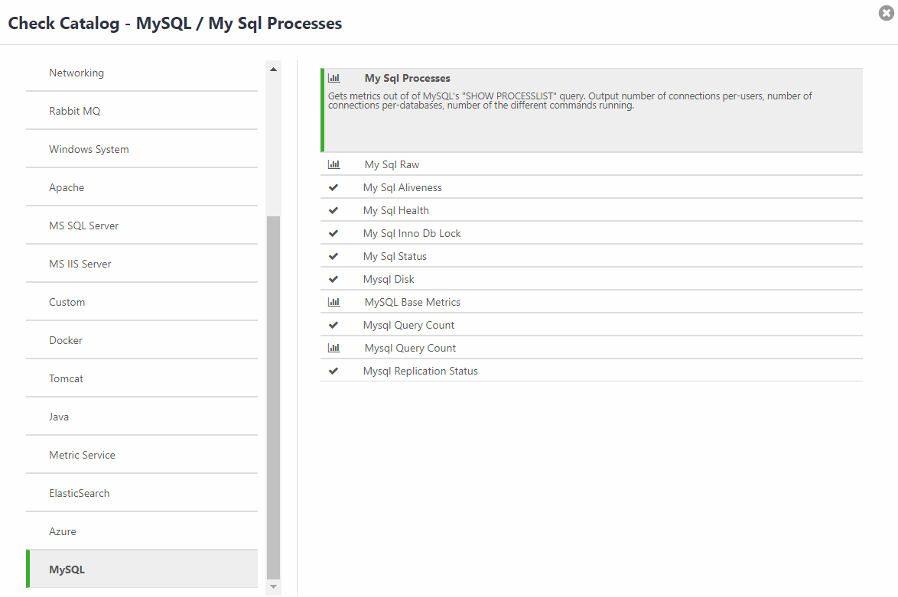

{{{
"title": "Cloud Platform - Release Notes: January 30, 2018",
"date": "01-30-2018",
"author": "Ranga Chakravarthula",
"attachments": [],
"contentIsHTML": false
}}}

### New Features (2)

##### Cloud Application Manager

###### Application Lifecycle Management

Application Lifecycle Management module now adds the support to use AWS Application Load Balancers (ALBs) *and Network Load Balancers (NLB)* by selecting any defined target groups associated with them into the Deployment Policy “Load Balancing - Target Groups” new section. Existing “Load Balancing” has been also renamed to “Classic Load Balancing”, and its functionality remains unchanged. The user will see new configuration details for this section in the Deployment Policy “Code” section, and in any instance that is deployed using such policy. The deployed instance will also show in the “Endpoints” tab a new entry corresponding to the ALB address, if available.

###### Monitoring

Cloud Application Manager Monitoring now has the ability to monitor MySQL checks. By clicking the Policies tab and then Check Catalog, you will see the addition of MySQL. There are also definitions that will explain each check type. The image below shows the checks available in our Check Catalog.

### Enhancements (1)

###### Relational DB - Selectable Backup locations

The Relational DB (DBaaS) team has enable the ability to select diverse regional locations in order to address data sovereignty concerns specifically in our European market(s). Additionally, we have enriched our backup automation by increasing speed and building resilience to Network Partitions.

### Announcements (2)

##### CLC OS Availability

The following OS versions are no longer available for new VMs in the Control Portal:

* CentOS 5
* Ubuntu 12

##### Relational DB now Available in Germany

Relational DB is now available in DE1 and DE3 Datacenters.

### Bug Fixes (1)

##### DCC General Bug Fixes

* Fixed CPU metrics calculations for Linux Virtual Machines.
* Fixed issue with Clone Virtual Machine behavior when a Virtual Machine is locked.
* Fixed Deploy Image and return single billing site for Deploy Image bug.
* Fixed Populate Utility or Unified billingsite based on cluster selection.
* Billing Site Authorization and Validation fix.