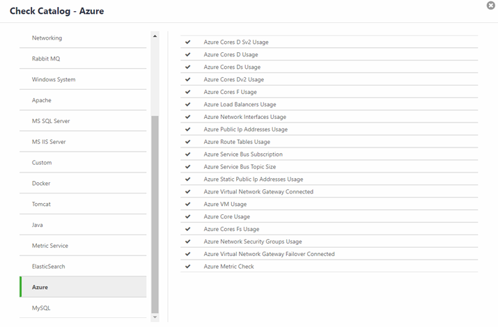

{{{
"title": "Cloud Platform - Release Notes: February 27, 2018",
"date": "02-27-2018",
"author": "Guillermo Sanchez",
"attachments": [],
"contentIsHTML": false
}}}

### New Features (5)

##### Cloud Application Manager

###### Billing

On the March 1 invoice, Cloud Application Manager will reveal per-provider billing. On the invoice, charges related to Application Lifecycle Management, Managed Services, and Optimized Azure and AWS will be broken out by the CAM Provider instead of an aggregated, view. For Managed Services Anywhere, reviewers of invoices will be able to associate ALM instances described on the invoice to the CAM providers.

###### Application Lifecycle Management

Going forward when a DCC or VMware vCloud provider type is configured, Cloud Application Manager will auto-discover existing instances in DCC as well as VMware vCloud based environments. With this additions, the discovery feature of existing instances is now available for any CLC, AWS, Azure, DCC, DCC-F and VMWare vCloud configured provider.

Consolidated Account activity:

Until now Cloud Application Manager users were able to see instance activity in the instance details page and once the instance was terminated, access to the activity log was also lost. Based on our customer feedback, we have now introduced a single place to show all the user and instance activity. Users can now access the "**Activity**" Section from the left menu. Activity will show all the user and instance activity with an option to Search or filter by Scope (Organization, Cost Center and Workspace) or filter by Type of activity (Provider, Box, Instance, Catalog, Settings, User). Users can also navigate to the resource (instance, box or provider) from the activity log when accessible. This will help customers meet their compliance and audit requirements to provide a history of actions performed by their team within Cloud Application Manager.

###### Cloud Optimization and Analytics

For Optimization customers, per-provider billing means the user can review charges by Account (AWS) or Subscription (Azure). The invoice will show an Account Alias. This Account Alias tag can be cross-referenced with your list of providers in Cloud Application Manager. Future phases will include more detail related to the account on the invoice.

Cloud Application Manager's detailed billing report's account breakout  will present the associated provider name and account alias next to the Account ID or Subscription ID. https://www.ctl.io/knowledge-base/cloud-application-manager/cloud-optimization/partner-cloud-integration-detailed-billing-report

###### Monitoring

Microsoft Azure Checks:

Cloud Application Manager Monitoring now allows for Microsoft Azure checks.  These checks will provide base-level infrastructure metrics and logs for Azure services. 
 
The checks live on the Policies tab (Check Catalog) in Cloud Application Management Monitoring site.  Please see the attached image.

Context Switching:

Cloud Application Manager Monitoring now has context switching that includes access to workspaces for federated Organization and Cost Center Admins to fit the Cloud Application Manager federation model.  Now you will see not only the Workspaces of which you are a member but also Workspaces you have access to through federated resource sharing.

Product tips:
* The workspace list is sorted alphabetically, but still can be quite large at times.  Searching for the desired workspace with Ctrl-F can save time.

##### Object Storage

CenturyLink Cloud's Object Storage service allows administrators to manage users on the storage level. These users are not the same as users in the Control Portal account, and through the S3 protocol, they may be granted limited access to buckets and objects.

Users may be disabled and re-enabled. It is not currently possible to delete users. When a user is disabled, buckets and objects owned by that user will become inaccessible.

See here for more details: https://www.ctl.io/knowledge-base/object-storage/object-storage-user-management/#disable-a-storage-user

### Announcements (2)

##### Dedicated Cloud Compute (DCC) OS Availability

Windows Server 2003 is no longer available for new VMs (guests) in the DCC UI and SavvisStation Portal.

##### AWS Operational Notification for SQS

From AWS:

We will be updating the certificate authority (CA) for the certificates used by Amazon Simple Queue Service domain(s), between March 5, 2018 to March 30, 2018. After completing the updates, the SSL/TLS certificates used by Amazon SQS will be issued by Amazon Trust Services (ATS), the same certificate authority (CA) used by AWS Certificate Manager. The update means that customers accessing AWS SQS endpoints via HTTPS whether through browsers or programmatically, will need to update the trusted CA list on their client machines if they do not already support any of the following CAs:
- "Amazon Root CA 1"
- "Starfield Services Root Certificate Authority - G2"
- "Starfield Class 2 Certification Authority"

This upgrade notice covers the following endpoints:
- sqs.us-east-1.amazonaws.com [queue.amazonaws.com]
- sqs.us-east-2.amazonaws.com
- sqs.us-west-1.amazonaws.com
- sqs.us-west-2.amazonaws.com
- sqs.ap-south-1.amazonaws.com
- sqs.ap-northeast-2.amazonaws.com
- sqs.ap-southeast-1.amazonaws.com
- sqs.ap-southeast-2.amazonaws.com
- sqs.ap-northeast-1.amazonaws.com
- sqs.ca-central-1.amazonaws.com
- sqs.eu-central-1.amazonaws.com
- sqs.eu-west-1.amazonaws.com
- sqs.eu-west-2.amazonaws.com
- sqs.sa-east-1.amazonaws.com

If your clients already trust at least one of the above three CAs then they will trust our certificates and no action is required. However, if you do not already trust any of the above CAs and do not add them to your trusted CA list by 05 March 2018, HTTPS connections to the Amazon SQS APIs will not be established. For more information about this AWS update, please visit this blog post: https://aws.amazon.com/blogs/security/how-to-prepare-for-aws-move-to-its-own-certificate-authority/

For information on the Amazon root CA see: https://www.amazontrust.com/repository/

    Operating Systems With ATS Support
    Microsoft Windows versions that have January 2005 or later updates installed, Windows Vista, Windows 7, Windows Server 2008, and newer versions
    Mac OS X 10.4 with Java for Mac OS X 10.4 Release 5, Mac OS X 10.5 and newer versions
    Red Hat Enterprise Linux 5 (March 2007), Linux 6, and Linux 7 and CentOS 5, CentOS 6, and CentOS 7
    Ubuntu 8.10
    Debian 5.0
    Amazon Linux (all versions)

    Java 1.4.2_12, Java 5 update 2, and all newer versions, including Java 6, Java 7, and Java 8

    Updating your Client Browser
    You can update the certificate bundle in your browser simply by updating your browser. Instructions for the most common browsers can be found on the browsers websites:

    Chrome: https://support.google.com/chrome/answer/95414?hl=en
    FireFox: https://support.mozilla.org/en-US/kb/update-firefox-latest-version
    Safari: https://support.apple.com/en-us/HT204416

    Microsoft Internet Explorer: http://windows.microsoft.com/en-us/internet-explorer/which-version-am-i-using#ie=other - Certificate bundles for Internet Explorer are managed by the Windows OS, so ensure that you update the OS as well.

    Testing Your Programmatic Access To SQS
    If you access Amazon SQS programmatically, you will need to write a test that performs an HTTPS GET to https://aws.amazon.com and validate that the TLS handshake succeeds.

Most AWS SDKs and CLIs are not impacted by the transition to the Amazon Trust Services CA. If you are using a version of the Python AWS SDK or CLI released before October 29, 2013, you must upgrade. The .NET, Java, PHP, Go, JavaScript, and C++ SDKs and CLIs do not bundle any certificates, so their certificates come from the underlying operating system. The Ruby SDK has included at least one of the required CAs since June 10, 2015. Before that date, the Ruby V2 SDK did not bundle certificates.

You can test your changes against the SQS Paris region (https://sqs.eu-west-3.amazonaws.com) which used Amazon Trust Services (ATS) since it was launched on December 18, 2017.

    Manually Updating Your Certificate Bundle
    If you cannot access https://aws.amazon.com and you need to update your certificate bundle, then you can do so by importing at least one of the required CAs. They can be found here https://www.amazontrust.com/repository/ . Instructions for importing a root CA certificate into your certificate bundle will vary so please consult the documentation that came with your software.

