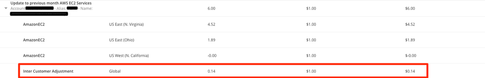

{{{
"title": "Cloud Platform - Release Notes: May 7, 2018",
<<<<<<< HEAD
<<<<<<< HEAD
<<<<<<< HEAD
"date": "05-07-2018",
=======
"date": "02-27-2018",
>>>>>>> release-notes-050718
"author": "David O'Brien",
=======
"date": "05-08-2018",
"author": "Thomas Broadwell",
>>>>>>> upstream/master
=======
"date": "05-07-2018",
"author": "David O'Brien",
>>>>>>> upstream/master
"attachments": [],
"contentIsHTML": false
}}}

### Enhancements (1)

#### Cloud Application Manager

##### Managed Services Anywhere

We are excited to launch a few major enhancements to our Managed Services Anywhere product. As you are aware we launched our initial set of Managed Services on AWS in February of 2017 and expanded to Azure in April of 2017. We are now announcing additional enhancements to our Managed Services Offering.

###### Supported Platforms

Besides AWS and Azure, we are now expanding our supported platforms to include CenturyLink Private Cloud on VMware Cloud Foundation. Users of CenturyLink Private Cloud on VMware Cloud Foundation can now signup for Cloud Application Manager and enable Managed Services and get the same features that they would get on AWS & Azure.

###### Improved set of fully supported services:

Our initial Managed Services offering included Managed Operating System of Microsoft Windows and RedHat Enterprise Linux flavors. Our expanded set of services now include:

A) Managed Operating System of Microsoft Windows and RedHat Enterprise Linux

B) Managed Applications (Microsoft SQL Server, Microsoft IIS Web Server, Oracle MySQL Enterprise Edition, Apache Web Server, Apache Tomcat)

C) AWS Services (Amazon EC2, VPC, Relational Database Services, EBS, S3, ELB, Route 53, ElastiCache, CloudFront, Management Tools, Cloud Formation, Direct Connect, Cloud Watch, Cloud Trail, Trusted Advisor, Cert Manager, Organizations, Auto Scale, Directory Services, IAM)

D) Azure Services (Virtual Machines, Virtual Network, VPN Gateway, Security Groups, ExpressRoute, IP Addresses, Blob Storage, Queue Storage, Disk Storage

E) CenturyLink Private Cloud on VMware Cloud Foundation Edge Gateway & VMware vCloud Director service features

###### Service enablement
Going forward customers can enable Managed Services by "Provider" instead of enabling by instance. Provider is a representation of an Account in the downstream cloud platform. Once Managed Services are enabled on a Provider, CenturyLink will provide full support on the services listed above.

###### Billing
Going forward Managed Services charge is calculated based on the spend of the Provider on which it is enabled unlike the per instance/per hour model. Managed Services are charged on a graduated spend.

Platform Support is not charged for the provider(s) where MSA is enabled.

Find out more about the updates to Managed Services Anywhere in https://www.ctl.io/cloud-application-manager/managed-services-anywhere/ and [the FAQ](https://www.ctl.io/knowledge-base/cloud-application-manager/faq/)

##### Cloud Optimization and Analytics

A new Usage History Enhancement details how CenturyLink safeguards customer accounts so they are billed fairly.  If a Reserved instance is purchased in one account and assigned by Amazon Web Services to a different account, CenturyLink will perform inter-customer adjustments. The RI-purchasing account will be credited and the RI-consuming account will be debited (see image below).

More details: [Partner Cloud Integration: Detailed Billing Report](https://www.ctl.io/knowledge-base/cloud-application-manager/cloud-optimization/partner-cloud-integration-detailed-billing-report/)

### Bug Fixes (1)

##### Cloud Application Manager

Issue preventing optimized AWS account notifications from being reviewed by Cloud Application Manager development team has been resolved.
