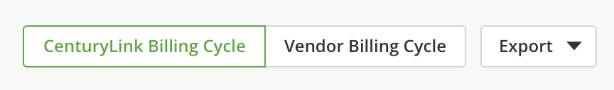
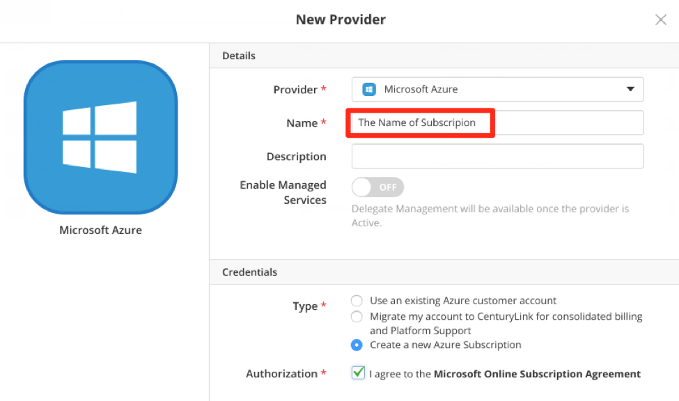

{{{
"title": "Cloud Platform - Release Notes: May 22, 2018",
"date": "05-22-2018",
"author": "Mathew Arackal",
"attachments": [],
"contentIsHTML": false
}}}

### Enhancements (7)

#### Cloud Application Manager

##### Cloud Optimization

###### Optimized AWS in Latin America

Cloud Application Manager now supports optimized AWS accounts from the following Latin American countries: Argentina, Brazil, Chile, Colombia, Ecuador, and Peru. Any customer with a legal and billing address in those countries can now migrate an existing account or create a new account to be optimized by Lumen for consolidated billing and platform support.

###### Usage History Updates

A new Usage History Enhancement fulfills the need to reconcile the Lumen billing cycle with our vendor billing cycles. (See notes regarding [Usage History](https://www.ctl.io/knowledge-base/cloud-application-manager/cloud-optimization/partner-cloud-integration-detailed-billing-report/) and [Reconciliation Usage](https://www.ctl.io/knowledge-base/cloud-application-manager/cloud-optimization/partner-cloud-integration-consolidated-billing/).)  On the 10th of every month, Lumen will make a final assessment of the differences between what we put on your last invoice and what our vendor charged us. With that final sliver of data, we can also make a "Vendor Billing Cycle" button appear in Cloud Application Manager's Usage History. When you click it, the data will align with the Vendor's billing cycle. Any line items that start with "Post-Bill Update" have not appeared on a Lumen invoice for that month. You will never see "Post Bill Updates" on an invoice. They are only presented in the Cloud Application Manager Usage History. But those same charges will appear as "Update to previous month…" on the next month's invoice.

Example: A customer thinks they may have $5 of EC2 usage from January. On February 1 they receive a Lumen invoice totaling $4 from Lumen: $3 of usage on a EC2 for January usage and a $1 charge from December usage called "Update to Previous Month's EC2 Services." There is no "Vendor Billing Cycle" Button yet available. On February 10, the customer sees the button in Cloud Application Manager. When they click it, they see the same $3 of usage on a EC2 for January usage plus the $2 Post-Bill Update to EC2 Services.

###### Microsoft Azure Subscription Update

All new, Optimized Azure providers will be given a name that is more closely associated with the Cloud Application Manager provider. The Azure Subscriptions will have the &lt;Provider Name&gt; (&lt;alias&gt;) format. The Provider Name will be what you enter into the Name field. The alias is a short, unique code, created at the time you launch the provider.  

The experience for gaining access to new Azure subscriptions has been simplified. The Azure credentials which are first given to the admin user of an Optimized, Azure account should automatically allow the customer to see and use the subscription with the Owner role when they log into the Azure Portal and manipulate resources. If that Cloud Application Manager user also launches other Azure providers, their existing Azure user will also get the Owner role on the new subscriptions. A new Azure user will not be created.

###### AWS and Azure Provider Updates

Cloud Application Manager now provides a detailed view of the provisioning process for new AWS and Azure provides. The provider details page will display a status bar showing the provisioning process statuses, and a more detailed activity log to inform about all the actions being performed during the provisioning process so the user has a better understanding of what is being done, and be able to track the progress. These log updates also provide links to associated KB articles for more information.

###### Application Lifecycle Management

Application Lifecycle Manager now supports a new type of variable called "Task Variables". These variables allows users execute a code script and have it associated with a lifecycle event so that the script is executed at that event. The two lifecycle events where code execution can be done are "Deploy" and "Remove".  The execution of the code script is performed outside the virtual machine instance that the task variable is associated with, in a controlled environment, so they can be used for initialization or finalization tasks, right after the instance is being provisioned or just when the instance has been finalized, respectively.

This new type of variables is only available in public boxes, the ones available through the catalog, so any user who wants to use this new feature should submit a request to publish the box with the task variables, and if the box is published it would be available for all Cloud Application Manager users. For more information, see: [Running Code outside an Instance with Task Variables](https://www.ctl.io/knowledge-base/cloud-application-manager/automating-deployments/running-code-outside-an-instance/).

#### Platform

##### Authentication Updates

Cloud Application Manager now supports Lumen Cloud as a new authentication option. Existing users of Lumen Cloud can now use their Lumen Cloud credentials to log on to Cloud Application Manager if Lumen Cloud has been enabled as one of the authentication options by the Organization Administrator.

Organization Administrators can enable Lumen Cloud as one of the authentication options from the Settings page and need to send invites to users for them to link their Lumen Cloud account with Cloud Application Manager. There is a one-time association step that  users need to do in order to continue to use Lumen Cloud credentials to log on to Cloud Application Manager.

##### Performance Updates

Cloud Application Manager has been enhanced with performance improvements to the Workspace Switcher. When a user expands the dropdown to select an Organization, Cost Center or Workspace, the details are loaded on-demand based on user selection. This reduces the content and time that needs to be loaded upfront, thus providing a greater user experience with shorter load times when using the Workspace switcher.

### Ecosystem-Partner Integrations (5)

**SearchStax Solr Service** helps companies host, deploy, and administer their Solr-based search solutions in the cloud. **SearchStax** is a managed Solr-as-a-Service that provides automated scaling, backups, disaster recovery, 24/7 monitoring and alerting, comprehensive analytics, and administrative tools.

**KEMP LoadMaster** is an Application Delivery Controller (ADC) that enables scalable and highly available application deployments with a variety of scheduling methods, application level health checking, intelligent content switching, SSL/TLS acceleration, single sign-on (SSO) authentication, and advanced security features.

**KEMP 360 Central** provides a single point of control for organizations that are transitioning to the cloud or migrating from legacy ADC hardware to virtualized or cloud-based solutions. **KEMP 360 Central** manages multiple Application Delivery Controller (ADC) instances across multiple environments &mdash; either on-premise or public cloud.

**SUREedge Office 365 Mailbox Protection** from SureLine provides mailbox backup and long-term protection for as many mailboxes as you want. Restore individual messages or entire mailboxes &mdash; to the same Office 365 account or another &mdash; to ensure compliance and/or legal hold requirements.

**VoiceXP SaaS** from VoiceXP is a hosted voice assistant on either Amazon Alexa or Google Assistant Voice. To add your information to these platforms, we create an Alexa "app" or Google Assistant "skill&#92;action". We collaborate with you to develop conversation guide based on your content, APIs, and media to deliver an amazing voice experience for your customers.

### Announcements (2)

#### Lumen Private Cloud on VMware Cloud Foundation

DCC Foundation has a new name &mdash; Lumen Private Cloud on VMware Cloud Foundation. We will be updating all collateral to reflect this name change.

#### Cloud Application Manager

Please note that the provider type "Lumen" in Cloud Application Manager has been renamed to "Lumen Cloud", to clearly indicate that it represents an account with Lumen Cloud. This also helps users to differentiate "Lumen Cloud" from the other Lumen Provider types like "Lumen DCC" and "Lumen DCC-F".
