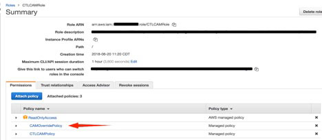
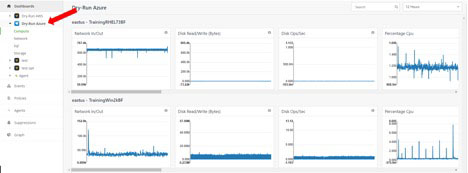

{{{
"title": "Cloud Platform - Release Notes: June 26, 2018",
"date": "06-26-2018",
"author": "Matthew Farrell",
"attachments": [],
"contentIsHTML": false
}}}

### Enhancements (3)

#### [Cloud Application Manager](//www.ctl.io/cloud-application-manager/)

##### Site Update

Cloud Application Manager now includes a new Overview page in the Management site where you can see at a glance the products you have available and the additional products that may enhance your Cloud Management experience through Cloud Application Manager. This new Overview page will be the landing page for all users login to Cloud Application Manager. Also, Applications site has removed some of the menu options that were already available through the Management site, such as Users, Settings and Billing. To access these options you should navigate to Management site to find them at organization scope.

##### Optimized AWS Provider Updates

CAM has made updates to the IAM Roles and Policies of its Optimized hardening process that offer you more security and control.

* Admins: Any admin of an Optimized CAM provider can click the "AWS Console" button to open a window into the console where they inherit a role called the CTLCINTAdminRole. Not only does that user inherit all the permissions and restrictions given to CAM already, but read-only access into everything else. See CAMOverridePolicy below for more information.
* Non-Admins: Any user of CAM who is not the admin but has the optimized provider shared with them can click the "AWS Console" button to open a window into the console where they inherit a read-only role called the CTLCINTReadRole. This ensures the admin can give another user visibility into the AWS Console without accidentally creating a security loophole.
* CenturyLink Operations: Employees of CenturyLink providing platform support to you may also click the AWS Console button and inherit a role into your account called CTLOperationsRole that provides them only read-only access plus the ability to update IAM. While many of our customers want fast support, this gives you the peace of mind that you are compliant with auditors and protect your business applications.
* CAMOverridePolicy: This policy allows AWS users to customize the CTLCAMRole. You may make it more or less permissive. If you have been dissatisfied with permissions given to CAM or by the Optimized CAM Provider's "AWS Console" button, updating the CAMOverridePolicy is your path for making your experience better.

#### Managed Services Anywhere Updates

Microsoft Azure Dashboards now Live!

Cloud Application Manager customers can now see their Azure cloud native monitoring metrics on the new dashboard landing page. Information about their Azure infrastructure and services can be viewed in an easy-to-read dashboard.

Product Highlights include:

* Users will be able to list & switch between their Azure providers within a Workspace.
* Upon selecting a Provider, users will be able to see a subset of their configured Azure services.
* With a single click, each individual metric graph on the dashboard will allow the user to do a deep dive on our more detailed graph page.

#### [Managed Disaster Recovery Services](//www.ctl.io/managed-services/disaster-recovery/)

Managed Disaster Recovery Service now includes an add-on option for Active Directory Replication. DR replication for AD leverages Microsoft Active Directory Replication technology to replicate the primary AD servers into the recovery site and uses SafeHaven technology to protect other business-critical servers.

MDRS monitors the replication process and provide audit and maintenance services. MDRS also provides test and at-time-of-disaster services for AD servers. Customer benefits from the cohesive and thorough protection.

### ANNOUNCEMENTS (1)

#### Public Cloud Infrastructure as a Service

On June 21, CenturyLink Cloud announced the end of availability for the Hyperscale virtual server instance type. For more information, view [this article](//www.ctl.io/knowledge-base/servers/hyperscale-eol-faqs/) on our Knowledge Base.
