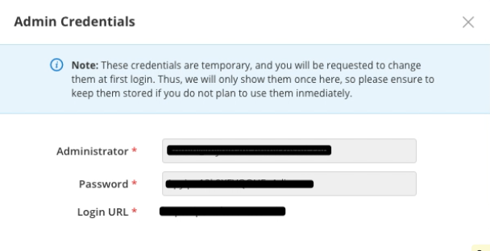

{{{
"title": "Cloud Platform - Release Notes: July 26, 2018",
"date": "07-26-2018",
"author": "David Gardner",
"attachments": [],
"contentIsHTML": false
}}}

### Enhancements (3)

#### [Cloud Application Manager](//www.ctl.io/cloud-application-manager/)

##### Managed Services Anywhere
Several feature enhancements have been made to the CAM Monitoring service including Intelligent Policies, hierarchical organization of policies and UI updates. These enhancements allow the application of policies to workloads dynamically based on meta-data about the workload and inheritance from higher scopes. These feature updates enable policy reuse through inherited defaults and the ability to override settings at any scope level.

Three new concepts have been introduced to facilitate Intelligent Policies: Policy Scope, Policy Inheritance and Policy Filter.

**Policy Scope:** Tiered hierarchy used to classify collections of IT assets
**Policy Inheritance:** Relationship between policies enabling policy composition. This is the mechanism through which checks are augmented, modified or removed within a policy.
**Policy Filter:** Programmatic expression that is evaluated to selectively apply policies within a scope.

The results of Intelligent Policies and the Hierarchical model are:

* Fewer policies are required to to maintain
* Policies organized by functional role
* Agents actively request their own policies
* Asynchronous configuration changes to policies
* Incremental deployments will receive customer overrides

CAM Monitoring has also introduced Dynamic Check Parameters that allow check parameter values to be taken from agent metadata. This allows policy templates to have secret or otherwise unique values associated to them but have the same policy applied to many agents.

##### [Cloud Optimization and Analytics](//www.ctl.io/cloud-application-manager/cloud-optimization/)

For each CAM Customer, Administrators of the first Optimized Azure Subscription will receive Admin credentials and login URL. This can be obtained through the Edit screen of the Optimized Azure provider. The admin user will receive the Owner role for that first subscription and all future subscriptions created via Cloud Application Manager.

#### Platform

##### New Applications Site

We have made changes to the scope of our Management Site. All OF the functionality related to Application Lifecycle Management has been moved to a new site called "Applications." Management functions like managing providers, users, settings and viewing activity logs and billing information remain in the "Management" site. "Applications" will still be the default site that users will land on at log on. They can switch to the Management site to perform any management activities.

This will provide a clear distinction between management activities and application related activities thus allowing the users who are interested in each of those activities to easily navigate and remain within their realm.

### Bug Fixes (2)

* Bug preventing full admin credentials from appearing in the credentials window for new, AWS and Azure providers.
* Bug causing a discrepancy between provider logs and the optimized provider status bar.
