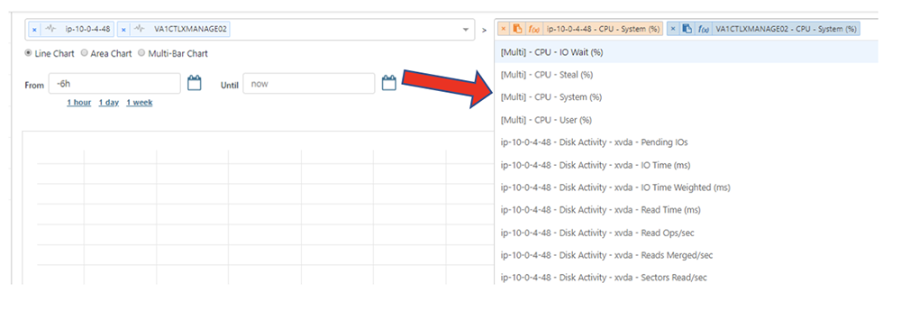

{{{
"title": "Cloud Platform - Release Notes: August 21, 2018",
"date": "08-21-2018",
"author": "Christine Sala",
"attachments": [],
"contentIsHTML": false
}}}

### Enhancements (6)

#### [Cloud Application Manager](//www.ctl.io/cloud-application-manager/)

#### [Application Lifecycle Management](//www.ctl.io/cloud-application-manager/application-lifecycle-management/)

##### ‘Group by Provider’ Instances View

Application Lifecycle Management now offers a Group by Provider view into the instances page, where users can see their providers with the instances deployed into it being shown in a drop-down. The state column in the provider will show a summary of the state of the instances under it: one state if all instances have the same or the icon of each state with the number of instances on it.

#### [Managed Services Anywhere](//www.ctl.io/cloud-application-manager/managed-services-anywhere/)

##### Metric Overlays Across "Producers"

Watcher dashboards now allow you to select multiple producers’ (Watcher agent or Managed Provider) metrics and overlay them in a single graph, allowing you to compare metric data across multiple similar workloads.

When multiple metric producers are selected, the list of collected metrics for all selected producers is deduplicated and grouped according to metric.  This allows for a single selection to populate the graphs with like metrics from all selected producers.

#### [Public Cloud IaaS](//www.ctl.io/product-overview/#)

##### Hyperscale Servers Re-entitled as Standard Servers

All instances of Hyperscale servers are re-entitled as standard compute instances. While these instances will still be hosted on our Hyperscale platform before the August 21st End of life, they will now be billed using our standard compute pricing.

On June 20th, CenturyLink Cloud announced the end of life for our Hyperscale server instances. Read more at this [Knowledge Base article](../../../servers/hyperscale-eol-faqs.md).

##### Site Redirect

We have refreshed our Site Redirect service and updated the underlying infrastructure. There will be no change in functionality, but stability and performance will improve.

##### "Submit Feedback" Feature Update

We have updated our "Submit Feedback" feature in the Control Portal menu to use our [new feedback submission form](https://managedsupport.ctl.io/msp/feedback). Now, your feedback will be received directly by our product team instead of a third-party service.

##### Improved Resiliency of Job Queue

We have added resiliency features and enhanced the monitoring for our job queue. Customers should see fewer instances of failed jobs.

### Announcements (1)

#### CenturyLink Private Cloud on VMware Cloud Foundation

We've completed the rebranding work of our new private cloud offering from DCC Foundation to CenturyLink Private Cloud on VMware Cloud Foundation.

### Bug Fixes (1)

#### Public Cloud IaaS

Fixed an issue where scheduled tasks did not expire as expected based on a user-configured end date.
