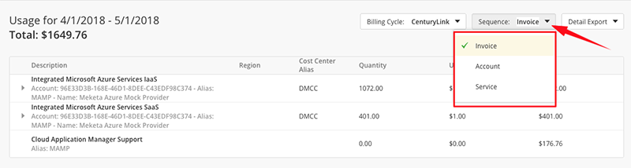
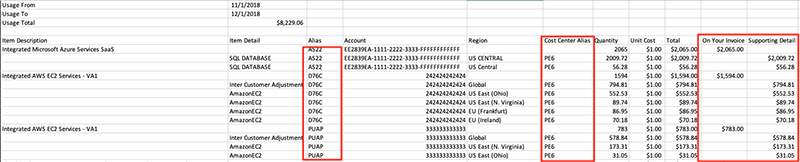

{{{
"title": "Cloud Platform - Release Notes: January 8, 2019",
"date": "01-08-2019",
"author": "Craig Wedbush",
"attachments": [],
"contentIsHTML": false
}}}

### Enhancements (9)

#### [Cloud Application Manager](https://www.ctl.io/cloud-application-manager/)

##### Usage History Improvements

Within the Management Site, Usage History now includes several enhancements to help explain invoices from Lumen and charges from the vendor.

Information regarding discounted line items and Managed Services are now shown. This allows you to gain a much more holistic explanation of your invoice, rather than just providing information about charges related to Optimized Accounts and CAM Support.

Users may adjust the sequencing of line items to accelerate invoice validation and approval. Three groupings are available: Invoice, Account, and Service. "Invoice" sequences the line items similar to how it is laid out on your Lumen Invoice. "Account" groups charges, account by account, regardless of service or invoice. "Service" groups charges by the type of service, regardless of service or invoice.

The CSV Export of the Usage History has been updated to include more detail to allow you to sort data quickly. The "Alias" and "Accounts" columns now include data for the supporting detail line items. A new column has been added that includes cost center data to allow users to understand usage associated with that scope. "On Your Invoice" and "Supporting Detail" columns have also been added to help you quickly understand the distinction between lines we serve to you.

##### New Autodiscovery Badge for Providers with Automatic Discovery of Resources Enabled

Cloud Application Manager now tags providers that have automatic discovery of resources enabled with a new badge "Autodiscovery" so the user can identify at a glance the providers that have this feature enabled, both in the Providers List view and in the Provider Details view. Remember that this feature enables automatic periodic synchronization of unregistered resources in the providers that are either managed or optimized by Lumen.

#### [Analytics](https://www.ctl.io/cloud-application-manager/cloud-optimization/)

##### Analytics Available for Any Type of AWS or Azure Provider

For AWS providers, Lumen now extends our Analytics offering to unmanaged, unhardened providers. This feature had previously only been available for providers where customers had selected Optimization or Managed Services Anywhere. On these "Bring Your Own Cloud" providers, administrators will see an "Analytics" option, capable of activating Analytics capabilities before or after a provider has been launched. When activated, Lumen will read your Provider's charges in our calculation of Platform Advisory Support. A CAM administrator has access to pricing details in the Management Site of CAM.

#### [Application Lifecycle Management](https://www.ctl.io/cloud-application-manager/application-lifecycle-management/)

##### Autoregister CloudFormation VM Resources in Managed Providers

Application Lifecycle Management recently included the ability to register virtual machine instances that were deployed by a CloudFormation template box from Cloud Application Manager. It now includes auto-registering of those instances whenever the template box is deployed in a managed provider. This allows compute instances included into the template box to be automatically registered in Cloud Application Manager and the Make Managed process to be executed on them.

##### Group Instances with Unaccessible Providers in Instances Provider View

Application Lifecycle Management now displays under an "Other providers" group the instances that belong to a provider that the user has no access to in the providers list view of the instances page. A user can share an instance with another user, without sharing the provider where that instance is hosted, so that the target user only has visibility of the instance itself, without knowing any details about the provider. The Providers View on the Instances page groups instances by the provider to which they belong, and now groups instances without a known provider under the new "Other providers" group.

##### New CloudFormation Types Supported

Application Lifecycle Management now supports additional CloudFormation types to be used in CloudFormation template boxes. These additional types are: "AWS::IoTAnalytics::Channel", "AWS::IoTAnalytics::Dataset", "AWS::IoTAnalytics::Datastore", "AWS::IoTAnalytics::Pipeline" and "AWS::AmazonMQ::ConfigurationAssociation". The user can now use these new resource types in the template definition of any CloudFormation template box or update the template file of any existing template instance and reconfigure it to use the new resource types.

##### Support for Custom Machine Images on Azure Providers

Application Lifecycle Management now supports the addition of custom machine images into an Azure provider, in addition to the existing support for adding public images. When you click the New button of the Configuration tab in an Azure provider details page, you will select if you want to add a Public or Custom machine image. By selecting Custom you will have the ability to select one of the custom images available in the Azure account, so you will have the option to choose it in a deployment policy box using the same provider.

##### Changed Default View to 'Registered' on Instances Page

Application Lifecycle Management has changed its default view on the Instances page to the "Registered" view instead of the "All" view, providing direct access to instances that the user has available to interact and perform lifecycle on. This also provides faster load times for the Instances page in scopes where there are a lot of unregistered resources.

#### [Simple Backup WebHooks](https://www.ctl.io/simple-backup-service/)

##### Webhook Notifications Added

We are pleased to announce an enhancement to the monitoring functionality of our Simple Backup Service. Webhook notifications have been added to send notifications for failed, partial success, missed or successful backups. Webhook functionality allows users to subscribe their own endpoints to receive real time notification of the statuses of their backups. Please see [Simple Backup Webhooks](https://www.ctl.io/knowledge-base/backup/webhooks/) and [Simple Backup Monitoring](https://www.ctl.io/knowledge-base/backup/sbs-monitoring/) in our knowledge base for more information on our monitoring features.
