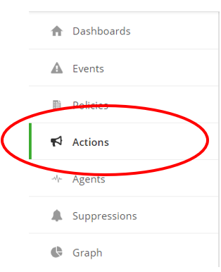
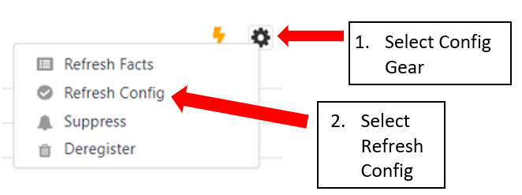

{{{
"title": "Cloud Platform - Release Notes: February 5, 2019",
"date": "02-05-2019",
"author": "Benjamin Swoboda",
"attachments": [],
"contentIsHTML": false
}}}

### Enhancements (10)

#### [Cloud Application Manager](https://www.ctl.io/cloud-application-manager/)

## [Cloud Application Manager Platform](https://www.ctl.io/cloud-application-manager/)

#### [Cost Center Admin Access](../../Cloud Application Manager/Administering Your Organization/admin-overview.md)
The Management Site and Billing Tab are accessible to Cost Center administrators, but only their scope of provider data is viewable in Dashboard, Pricing, and Usage History.

#### [Usage History Update](../../Cloud Application Manager/Cloud Optimization/partner-cloud-integration-detailed-billing-report.md)
Within a single month's detail billing, now you will find the ability to export even more detail regarding the behavior of AWS Reserved Instance discounts in your accounts. Behavior is consistent with the [AWS Reserved Instance Strategy](../../Cloud Application Manager/Cloud Optimization/partner-cloud-integration-aws-ri.md).

## [Managed Services Anywhere](https://www.ctl.io/cloud-application-manager/managed-services-anywhere/)

#### Actions
We are pleased to announce the release of Actions into the Cloud Application Manager [Monitoring Site](https://www.ctl.io/knowledge-base/cloud-application-manager/monitoring/#1). This feature will allow for various Actions to be executed in response to monitoring events that occur within your infrastructure.  Actions can be applied at all scope levels: Organization, Cost Center, Workspace, Provider and an individual agent.  

#### Existing Action types:
**Netcool** – will send the details of an Alert to Netcool for WebTop display
**Slack** - will send the details of an Alert to a channel within a Slack Instance
**WebHook** – will send details of an Alert to a configured WebHook

New deployments of instances on Managed Services Anywhere enabled providers will have the Actions enabled Watcher agent deployed.  For those instances that were deployed prior to 2/1/2019, a Watcher agent refresh is required to take advantage of the Actions feature.

#### Coming Soon:
- **AWS Simple Email Service (SES) Action Type** – This action type can generate an email via a configured AWS SES instance when triggered by an event.  
- **Additional features to actions** - allow finer grain control of actions to associate to specific events.  This would allow for actions to initiate auto-remediation in response to events.

## [Analytics](https://www.ctl.io/knowledge-base/cloud-application-manager/analytics/#1)

Going forward, when Analytics is configured for accounts in all applicable use cases (Optimization; Managed Services; and Analytics-only), an Analytics label will appear in Provider Lists and in within the Provider screen itself. 

## [Application Lifecycle Management](https://www.ctl.io/cloud-application-manager/application-lifecycle-management/)

#### Register an Azure Scale Set as a single instance

Application Lifecycle Management now provides the ability to import Azure Scale Sets as a single instance. The instances belonging to the Scale Set will be shown grouped under the Import Instances page in Cloud Application Manager, and they will be imported as a whole into a single instance, that will contain all the associated machines. Once registered (either providing the certificate for Cloud Application Manager to access the machines and after installing the agent, or installing the agent manually), all the machine id's will be shown on the instance details page of Cloud Application Manager, and all auto-scaling events will be detected. In addition, the instance details will be updated to show the current machines available in the group. If you terminate the instance in Cloud Application Manager, all the machines of the group will be terminated.

#### Notify whether an instance agent has stopped responding

Application Lifecycle Management has added the ability to detect whether an instance agent has stopped responding to mark that instance as 'Not responding' on the Instances page. After a 10 minutes period in which the instance agent has not contacted the Cloud Application Manager backend, the instance will be marked with the new 'Not responding' state. In case the instance has multiple machines and all of them have not contacted back, the instance will be marked as 'Not responding' as well. However, if some of the machines are responding and some others not, the instance will be marked with the 'Unknown' state. In that scenario, you should check the instance logs or the status in the underlying provider console to determine what action is required to fix the instance state.

#### Register a CloudFormation stack as a template instance

Application Lifecycle Management now supports registering an AWS CloudFormation stack as a template instance as a whole. The user will now see the CloudFormation stacks either on the Instances page, All or Unregistered views, or on the Unregistered Instances tab of the provider details page, and will have the option to register it. Once registered, the instance will be shown on the registered instances view as a CloudFormation template instance, and it will display its deployed resources in the Resources tab of the instance details page.

#### New CloudFormation type supported

Application Lifecycle Management now supports an additional CloudFormation type to be used in CloudFormation template boxes. This additional type is: 
"AWS::OpsWorksCM::Server". The user can now use this new resource types in the template definition of any CloudFormation template box or update the template file of any existing template instance adding this type of resource and reconfigure the instance to use it.

