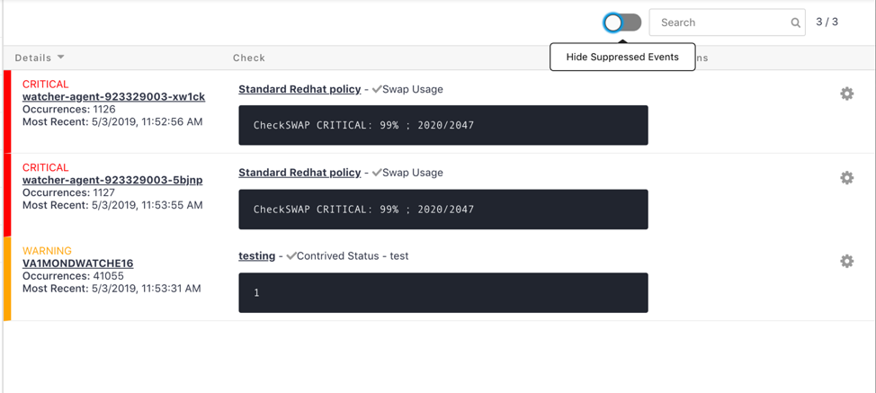
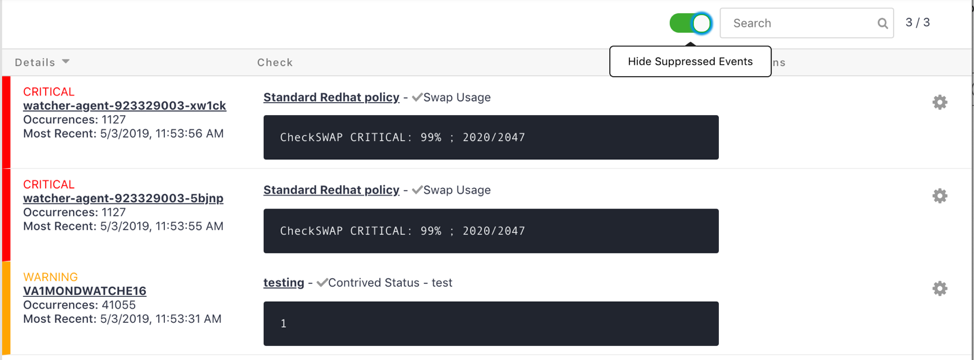
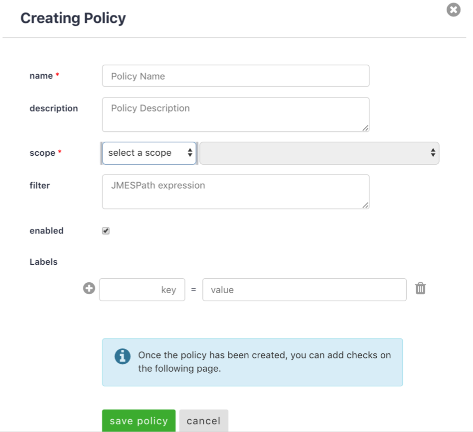
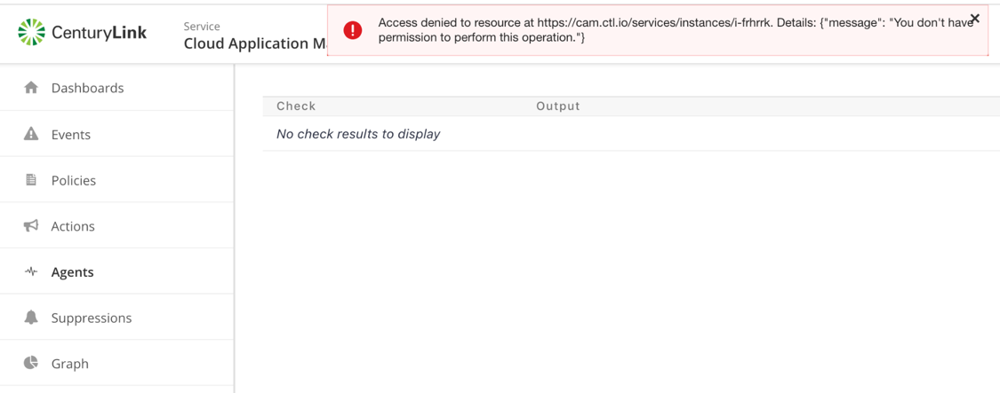

{{{
"title": "Cloud Platform - Release Notes: May 7, 2019",
"date": "05-07-2019",
"author": "Madhavi Pavanraj",
"keywords":["centurylink", "cam", "ams", "msa", "analytics"],
"attachments": [],
"contentIsHTML": false
}}}

### Enhancements (9)

#### [Cloud Application Manager](https://www.ctl.io/cloud-application-manager/)

#### [Application Lifecycle Management](https://www.ctl.io/cloud-application-manager/application-lifecycle-management/)

##### New Azure Government provider type

Cloud Application Manager now supports a new type of provider to manage Azure Government subscriptions. With this new provider type, users can create and manage Azure Government resources in its defined subscription, in the same way, they create and manage resources in a regular Azure subscription. The Azure Government provider type is currently supporting all US Azure Government regions.

##### Support for aborting running event scripts

Application Lifecycle Management now supports to abort running event scripts. When an instance is in "Processing" state and it is executing an event script, a new option "Abort" will appear under the three dots button in the instance details page to allow the user to abort the event script being executed and leave the instance in an unavailable state. This allows the user to recover the control of an instance stuck in a script execution not returning the control to Cloud Application Manager and fix the issue before retrying to run the event script.

##### New option to specify public box visibility

Application Lifecycle Management now includes a new field to specify how the user wants to publish a box. In the request to publish a box dialog, a new field "Visibility Type" was added to specify whether the box should be published as:
1. Open: box will be made public as open-source
2. Execute: box will be made public as execute-only, so it will only be deployable and only public variables will be visible.
3. Closed: box will be used to embed into other boxes as box variables, but event code will be hidden. Only public variables will be visible.

##### New Cloud Formation type supported

Application Lifecycle Management now supports an additional Cloud Formation type to be used in Cloud Formation template boxes. This additional type is:
"AWS::EC2::CapacityReservation". The user can now use this new resource types in the template definition of any Cloud Formation template box or update the template file of any existing template instance adding this type of resource and reconfigure the instance to use it.

##### Support for new Google Cloud Platform region

Application Lifecycle Management now supports a new Google Cloud Platform region: Asia North East 2 (asia-northeast2) and its corresponding zones. Once you synchronize your Google Cloud provider in Cloud Application Manager, you will be able to select in your Deployment Policy boxes the zones corresponding to the new region.

#### [Cloud Optimization](https://www.ctl.io/cloud-application-manager/cloud-optimization/)

##### Optimized AWS in EMEA

The user experience for the Analytics site has been improved for both new and existing customers. At the time your analytics-enabled provider is created  automation will deliver correct Analytics permissions. Your CAM user will inherit those permissions simply by signing into our Analytics site or by clicking the "sync user" button. If you are an existing Analytics user and want to ensure Analytics permissions are correct, first synchronize the provider in the Management site and then navigate to the Analytics site.

#### [Managed Services Anywhere](https://www.ctl.io/cloud-application-manager/managed-services-anywhere/)

##### Hide Suppressed Events Toggle

A new feature has been on the Events Tab that includes a toggle to hide/unhide Events that have been suppressed. Green indicates Suppressed Events have been hidden.

##### Fix to Workspace-Level Scope when adding new Policy or Events

When adding a new Policy or Event, the Scope will no longer pre-populate a Workspace-Level Scope and will be required for the User to select during the creation of the Policy.

##### Access Denied Fixed for Orphaned Watcher Agents

A fix was put in place to remove the error message when attempting to clean up orphaned Watcher Agents.

