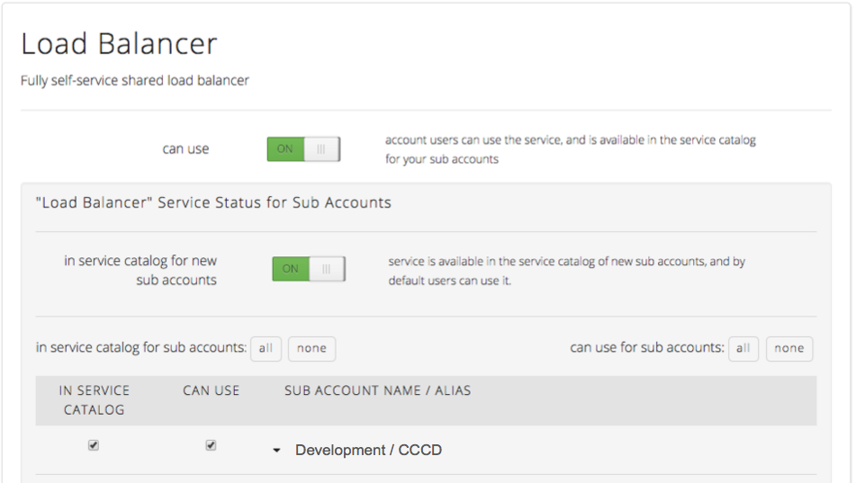
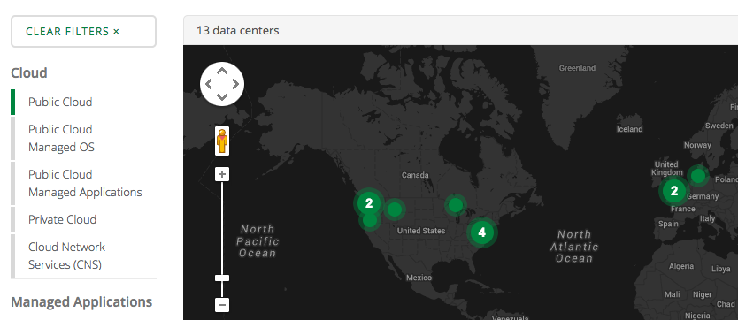
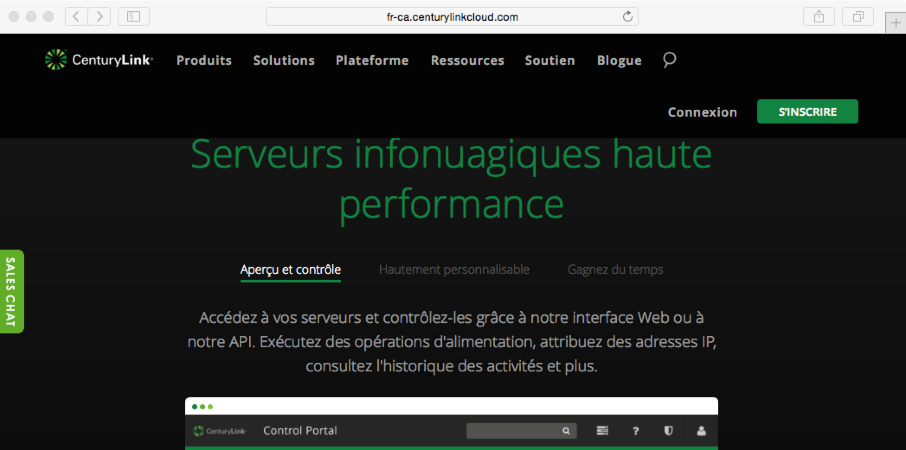
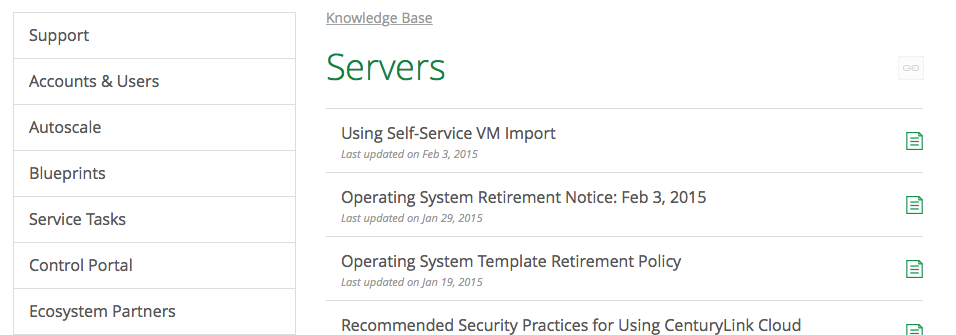

{{{
  "title": "Cloud Platform - Release Notes: March 5, 2015",
  "date": "3-5-2015",
  "author": "Jared Ruckle",
  "attachments": [],
  "contentIsHTML": false
}}}

###New Features (1)

* **Service Catalog.** Selected platform services can now be exposed to chosen subaccounts (as well as child subaccounts). This new capability is ideal for the phased rollout of new features to certain subaccounts. The service catalog currently includes: load balancers, premium backup, and public IP addresses for servers.

###Minor Enhancements (5)</strong>

* **New Domains.** The default CenturyLink Cloud domain as been updated to https://control.ctl.io.  The URL for SAML users has also been updated to https://[accountalias].cloudportal.io (where account alias is your four-letter account identifier). The legacy domains will continue to operate for 90 days.

* **Subdomains featuring Account Alias.** Along with the new domains listed above, custom subdomains based on account alias are now available, in the form of https://[accountalias].cloudportal.io. Use the Site Branding capabilities (under the Account tab) to update logo that appears on the bottom of the page. This furthers the "white label" capabilities of the platform.

* **Support for Custom Price Lists & Displays.** Administrators who want to show a custom price for services in the Control Portal can now do so. Contact CenturyLink Cloud to learn more.

* **Cloud Network Services in DE1.** CenturyLink Cloud deployments in DE1 can now be connected to other environments using Cloud Network Services.  This capability delivers private, secure, and high-speed connectivity between traditional and cloud environments.
* **MS SQL Server 2014.** Deploy MS SQL 2014 Web, Standard & Enterprise Editions on CenturyLink Cloud via Blueprints.  These SQL instances are unmanaged; licensing is handled under CenturyLink's SPLA relationship with Microsoft.

###Online Tools (3)

* **Cloud Cost Estimator now open source.** Understand and model cloud costs in more depth by viewing and modifying the code behind the [CenturyLink Cloud Cost Estimator](http://www.centurylinkcloud.com/estimator). Details are available in this [blog post](http://www.centurylinkcloud.com/blog/post/cloud-services-estimator-now-open-source), and the Github repo can be found [here](http://www.github.com/CenturyLinkCloud/PriceEstimator).
* **Map of CenturyLink data centers and services.** View CenturyLink's portfolio of capabilities by data center using an [interactive map](http://www.centurylinkcloud.com/data-centers) online.  The tool supports multiple layers of filtering, as well as standard online map controls.

* **CenturyLinkCloud.com is now multi-language.** Browse http://www.centurylinkcloud.com in multiple languages, including German, Japanese, English (UK), English (Canada), and Canadian French. To change the language, simply navigate to the bottom right of any page on the site.

* **New Knowledge Base.** The CenturyLink Cloud [Knowledge Base](http://www.centurylinkcloud.com/knowledge-base) has been re-designed to be even easier to use. These enhancements include improved organization, layout, and search capabilities.

###Documentation (1)
* **Expanded API documentation.** New knowledge base articles for CenturyLink Cloud's V2 have been added [here](http://www.centurylinkcloud.com/api-docs/v2/).  New actions covered include [Set Server Disks](http://www.centurylinkcloud.com/api-docs/v2/#servers-set-server-disks), [Set Server CPU/Memory](http://www.centurylinkcloud.com/api-docs/v2/#servers-set-server-cpumemory), and [Set Server Credentials](http://www.centurylinkcloud.com/api-docs/v2/#servers-set-server-credentials), among others.

###Ecosystem - New Blueprints (5)

* **FoundationDB** – Next generation database engine that combines the advantages of modern NoSQL databases with the power and reliability of ACID transactions. [Learn More](../Ecosystem Partners/getting-started-with-foundationdb-blueprint.md)

* **Dynatrace** – Application Performance Monitoring (APM) software for today's most challenging web, cloud, mobile, enterprise and Big Data applications worldwide.
[Learn More](../Ecosystem Partners/getting-started-with-dynatrace-blueprints.md)

* **Datastax** - Enterprise–grade Cassandra solution, enabling customer big data analytics workloads.
[Learn More](../Ecosystem Partners/getting-started-with-datastax-blueprint.md)

* **Acumatica** - Cloud–based accounting and ERP software for the small to midsize business looking to streamline management processes and unlock business potential. [Learn More](../Ecosystem Partners/getting-started-with-acumatica-erp-blueprint.md)

* **Centerity** – Enhanced monitoring solution providing server metrics and a complete business intelligence layer across  server assets in the CenturyLink Cloud. [Learn More](../Ecosystem Partners/getting-started-with-centerity-blueprints.md)
