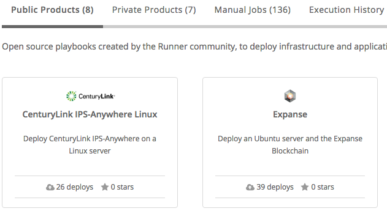
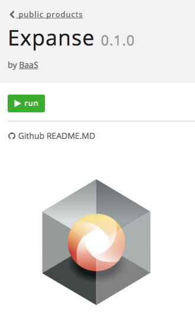
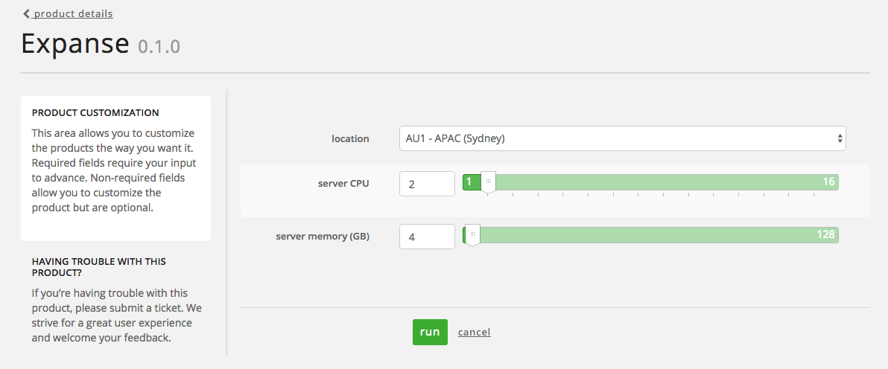

{{{
  "title": "Expanse - Getting Started",
  "date": "05-23-2016",
  "author": "Ryan Todd",
  "attachments": [],
  "contentIsHTML": false,
  "sticky": true
}}}

### Overview of the Expanse Runner job
We currently support with Runner two options for deploying Expanse on a VM to get you up and running quickly.
1. Is an option to build a Ubuntu 14 server in the Data Center of your choice and deploy Expanse upon it in about 6 minutes.
2. Is an option to deploy Expanse to an Ubuntu 14 server that has been put into the CLC inventory and is already stood up.

### Prerequisites
* A CenturyLink Cloud Account
* A network existing in the Datacenter you want to deploy to. Run the network builder Runner job.
* One of the Supported Operating Systems listed below on the Virtual Machine
  Ubuntu 14
  more being added in future

  
### Installation Process

1. Log into **runner.ctl.io**.
2. Search for **Expanse** in the Public Products section then click on it
  
3. Click on run button
  
4. Choose the Datacenter you want to deploy a server to, CPU, and RAM. Recommend 2 CPU and 4 GB RAM
  
5. It is now building your server and after about 8 minutes you should see your servers name at http://stats.expanse.tech/

### Troubleshooting
Sometimes the blockchain does not fully sync at first run and you will need to re-execute the following commands to restart it

1. ssh into your server from a terminal(ex: ssh root@ipaddress)
2. Find the screen session that is running the command currently. screen -ls
3. Attach to that session and kill it. screen -r {{ number of the session }} then ctrl-c
4. Now start the sync again by typing the following. screen -dm bash -c ". /opt/expanse/setup.sh"
5. It should now fully sync up.
