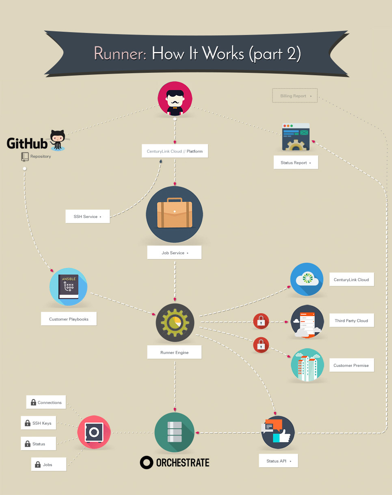

{{{
  "title": "Getting Started with Runner",
  "date": "04-27-2016",
  "author": "Anthony Hakim",
  "attachments": [],
  "related-products" : [],
  "contentIsHTML": false,
  "sticky": true
}}}

### Audience

This article is to support customers of Runner, a product that enables teams, developers, and engineers to quickly provision, interact, and modify their environments anywhere - Lumen Cloud, third-party cloud providers, and on-premises.

### Overview: What is Runner?

Runner is a new product from Lumen that enables fast and easy automation and orchestration on the Lumen Platform, as well as third-party cloud providers such as Amazon’s AWS and Microsoft’s Azure and on-premises infrastructure and devices. Runner provides the ability to quickly provision and modify resources on any environment, and gives users a true hybrid-IT solution.

### Runner Feature list

- Programmable API
- Rich UI
- Highly Available, Resilient Infrastructure

### Using Runner

There are two ways to interact with Runner:

**1. Via the User Interface (UI) -** In the Control Portal, click on Runner, under Orchestration in the drop-down menu, or you can go directly to Runner at [runner.ctl.io](https://runner.ctl.io).

**2. Via the Application Programming Interface (API) -** This API is RESTful, using JSON messages over HTTPS and relying on the standard HTTP verbs including GET, POST, PUT and, DELETE.

The general URL format of the service is:

`https://api.runner.ctl.io/{resource}/{account alias}`

Note: You will need access to the Lumen Cloud Platform as an authorized user to be able to use Runner.

For more information on how to use Runner, please take a look at the documentation in our [Knowledge Base](https://www.ctl.io/knowledge-base/runner)

If you have questions or feedback, please submit them to our team by emailing <a href="mailto:help@ctl.io">help@ctl.io</a>.
