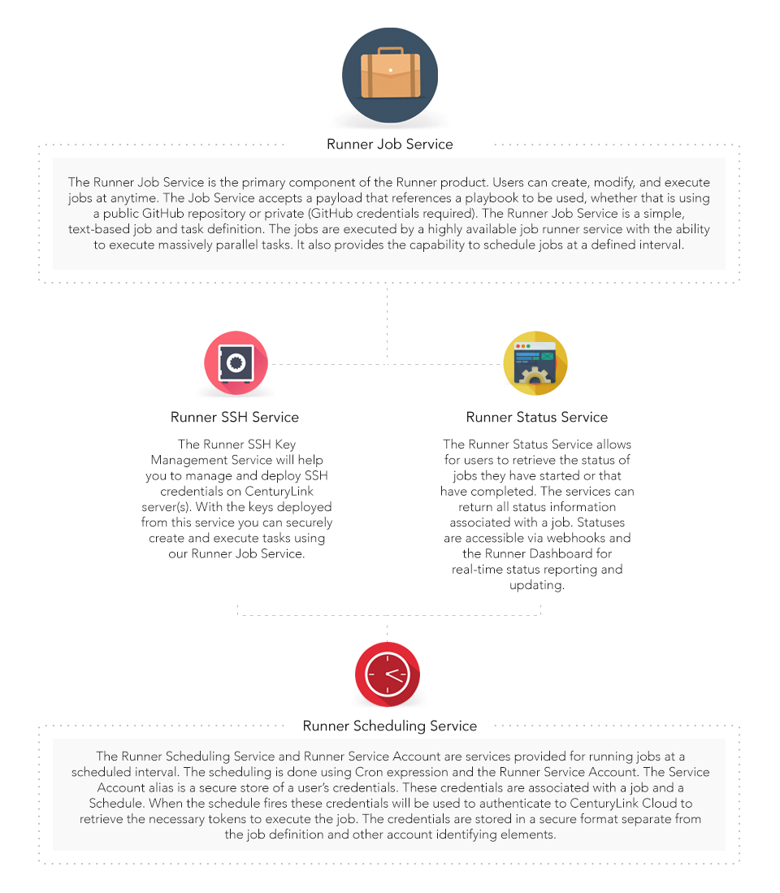

{{{
  "title": "How to Ansible with Runner",
  "date": "05-06-2016",
  "author": "Chris Kent, Anthony Hakim",
  "attachments": [],
  "related-products" : [],
  "contentIsHTML": false,
  "sticky": true
}}}

### Introduction
Here at CenturyLink, we use a technology called [Ansible](http://www.ansible.com/) pretty extensively throughout our platform. Ansible is an IT automation and orchestration engine that enables configuration management, provisioning, deployment, as well as many other IT needs. [Runner](https://www.ctl.io/runner/) wraps all of Ansible’s goodness into a Job Service, along with other micro services such as SSH, status, queuing, and scheduling. Next we'll look at what Runner is and how you would use it.


#### What Is Runner?
Runner is a new product from CenturyLink that enables fast, easy automation and orchestration on the CenturyLink Platform, as well as third-party cloud providers and on-premises infrastructure and devices. Runner provides the ability to quickly provision and modify resources on any environment, and gives users a true Hybrid IT solution, regardless of where their resources are.

On a more granular level, Runner is an automation and orchestration engine that we exposed as a service, and coupled with services mentioned below, enhance the Runner experience. Runner, at its core, is an Ansible engine. On top of that engine exists several other custom services and APIs we've created, many of which were created in tandem with the Runner job service to enhance the job execution capabilities.

**Here is a little more detail on the services available:**




#### How to Use Runner
Using Runner is a fairly straightforward process. To get started, one must first create a job. A job requires a Playbook that you have created or one that is publicly available on [GitHub](https://github.com/), as well as these key ingredients needed:

**Playbook and GitHub Location** – The Playbooks you use must exist on GitHub, either publicly or privately; if privately, GitHub credentials are required.

**Host Information** – This information provides the job context for where your job is to be run. You can specify a single host, group, or all hosts you want to use.

**Bearer Token** – Each job requires authorization in order to run. Runner authorizes your job using your CenturyLink Cloud Bearer Token. [The API is available here](https://www.ctl.io/api-docs/v2/#authentication-login). Runner takes a JSON payload of user defined options and parameters, including the above required information, and creates a job definition within Runner. For a full list of payload options and parameters, please take a look at this [KB article](https://www.ctl.io/knowledge-base/runner/job-service/). It is worth noting that you can create a job and not run it. This will be defined in your API calls, such as:

`[RUNNER API PATH]/jobs/{accountAlias}?immediate=true|false`

**Note:** Once a job has been created, it can be run or rerun at any point in time.

**Below is an example of what a payload might look like:**

```
     {
	  	"description": "Enter your playbook description here",
		"callbacks": [
			{
			  "level": "DEBUG",
			  "url": "http://webhooks.url/ifdesired"
			}
		],
		"hosts":[
			{
			  "id":"localhost",
			  "hostVars":{"ansible_connection":"local"}
			}
		],
		"repository": {
			"defaultPlaybook": "my-playbook.yml",
		    "url": "https://github.com/clc-runner/Hello-World-Playbook"
		},
	}
```

The Runner engine grabs your Playbook from GitHub and loads it into Runner. The Runner engine then parses the job to understand which environment it will be working in and establishes the necessary connections to those environments to execute the Playbooks.

Once a job starts to execute, Runner updates the status of the job via the Runner Status Service, which can be accessed via the [dashboard](https://runner.ctl.io/), API, or your own webhooks endpoints. All updates and changes are logged and exposed throughout the job's life.

And that’s it. While  simplified, it’s pretty straightforward and easy to create and run jobs using Runner.

#### Did You Know Runner can Work Almost Anywhere?

Runner can easily integrate with third-party clouds, as well as on-premises! Whether you’re in one or more cloud, have your own devices in your own data center, or even on location, Runner integrates with them all! Runner is a one stop, Hybrid IT solution.  Automation and orchestration made simple.

#### What are Playbooks?
Runner uses Playbooks to execute tasks and commands on the hosts you’ve defined. Playbooks are Ansible’s configuration, deployment, and orchestration language. They can describe a policy you want your remote systems to enforce, or a set of steps in a general IT process. Playbooks are written with YAML, and usually contain the extension example.yml.

Within Playbooks, users can create or call modules, tasks, hosts, and roles. Hosts are the target systems in which you want to execute. Modules (also referred to as “task plugins” or “library plugins”) are the ones that do the actual work in Ansible. They are what gets executed in each Playbook task, but you can also run a single one using the ‘Ansible’ command. Ansible ships with over 450 modules, and custom modules can be written. Each play contains a list of tasks. Tasks are executed in order, one at a time, against all machines matched by the host pattern, before moving on to the next task. It is important to understand that, within a play, all hosts are going to get the same task directives. It is the purpose of a play to map a selection of hosts to tasks. Roles are ways of automatically loading certain vars_files, tasks, and handlers based on a known file structure. Grouping content by roles also allows easy sharing of roles with other users. Roles are just automation around ‘include’ directives as described above, and really don’t contain much additional magic beyond some improvements to search path handling for referenced files.

**Exploring a Simple "Hello World" Playbook**

Let’s take a look a simple “Hello World” playbook:

```
---
	- name: Hello World
	  hosts: localhost

	  tasks:
	    - name: Display Text
	      shell: echo “Hello World!”
```	   


`---`
Indicates the start of YAML file *(Required)*


`- name: Hello World`
The name tag is used, but not required, to identify both the name of the playbook and where you are during the execution. The name is also returned to the Runner Status Service during a job execution.


`- hosts: localhost`
This indicates which hosts the Playbook will be run against, in this case just locally. You could also set to `all` to run on every server. *(Required)*


`tasks:`
This is the area where you can define the tasks to be run. In this example, this is where we’ll echo out “Hello World”.


`- name: Display Text`
Similar to the name tag at the beginning of the Playbook, this name tag is used to tell us that it’s executing this particular task.


`shell: echo “Hello World!”`
We run the shell command **echo** here.

**That’s it!** You have your first Playbook! Now you can run this Playbook on Runner and see it in action.

**Want to see it for yourself?** For the full list of playbooks and all Ansible module-related things, visit our [GitHub page](https://github.com/CenturyLinkCloud/clc-ansible-module).

#### What's Next?
* Start a [free trial](https://www.ctl.io/free-trial/) on CenturyLink Cloud.
* Learn more about Runner in our [Knowledge Base](https://www.ctl.io/knowledge-base/runner/).
