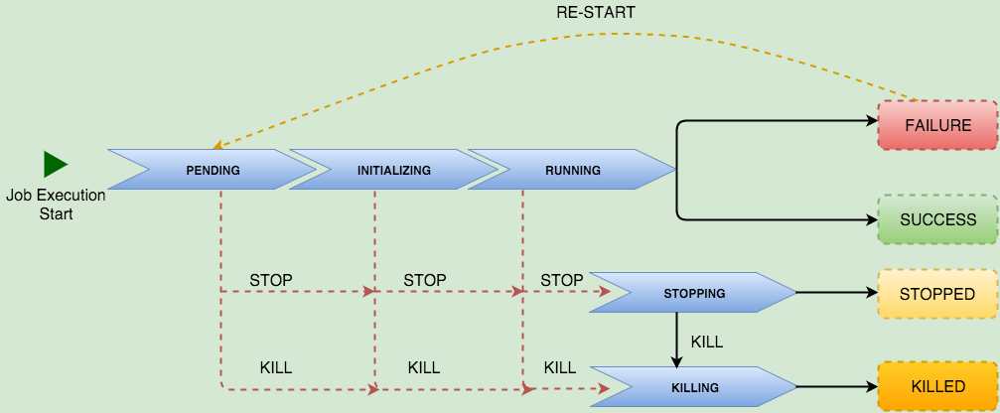

{{{
  "title": "Runner Job Service",
  "date": "04-27-2016",
  "author": "Anthony Hakim",
  "attachments": [],
  "related-products" : [],
  "contentIsHTML": false,
  "sticky": true
}}}

### Audience

This article is to support customers of Runner, a product that enables teams, developers, and engineers to quickly provision, interact, and modify their environments anywhere - Lumen Cloud, third-party cloud providers, and on-premises.  Additionally, the responses in this FAQ document are specific to using the service through the Control Portal.

### Job Service Overview

The Job Service is the primary component of the Runner product. Users can create, modify, and execute jobs at anytime. Many of the other services were created in tandem with the Job Service, and enhance the Job Execution capabilities. The Job Service accepts a payload that references a playbook to be used, whether that is using a public or private GitHub repository. When using a private GitHub repository, GitHub credentials are required.

The Job Service is a simple, text-based job and task definition. These jobs are executed by a highly available service with the ability to execute massively parallel tasks. It also provides the capability to schedule jobs at a defined interval.

The job actions can be performed via REST API calls. The API works with JSON messages over HTTP. It relies on the standard HTTP verbs including GET, POST, PUT, and DELETE.

The URL format of the service is: `https://api.runner.ctl.io/{resource}/{account alias}`.

For example, to retrieve all the Jobs created at the account alias level, you would issue a GET request to `https://api.runner.ctl.io/jobs/XXXX`. The HTTP request must include headers Content-Type (set to application/json) and Authorization (set to ‘Bearer Token from authentication API’).

In addition to managing Runner Jobs the Job Service will allow you to define execution schedules for your Jobs.

### Job Service/Job Schedule Service API Details

1. Job Service
 - [Create Job](#CreateJob)
 - [Get Job](#GetJob)
 - [Update Job](#UpdateJob)
 - [Delete Job](#DeleteJob)
 - [Get Jobs](#GetJobs)
 - [Start a Job](#StartJob)
 - [Get Job Executions](#GetJobExecutions)
 - [Restart a Job Execution](#RestartJobExecution)
 - [Stop a Job Execution](#StopJobExecution)
 - [Kill a Job Execution](#KillJobExecution)
2. Job Schedule Service – The Scheduling service allows you to define a set interval at which a job will automatically execute.
 - [Create Job Schedule](#CreateJobSchedule)
 - [Update Job Schedule](#UpdateJobSchedule)
 - [Delete Job Schedule](#DeleteJobSchedule)
 - [Get Job Schedule](#GetJobSchedule)


#### CREATE JOB <a id="CreateJob"></a>

Creates a Runner job in a given account. The Runner jobs have to be scripted plays using Ansible. Calls to this operation must include a token acquired from the authentication endpoint. See the [Login API](https://www.ctl.io/api-docs/v2/#authentication-login) for information on acquiring this token.

**When to use it**

Use this API operation when you would like to create a new job definition to execute the tasks specified in the referenced playbook. You also have the option to run it immediately or execute it later by issuing a start request.

##### URL
**Structure**

`POST https://api.runner.ctl.io/jobs/{accountAlias}?immediate=true|false`

**Example**

`POST https://api.runner.ctl.io/jobs/XXXX?immediate=false`

##### Request
**URI Parameters**

| NAME | TYPE |	DESCRIPTION	| REQ.|
| --- | --- | --- | --- |
| accountAlias |	string |	Short code for a particular account. |	Yes |
| immediate	| boolean	| Set to “true” if the job to be executed immediately after creation. Default is “false”. |	No |

**Content Properties**

Playbooks can be executed in couple of different ways:

1. We recommend to have your playbook in a GitHubHib Repository for complex plays that are referencing multiple dependent playbooks/templates. Please refer to the Repository Entity information listed below.

| NAME | TYPE |	DESCRIPTION	| REQ.|
| --- | --- | --- | --- |
| description	| string |	Description of the job. |	No |
| executionTtl |	integer |	You can mention the time in minutes expected for the job execution to be complete. If the execution doesn’t complete before the specified time, then it will be gracefully stopped. Default value is “180”. |	No |
| callbacks |	array |	Callback entity schema |	No |
| playbookTags |	array |	If you would like to execute only specific plays/tasks tags, you can list them as comma separated array of string. |	No |
| repository |	complex |	Repository entity schema. Please read the above note. |	Yes |
| hosts |	array |	Hosts entity schema |	Yes |
| properties |	array |	Property entity schema |	No |
| sshPrivateKey |	string |	The default private key (base64 encoded) when connecting to hosts during playbook execution. |	No |
| useDynamicInventory |	boolean |	Instructs Runner to gather all hosts of your account alias. This makes all hosts available as inventory during the playbook execution. Your playbook can then filter the hosts using the hosts property. |	No |

**Callbacks Entity**

| NAME | TYPE |	DESCRIPTION	| REQ.|
| --- | --- | --- | --- |
| url   | string | Your callback webhook url. | Yes  |
| level | string | You can choose the level of information you would like to receive from DEBUG, ERROR, RESULT. When not specified the default value will be “DEBUG” | No |

**Repository Entity**

| NAME | TYPE |	DESCRIPTION	| REQ.|
| --- | --- | --- | --- |
| credentials |	array |	Required only when executing playbooks from a private GitHub repository. |	No |
| url |	string |	Playbook GitHub repository url. Note: HTTPS url should be provided. |	Yes |
| branch |	string |	Repository branch or tag where the playbook is present. Note: Not required if the playbook is in master branch. |	No |
| defaultPlaybook |	string |	Name of the playbook to be executed with file extension. |	Yes |

**Credentials Entity**

In order to execute the playbook from your private GitHub repository, please provide a username and password or SSH Key associated with your GitHub account.

Note: GitHub credentials are NOT required for a playbook in a public repository.

| NAME | TYPE |	DESCRIPTION	|
| --- | --- | --- | --- |
| username |	string |	User name of your private GitHub repository. |
| password |	string |	Password of your private GitHub repository. |
| sshPrivateKey	 |string |	The private key (base64 encoded) associated with your private GitHub account. |

**Hosts Entity**

Define list of hosts and their related variable made available to the playbook when a play or task is executed for that host.

| NAME | TYPE |	DESCRIPTION	| REQ.|
| --- | --- | --- | --- |
| id |	string |	Host name on which the play is to be executed. |	Yes |
| hostVars |	array |	Host vars are made available to the playbook when a play or task is executed for that host. |	No |
| sshPrivateKey |	string |	Private Key (base64 encoded) required when any task to be performed on the specified host connected via SSH. |	No |

**Properties Entity**

This entity can be used to pass any additional variables to the playbook as extra variables. Similar to the command line –extra-vars argument.

```
{
    "property1": "value1",
    "property2": "value2"
}
```

**Example**

```
{
    "description": "Sample Job",
    "repository": {
        "credentials": {
            "username": "GitHub username",
            "password": "GitHub password"
        },
        "defaultPlaybook": "example.yml",
        "branch": "feature",
        "url": "https://GitHub.com/yourrepository.GitHub"
    },
    "callbacks": [
        {
            "url": "your callback webhook",
            "level": "DEBUG"
        }
    ],
    "hosts": [
        {
            "hostVars": {
                    "ansible_connection": "ssh",
                    "datacenter": "VA1"
                },
            "sshPrivateKey" : "TUlJRW93SUJBQUtDQVF........WE81ZnQ1dg==",
            "id": "localhost"
        }
    ]
}
```

##### Response

The response will be a list of objects containing entities for each job created in the given account.

Below is the representation of Job Execution Status for various requests:



**Entity Definition**

| NAME | TYPE |	DESCRIPTION	|
| --- | --- | --- |
| id |	string |	ID of the job. |
| description |	string |	Description of the job. |
| executionTtl |	integer |	The time in minutes expected for the job execution to be complete. |
| repository |	complex |	GitHub repository specifications where the playbook is related to the job is present. |
| hosts |	array |	Defined list of hosts and their related variables provided part of request payload. |
| callbacks |	array |	Call back webhook urls where you would like to view live feed of job status. |
| createdTime |	integer |	Timestamp when the Job was created. |
| lastUpdatedTime |	integer |	Timestamp when the Job was last updated. |
| links |	array |	Collection of entity links that point to resources related to this policy. |

**Example**

```
[
  {
    "id": "1111505e-6773-494a-b2bf-d2cc2684710d",
    "accountAlias": "XXXX",
    "description": "Sample Job",
    "executionTtl": null,
    "repository": {
      "url": "https://GitHub.com/yourrepository.GitHub",
      "branch": "feature",
      "defaultPlaybook": "example.yml",
      "credentials": {
        "username": "GitHub username",
        "password": "GitHub password"
      }
    },
    "hosts": [
      {
        "id": "localhost",
        "hostVars": {
          "ansible_connection": "ssh",
          "datacenter": "VA1",
          "public_key": "ssh-rsa B3NzaC1yc......rhizlpix3f test@test\n",
      "state": "present"
        }
      }
    ],
    "properties": {},
    "status": "ACTIVE",
    "callbacks": [
      {
        "url": "your callback webhook",
        "level": "DEBUG"
      }
    ],
    "createdTime": 1440785845177,
    "lastUpdatedTime": 1440785845177,
    "links": [
      {
        "ref": "self",
        "id": "52f9505e-6773-494a-b2bf-d2cc2684710d",
        "href": "/v2/workflow/XXXX/jobs/52f9505e-6773-494a-b2bf-d2cc2684710d",
        "verbs": [
          "GET",
          "POST",
          "DELETE"
        ]
      }
    ]
  }
]
```


##### GET JOB <a id="GetJob"></a>

Gets a given Runner job by ID. Calls to this operation must include a token acquired from the authentication endpoint. See the [Login API](https://www.ctl.io/api-docs/v2/#authentication-login) for information on acquiring this token.

**When to use it**
Use this API operation when you would like to get the details of a specific job created within a given account.

##### URL
**Structure**

`GET https://api.runner.ctl.io/jobs/{accountAlias}/{jobId}`

**Example**

`GET https://api.runner.ctl.io/jobs/XXXX/1111505e-6773-494a-b2bf-d2cc2684710d`

##### Request
**URI Parameters**

| NAME | TYPE |	DESCRIPTION	| REQ.|
| --- | --- | --- | --- |
| accountAlias |	string |	Short code for a particular account. |	Yes |
| id |	string |	ID of the job being queried. |	Yes |

##### Response

The response will be a Job object containing all its entities.

**Entity Definition**

| NAME | TYPE |	DESCRIPTION	|
| --- | --- | --- | --- |
| id |	string |	ID of the job. |
| accountAlias |	string |	The account alias under which the job was created. |
| description |	string |	Description of the job. |
| executionTtl |	integer |	The time in minutes expected for the job execution to be complete. |
| repository |	array |	GitHub repository details where the playbook is related to the job is present. |
| hosts |	array |	Hosts entity schema |
| callbacks |	array |	Call back webhook urls where you would like to view live feed of job status. |
| createdTime |	integer |	Timestamp when the Job was created. |
| lastUpdatedTime |	integer |	Timestamp when the Job was last updated. |
| links |	array |	Collection of entity links that point to resources related to this policy. |

**Repository Entity**

| NAME | TYPE |	DESCRIPTION	|
| --- | --- | --- | --- |
| credentials |	array |	Credentials of a private GitHub repository where the playbook is present. |
| url |	string |	Playbook GitHub repository url. |
| branch |	string |	Repository branch or tag where the playbook is present. |
| defaultPlaybook |	string |	Name of the playbook to be executed with file extension. |

**Credentials Entity**

| NAME | TYPE |	DESCRIPTION	|
| --- | --- | --- | --- |
| username |	string |	User name of your private GitHub repository. |
| password |	string |	Password of your private GitHub repository. |

**Hosts Entity**

Defined list of hosts and their related variable made available to the playbook when a play or task is executed for that host.

| NAME | TYPE |	DESCRIPTION	|
| --- | --- | --- | --- |
| id |	string |	Host name on which the play is to be executed. |
| hostVars |	array |	Host vars are made available to the playbook when a play or task is executed for that host. |

**Example**

```

[
  {
    "id": "1111505e-6773-494a-b2bf-d2cc2684710d",
    "accountAlias": "XXXX",
    "description": "Your job description",
    "executionTtl": null,
    "repository": {
      "url": "https://GitHub.com/yourrepository.GitHub",
      "branch": "repository_branch",
      "defaultPlaybook": "example.yml",
      "credentials": {
        "username": "GitHub username",
        "password": "GitHub password"
      }
    },
    "hosts": [
      {
        "id": "localhost",
        "hostVars": {
          "ansible_connection": "local",
          "datacenter": "VA1"
        }
      }
    ],
    "properties": {},
    "status": "ACTIVE",
    "callbacks": [
      "your callback webhook"
    ],
    "links": [
      {
        "ref": "self",
        "id": "52f9505e-6773-494a-b2bf-d2cc2684710d",
        "href": "/v2/workflow/XXXX/jobs/52f9505e-6773-494a-b2bf-d2cc2684710d",
        "verbs": [
          "GET",
          "POST",
          "DELETE"
        ]
      }
    ]
  }
]
```


#### UPDATE JOB <a id="UpdateJob"></a>

Updates the details of an existing Runner job by ID. Calls to this operation must include a token acquired from the authentication endpoint. See the [Login API](https://www.ctl.io/api-docs/v2/#authentication-login) for information on acquiring this token.

**When to use it**

Use this API operation when you would like to update the details of a specific job created within a given account. Basically you can re-write the entire Job description of an existing Job.

##### URL
**Structure**

`PUT https://api.runner.ctl.io/jobs/{accountAlias}/{id}?immediate=true|false`

**Example**

`PUT https://api.runner.ctl.io/jobs/XXXX/1111505e-6773-494a-b2bf-d2cc2684710d`

##### Request
**URI Parameters**

| NAME | TYPE |	DESCRIPTION	| REQ.|
| --- | --- | --- | --- |
| accountAlias |	string |	Short code for a particular account. |	Yes |
| id |	string |	ID of the job being updated. |	Yes |
| immediate |	boolean |	Set to “true” if the job to be executed immediately after creation. Default is “false”. |	No |

**Content Properties**

Playbooks can be executed in couple of different ways:

1. We recommend to have your playbook in a GitHubHib Repository for complex plays that are referencing multiple dependent playbooks/templates. Please refer to the Repository Entity information listed below.

| NAME | TYPE |	DESCRIPTION	| REQ.|
| --- | --- | --- | --- |
| description |	string |	Description of the job. |	No |
| executionTtl |	integer |	You can mention the time in minutes expected for the job execution to be complete. If the execution doesn’t complete before the specified time, then it will be gracefully stopped. Default value is “180”. |	No |
| callbacks |	array |	Callback entity schema. |	No |
| playbookTags |	array |	If you would like to execute only specific plays/tasks tags, you can list them as comma separated array of string. |	No |
| repository |	complex |	Repository entity schema. Please read the above note. |	Yes |
| hosts |	array |	Hosts entity schema. |	Yes |
| properties |	array |	Property entity schema. |	No |
| sshPrivateKey |	string |	The default private key (base64 encoded) when connecting to hosts during playbook execution. |	No |
| useDynamicInventory |	boolean |	Instructs Runner to gather all hosts of your account alias. This makes all hosts available as inventory during the playbook execution. Your playbook can then filter the hosts using the hosts property. |	No |

**Callbacks Entity**

You could use callback webhook URLs, to receive a live feed of your job execution.

| NAME | TYPE |	DESCRIPTION	| REQ.|
| --- | --- | --- | --- |
| url |	string |	Your callback webhook URL. |	Yes |
| level |	string |	You can choose the level of information you would like to receive from DEBUG, ERROR, RESULT. When not specified the default value will be “DEBUG”. |	No |

**Repository Entity**

| NAME | TYPE |	DESCRIPTION	| REQ.|
| --- | --- | --- | --- |
| credentials |	array |	Required only when executing playbooks from a private GitHub repository. |	No |
| url |	string |	Playbook GitHub repository URL. Note: HTTPS URL should be provided. |	Yes |
| branch |	string |	Repository branch or tag where the playbook is present. Note: Not required if the playbook is in master branch. |	No |
| defaultPlaybook |	string |	Name of the playbook to be executed with file extension. |	Yes |
| playbookTags |	array |	If you have a large playbook and would like to execute only specific plays/tasks tags, you can list them as comma separated array of string. |	No |

**Credentials Entity**

In order to execute the playbook from your private GitHub repository please provide username and password or SSH Key associated with your GitHub account.

Note: GitHub credentials are NOT required for a playbook in a public repository.

| NAME | TYPE |	DESCRIPTION	|
| --- | --- | --- | --- |
| username |	string |	User name of your private GitHub repository. |
| password |	string |	Password of your private GitHub repository. |
| sshPrivateKey |	string |	The private key (base64 encoded) associated with your private GitHub account. |

**Hosts Entity**

Define list of hosts and their related variable made available to the playbook when a play or task is executed for that host.

| NAME | TYPE |	DESCRIPTION	| REQ.|
| --- | --- | --- | --- |
| id |	string |	Host name on which the play is to be executed. |	Yes |
| hostVars |	array |	Host vars are made available to the playbook when a play or task is executed for that host. |	No |
| sshPrivateKey |	string |	Private Key (base64 encoded) required when any task to be performed on the specified host connected via SSH. |	No |

**Properties Entity**

This entity can be used to pass any additional variables to the playbook as extra variables. Similar to the command line –extra-vars argument.

```
{
    "property1": "value1",
    "property2": "value2"
}
```

**Example**

```
{
    "description": "Sample Job",
    "repository": {
        "credentials": {
            "username": "GitHub username",
            "password": "GitHub password"
        },
        "defaultPlaybook": "example.yml",
        "branch": "feature",
        "url": "https://GitHub.com/yourrepository.GitHub"
    },
    "callbacks": [
        {
            "url": "your callback webhook",
            "level": "DEBUG"
        }
    ],
    "hosts": [
        {
            "hostVars": {
                    "ansible_connection": "ssh",
                    "datacenter": "VA1"
                },
            "sshPrivateKey" : "TUlJRW93SUJBQU.......WE81ZnQ1dg==",
            "id": "localhost"
        }
    ]
}
```

##### Response

The response will be a list of objects containing entities for each job created in the given account.

**Entity Definition**

| NAME | TYPE |	DESCRIPTION	|
| --- | --- | --- | --- |
| id |	string |	ID of the job. |
| description |	string |	Description of the job. |
| executionTtl |	integer |	The time in minutes expected for the job execution to be complete. |
| repository |	complex |	GitHub repository specifications where the playbook is related to the job is present. |
| hosts |	array |	Defined list of hosts and their related variables provided part of request payload. |
| callbacks |	array |	Call back webhook urls where you would like to view live feed of job status. |
| createdTime |	integer |	Timestamp when the Job was created. |
| lastUpdatedTime |	integer |	Timestamp when the Job was last updated. |
| links |	array |	Collection of entity links that point to resources related to this policy. |

**Example**

```
[
  {
    "id": "1111505e-6773-494a-b2bf-d2cc2684710d",
    "accountAlias": "XXXX",
    "description": "Sample Job",
    "executionTtl": null,
    "repository": {
      "url": "https://GitHub.com/yourrepository.GitHub",
      "branch": "feature",
      "defaultPlaybook": "example.yml",
      "credentials": {
        "username": "GitHub username",
        "password": "GitHub password"
      }
    },
    "hosts": [
      {
        "id": "localhost",
        "hostVars": {
          "ansible_connection": "ssh",
          "datacenter": "VA1",
          "public_key": "ssh-rsa AAAAB3NzaC1yc2EAAAADAQABAAAAQQDxt+1boRV5ZuyTPJsmz2mBe0AG+9zaSRrRHVIgwjl5uHso9GZAn8G7+hAKJuHSzfxTQXGwTdLmozrhizlpix3f test@test\n",
      "state": "present"
        }
      }
    ],
    "properties": {},
    "status": "ACTIVE",
    "callbacks": [
      {
        "url": "your callback webhook",
        "level": "DEBUG"
      }
    ],
    "createdTime": 1440785845177,
    "lastUpdatedTime": 1556785845177,
    "links": [
      {
        "ref": "self",
        "id": "52f9505e-6773-494a-b2bf-d2cc2684710d",
        "href": "/v2/workflow/XXXX/jobs/52f9505e-6773-494a-b2bf-d2cc2684710d",
        "verbs": [
          "GET",
          "POST",
          "DELETE"
        ]
      }
    ]
  }
]
```


#### DELETE JOB <a id="DeleteJob"></a>

Delete an existing Runner job in a given account. Calls to this operation must include a token acquired from the authentication endpoint. See the [Login API](https://www.ctl.io/api-docs/v2/#authentication-login) for information on acquiring this token.

**When to use it**

Use this API operation when you would like to delete an existing job within a given account.

##### URL
**Structure**

`DELETE https://api.runner.ctl.io/jobs/{accountAlias}/{id}`

**Example**

`DELETE https://api.runner.ctl.io/jobs/XXXX/e436f511-21f9-4cda-9026-a68cd6112240`

##### Request
**URI Parameters**

| NAME | TYPE |	DESCRIPTION	| REQ.|
| --- | --- | --- | --- |
| accountAlias |	string |	Short code for a particular account. |	Yes |
| id |	string |	ID of the job to be deleted from the account. |	Yes |

##### Response

| HTTP CODE |	DESCRIPTION |
| --- | --- |
| 204 |	Sent when a request to delete a Job is successful. |


#### GET JOBS <a id="GetJobs"></a>

Retrieve the list of jobs created within a given account alias. Calls to this operation must include a token acquired from the authentication endpoint. See the [Login API](https://www.ctl.io/api-docs/v2/#authentication-login) for information on acquiring this token.

**When to use it**

Use this API operation when you would like to retrieve the list of jobs published within a given account and view the details of a job.

##### URL
**Structure**

`GET https://api.runner.ctl.io/jobs/{accountAlias}?page=0&size=100`

**Example**

`GET https://api.runner.ctl.io/jobs/XXXX`

##### Request
**URI Parameters**

| NAME | TYPE |	DESCRIPTION	| REQ.|
| --- | --- | --- | --- |
| accountAlias |	string |	Short code for a particular account. |	Yes |
| page |	integer |	You can specify the page number for which you would like to get the results for. Default is “0”. |	No |
| size |	integer |	You can specify the page size between 1 to 100. Default is “100”. |	No |

##### Response

The response will be a list of objects containing entities for each job created in the given account in the order of last created. Along with total number of jobs created under your account alias.

Note: The maximum number of records per request is 100, use the combination of page and size to recursively retrieve subsequent records.

**Entity Definition**

| NAME | TYPE |	DESCRIPTION	|
| --- | --- | --- | --- |
| totalSize |	integer |	Total number of jobs created under your account alias. |
| page |	integer |	The current page number based on your query. |
| size |	integer |	Page size of your query. |
| results |	array |	List of jobs |

**Jobs Entity**

| NAME | TYPE |	DESCRIPTION	|
| --- | --- | --- | --- |
| id |	string |	ID of the job. |
| accountAlias |	string |	The account alias under which the job was created. |
| description |	string |	Description of the job. |
| executionTtl |	integer |	The time in minutes expected for the job execution to be complete. |
| repository |	array |	GitHub repository details where the playbook is related to the job is present. |
| hosts |	array |	Hosts entity schema |
| callbacks |	array |	Call back webhook urls where you would like to view live feed of job status. |
| createdTime |	integer |	Timestamp when the Job was created. |
| lastUpdatedTime |	integer |	Timestamp when the Job was last updated. |
| links |	array |	Collection of entity links that point to resources related to this policy. |

**Repository Entity**

| NAME | TYPE |	DESCRIPTION	|
| --- | --- | --- | --- |
| credentials |	array |	Credentials of a private GitHub repository where the playbook is present. |
| url |	string |	Playbook GitHub repository URL. |
| branch |	string |	Repository branch or tag where the playbook is present. |
| defaultPlaybook |	string |	Name of the playbook to be executed with file extension. |

**Credentials Entity**

| NAME | TYPE |	DESCRIPTION	|
| --- | --- | --- | --- |
| username |	string |	User name of your private GitHub repository. |
| password |	string |	Password of your private GitHub repository. |

**Hosts Entity**

Defined list of hosts and their related variable made available to the playbook when a play or task is executed for that host.

| NAME | TYPE |	DESCRIPTION	|
| --- | --- | --- | --- |
| id |	string |	Host name on which the play is to be executed. |
| hostVars |	array |	Host vars are made available to the playbook when a play or task is executed for that host. |

**Example**

```
{
    "totalSize": 2000,
    "page": 0,
    "size": 100,
    "results": [
                  {
                    "id": "1111505e-6773-494a-b2bf-d2cc2684710d",
                    "accountAlias": "XXXX",
                    "description": "Your job description",
                    "executionTtl": null,
                    "repository": {
                      "url": "https://GitHub.com/yourrepository.GitHub",
                      "branch": "repository_branch",
                      "defaultPlaybook": "example.yml",
                      "credentials": {
                        "username": "GitHub username",
                        "password": "GitHub password"
                      }
                    },
                    "hosts": [
                      {
                        "id": "localhost",
                        "hostVars": {
                          "ansible_connection": "local",
                          "datacenter": "VA1"
                        }
                      }
                    ],
                    "properties": {},
                    "status": "ACTIVE",
                    "callbacks": [
                      {
                        "url": "your callback webhook",
                        "level": "DEBUG"
                      }
                    ],
                    "createdTime": 1440785845177,
                    "lastUpdatedTime": 1440785845177,
                    "links": [
                      {
                        "ref": "self",
                        "id": "52f9505e-6773-494a-b2bf-d2cc2684710d",
                        "href": "/v2/workflow/XXXX/jobs/52f9505e-6773-494a-b2bf-d2cc2684710d",
                        "verbs": [
                          "GET",
                          "POST",
                          "DELETE"
                        ]
                      }
                    ]
                  }
    ]
}
```


#### START JOB <a id="StartJob"></a>

Creates an execution of an existing job by ID against different host(s). Calls to this operation must include a token acquired from the authentication endpoint. See the [Login API](https://www.ctl.io/api-docs/v2/#authentication-login) for information on acquiring this token. Once the execution is created, it will be queued to start at the earliest. Live status feed of the execution can be viewed with your callback(s) URL if you have defined at the time of job creation.

**When to use it**

Use this API operation when you would like to explicitly start a job execution on any host(s).

##### URL
**Structure**

`POST https://api.runner.ctl.io/jobs/{accountAlias}/{id}/start`

**Example**

`POST https://api.runner.ctl.io/jobs/XXXX/1111505e-6773-494a-b2bf-d2cc2684710d/start`

##### Request
**URI Parameters**

| NAME | TYPE |	DESCRIPTION	| REQ.|
| --- | --- | --- | --- |
| accountAlias |	string |	Short code for a particular account. |	Yes |
| id |	string |	ID of the job to be started. |	Yes |

**Content Properties**

Based on your job definition you have to start an execution by passing in required host(s) information. If you would like to start the execution without any host, then you have to POST an empty object.

| NAME | TYPE |	DESCRIPTION	| REQ.|
| --- | --- | --- | --- |
| hosts |	array |	Hosts entity schema. |	No |
| sshPrivateKey |	string |	SSH private key (base64 encoded) that can be used to connect listed hosts. |	No |

**Hosts Entity**

Define list of hosts and their related variable made available to the playbook, when a playbook or task is executed for that host.

| NAME | TYPE |	DESCRIPTION	| REQ.|
| --- | --- | --- | --- |
| id |	string |	Host name on which the play is to be executed. |	Yes |
| sshPrivateKey |	string |	Private Key (base64 encoded) required when any task to be performed on the specified host connected via SSH. |	No |

**Example**

```
{
    "hosts": [
        {
            "id": "localhost"
        }
    ]
}
```

##### Response

An execution document will be your response but you could view the execution details by making a call to the GET Job Executions.

**Entity Definition**

| NAME | TYPE |	DESCRIPTION	|
| --- | --- | --- | --- |
| execution_id |	string |	Execution ID of the queried Job. |
| start |	number |	EPOCH format of job execution start Date time in UTC. |
| end |	number |	EPOCH format of job execution end Date time in UTC. |
| job_id |	string |	ID of the job being queried. |
| account_alias |	string |	Short code for a particular account. |
| status |	string |	Will be PENDING at the time of start. |

**Examples**

```
{
    "start": null
    "end": null
    "job_id": "1111505e-6773-494a-b2bf-d2cc2684710d"
    "execution_id": "44fdcfa2-6a7f-46d3-9f71-22e629e2358a"
    "account_alias": "XXXX"
    "status": "PENDING"
    "repository_log": null
    "failed_hosts": [0]
    "is_vpn_established": false
}
```


#### GET JOB EXECUTIONS <a id="GetJobExecutions"></a>

Gets details of all the executions of a particular Job by ID. Calls to this operation must include a token acquired from the authentication endpoint. See the [Login API](https://www.ctl.io/api-docs/v2/#authentication-login) for information on acquiring this token.

**When to use it**

Use this API operation when you would like to get details of all the executions of a particular job created within your account.

##### URL
**Structure**

`GET https://api.runner.ctl.io/jobs/{accountAlias}/{jobId}/executions?page=0&size=100`

**Example**

`GET https://api.runner.ctl.io/jobs/XXXX/ba7e6f6a-2673-4580-a297-8d7e44483bd7/executions`

##### Request
**URI Parameters**

| NAME | TYPE |	DESCRIPTION	| REQ.|
| --- | --- | --- | --- |
| accountAlias |	string |	Short code for a particular account. |	Yes |
| id |	string |	ID of the job being queried. |	Yes |
| page |	integer |	You can specify the page number for which you would like to get the results for. Default is “0”. |	No |
| size |	integer |	You can specify the page size between 1 to 100. Default is “100”. |	No |

##### Response

Preview of all executions of a particular job.

**Entity Definition**

| NAME | TYPE |	DESCRIPTION	|
| --- | --- | --- | --- |
| totalSize |	integer |	Total number of executions for a queried job. |
| page |	integer |	The current page number based on your query. |
| size |	integer |	Page size of your query. |
| results |	array |	List of job executions. |

**Job Executions Entity**

| | NAME | TYPE |	DESCRIPTION	|
| --- | --- | --- | --- |
|  execution_id |	string |	Execution ID of the queried Job. |
| timers |	array |	History of execution timers. |
| job_id |	string |	ID of the job being queried. |
| account_alias |	string |	Short code for a particular account. |
| status |	string |	Current status of the execution. Status transition from PENDING -> RUNNING -> SUCCESS/FAILURE. |
| repository_log |	string |	GitHub commit version of the playbook, if the defined playbook is from GitHub repository. |
| failed_hosts |	array |	List of failed hosts. |
| is_vpn_established |	boolean |	Set to true if the execution has any VPN connections enabled part of the play. |

**Execution Timers Entity**

An execution will have multiple timers only when it is restarted.

| NAME | TYPE |	DESCRIPTION	|
| --- | --- | --- | --- |
| start |	number |	EPOCH format of job execution start Date time in UTC. |
| end |	number |	EPOCH format of job execution end Date time in UTC. |

**Example**

```
{
    "totalSize": 2,
    "page": 0,
    "size": 2,
    "results": [
        {
            "start": 1444924450534,
            "end": 1444924452123,
            "job_id": "ba7e6f6a-2673-4580-a297-8d7e44483bd7",
            "execution_id": "43324ce3-dc2a-480e-94b9-1ea705373111",
            "account_alias": "XXXX",
            "status": "FAILURE",
            "repository_log": {
              "recent_commit": [
                  {
                       "commit": "b087e1a44c79d0576d7cccd249d3e71a3c54fe12",
                       "author": "Author name",  
                       "author_email": "sample@xxx.com",  
                       "date": "Wed Sep 16 16:27:20 2015 -0500",  
                       "message": "Latest commit"
                  }
              ],
              "tags": []
            },
            "failed_hosts": [
                                "localhost"
            ],
            "is_vpn_established": false
        },
        {
            "start": 1444919575778,
            "end": null,
            "job_id": "ba7e6f6a-2673-4580-a297-8d7e44483bd7",
            "execution_id": "44fdcfa2-6a7f-46d3-9f71-22e629e2358a",
            "account_alias": "XXXX",
            "status": "RUNNING",
            "repository_log": {
              "recent_commit": [
                  {
                       "commit": "b087e1a44c79d0576d7cccd249d3e71a3c54fe12",
                       "author": "Author name",  
                       "author_email": "sample@xxx.com",  
                       "date": "Wed Sep 16 16:27:20 2015 -0500",  
                       "message": "Latest commit"
                  }
              ],
              "tags": []
            },                                         "failed_hosts": [        
            ],
            "is_vpn_established": false,
            "id": "61671a90-93f2-491a-b8f2-aed515f0b5a6"
        }
    ]   
 }
```


#### RESTART JOB EXECUTION <a id="RestartJobExecution"></a>

Restarts a failed execution of an existing job by ID against failed host(s). Calls to this operation must include a token acquired from the authentication endpoint. See the [Login API](https://www.ctl.io/api-docs/v2/#authentication-login) for information on acquiring this token. Once the execution is created, it will be queued to restart at the earliest. Live status feed of the execution can be viewed with your callback(s) URL if you have defined at the time of job creation.

**When to use it**

This API operation is applicable only on Failed executions of a job. Use this API operation when you would like to execute the same play against the failed host(s).

##### URL
**Structure**

`POST https://api.runner.ctl.io/jobs/{accountAlias}/{jobId}/executions/{executionId}/restart`

**Example**

`POST https://api.runner.ctl.io/jobs/XXXX/1111505e-6773-494a-b2bf-d2cc2684710d/executions/44fdcfa2-6a7f-46d3-9f71-22e629e2358a/restart`

##### Request
**URI Parameters**

| NAME | TYPE |	DESCRIPTION	| REQ.|
| --- | --- | --- | --- |
| accountAlias |	string |	Short code for a particular account. |	Yes |
| jobId |	string |	ID of the job to be restarted. |	Yes |
| executionId |	string |	Execution ID of the job to be restarted. |	Yes |

**Content Properties**

Based on your job definition you can restart an execution by passing in required failed host(s) information. If you would like to restart the execution without any host, then you have to POST an empty object.

| NAME | TYPE |	DESCRIPTION	| REQ.|
| --- | --- | --- | --- |
| hosts |	array |	Hosts entity schema |	No |
| sshPrivateKey |	string |	SSH private key (base64 encoded) that can be used to connect listed hosts. |	No |

**Hosts Entity**

Define list of failed host(s) and their related variable made available to the playbook when a play or task is executed for that host.

| NAME | TYPE |	DESCRIPTION	| REQ.|
| --- | --- | --- | --- |
| id |	string |	Host name on which the play is to be executed. |	Yes |
| sshPrivateKey |	string |	Private Key (base64 encoded) required when any task to be performed on the specified host connected via SSH. |	No |

**Example**

```
{
    "hosts": [
        {
            "id": "localhost"
        }
    ]
}
```

##### Response

An execution document with your previous run timer details with an updated status as “PENDING” will be your response. You could view the execution details by making a call to the GET Job Executions.

**Entity Definition**

| NAME | TYPE |	DESCRIPTION	|
| --- | --- | --- | --- |
| execution_id |	string |	Execution ID of the queried Job. |
| timers |	array |	History of execution timers. |
| job_id |	string |	ID of the job being queried. |
| account_alias |	string |	Short code for a particular account. |
| status |	string |	Will be PENDING at the time of re-start. |
| repository_log |	string |	GitHub commit version of the playbook, if the defined playbook is from GitHub repository. |
| failed_hosts |	array |	List of failed hosts. |
| is_vpn_established |	boolean |	Set to true if the execution has any VPN connections enabled part of the play. |

**Execution Timers Entity**

An execution will have multiple timers only when it is restarted.

| NAME | TYPE |	DESCRIPTION	|
| --- | --- | --- | --- |
| start |	number |	EPOCH format of job execution start Date time in UTC. |
| end |	number |	EPOCH format of job execution end Date time in UTC. |

**Example**

```
{
    "timers": [
        {
          "start": 1445359386400,
          "end": 1445359388219
        }
    ],
    job_id: "1111505e-6773-494a-b2bf-d2cc2684710d",
    execution_id: "44fdcfa2-6a7f-46d3-9f71-22e629e2358a",
    account_alias: "XXXX",
    status: "PENDING",
    repository_log: null,
    failed_hosts: [0],
    is_vpn_established: false
}
```


#### STOP JOB EXECUTION <a id="StopJobExecution"></a>

To stop a Pending/Initializing/Running/Stopping job execution gracefully. Calls to this operation must include a token acquired from the authentication endpoint. See the [Login API](https://www.ctl.io/api-docs/v2/#authentication-login) for information on acquiring this token. Live status feed of the execution can be viewed with your callback(s) url if you have defined at the time of job creation.

**When to use it**

Use this API operation when you would like to stop a Pending/Initializing/Running/Stopping execution of a job.

##### URL
**Structure**

`POST https://api.runner.ctl.io/jobs/{accountAlias}/{jobId}/executions/{executionId}/stop`

**Example**

`POST https://api.runner.ctl.io/jobs/XXXX/1111505e-6773-494a-b2bf-d2cc2684710d/executions/44fdcfa2-6a7f-46d3-9f71-22e629e2358a/stop`

##### Request
**URI Parameters**

| NAME | TYPE |	DESCRIPTION	| REQ.|
| --- | --- | --- | --- |
| accountAlias |	string |	Short code for a particular account. |	Yes |
| id |	string |	ID of the job. |	Yes |
| executionId |	string |	Execution ID of the job to be stopped. |	Yes |

**Content Properties**

| NAME | TYPE |	DESCRIPTION	| REQ.|
| --- | --- | --- | --- |
| expiryDuration | 	number | 	Stop signal expiry duration in seconds. Default value is zero seconds. |	No |

**Example**

```
{
    "expiryDuration": 5
 }
```

##### Response

An execution document with your previous run timer details with an updated status as “STOPPING” will be your response. Eventually the status will change to STOPPED. You can view the execution details by making a call to the GET Job Executions.

Note: Tasks that are executed until the stop request will not rollback.

**Entity Definition**

| NAME | TYPE |	DESCRIPTION	|
| --- | --- | --- | --- |
| execution_id |	string |	Execution ID of the queried Job. |
| timers |	array |	History of execution timers. |
| job_id |	string |	ID of the job being queried. |
| account_alias |	string |	Short code for a particular account. |
| status |	string |	Will be STOPPING at the time of stop. |
| repository_log |	string |	GitHub commit version of the playbook, if the defined playbook is from GitHub repository. |
| failed_hosts |	array |	List of failed hosts. |
| is_vpn_established |	boolean |	Set to true if the execution has any VPN connections enabled part of the play. |

**Execution Timers Entity**

| NAME | TYPE |	DESCRIPTION	|
| --- | --- | --- | --- |
| start |	number |	EPOCH format of job execution start Date time in UTC. |
| end |	number |	EPOCH format of job execution end Date time in UTC. |

**Example**

```
{
    "timers": [
        {
          "start": 1445359386400,
          "end": 1445359388219
        }
    ],
    job_id: "1111505e-6773-494a-b2bf-d2cc2684710d"
    execution_id: "44fdcfa2-6a7f-46d3-9f71-22e629e2358a"
    account_alias: "XXXX"
    status: "STOPPING"
    repository_log: null
    failed_hosts: [0]
    is_vpn_established: false
}
```

#### KILL JOB EXECUTION <a id="KillJobExecution"></a>

To kill the process of a job execution with any of status as Pending/Initializing/Running/Stopping/Killing. Calls to this operation must include a token acquired from the authentication endpoint. See the [Login API](https://www.ctl.io/api-docs/v2/#authentication-login) for information on acquiring this token.Calls to this operation must include a token acquired from the authentication endpoint. Live status feed of the execution can be viewed with your callback(s) url if you have defined at the time of job creation.

**When to use it**

Use this API operation when you would like to terminate an execution of a job with any of status as Pending/Initializing/Running/Stopping/Killing.

##### URL
**Structure**

`POST https://api.runner.ctl.io/jobs/{accountAlias}/{jobId}/executions/{executionId}/kill`

**Example**

`POST https://api.runner.ctl.io/jobs/XXXX/1111505e-6773-494a-b2bf-d2cc2684710d/executions/44fdcfa2-6a7f-46d3-9f71-22e629e2358a/kill`

##### Request
**URI Parameters**

| NAME | TYPE |	DESCRIPTION	| REQ.|
| --- | --- | --- | --- |
| accountAlias |	string |	Short code for a particular account. |	Yes |
| id |	string |	ID of the job. |	Yes |
| executionId |	string |	Execution ID of the job to be killed. |	Yes |

**Content Properties**

| NAME | TYPE |	DESCRIPTION	| REQ.|
| --- | --- | --- | --- |
| expiryDuration |	number |	Kill signal expiry duration in seconds. Default value is zero seconds. |	No |

**Example**

```
{
    "expiryDuration": 5
 }
```

##### Response

An execution document with your previous run timer details with an updated status as “KILLING” will be your response. Eventually the status will change to KILLED. You can view the execution details by making a call to the GET Job Executions.

Note: Tasks that are executed until the kill request will not rollback.

**Entity Definition**

| NAME | TYPE |	DESCRIPTION	|
| --- | --- | --- | --- |
| execution_id |	string |	Execution ID of the queried Job. |
| timers |	array |	History of execution timers. |
| job_id |	string |	ID of the job being queried. |
| account_alias |	string |	Short code for a particular account. |
| status |	string |	Will be KILLING at the time of kill. |
| repository_log |	string |	GitHub commit version of the playbook, if the defined playbook is from GitHub repository. |
| failed_hosts |	array |	List of failed hosts. |
| is_vpn_established |	boolean |	Set to true if the execution has any VPN connections enabled part of the play. |

**Execution Timers Entity**

| NAME | TYPE |	DESCRIPTION	|
| --- | --- | --- | --- |
| start |	number |	EPOCH format of job execution start Date time in UTC. |
| end |	number |	EPOCH format of job execution end Date time in UTC. |

**Example**

```
{
    "timers": [
        {
          "start": 1445359386400,
          "end": 1445359388219
        }
    ],
    job_id: "1111505e-6773-494a-b2bf-d2cc2684710d"
    execution_id: "44fdcfa2-6a7f-46d3-9f71-22e629e2358a"
    account_alias: "XXXX"
    status: "KILLING"
    repository_log: null
    failed_hosts: [0]
    is_vpn_established: false
}
```


### Job Schedule Service Overview

The Job Schedule Service, allows you to define a set interval at which a job will automatically execute. In order to use the Job Schedule Service, you will need to create a Service Account. Please refer to the [Service Account KB article](https://www.ctl.io/knowledge-base/runner/service-account/) for detailed instructions.


#### CREATE JOB SCHEDULE <a id="CreateJobSchedule"></a>

Define the schedule for an existing job. Have your Service Account Alias created. Calls to this operation must include a token acquired from the authentication endpoint. See the [Login API](https://www.ctl.io/api-docs/v2/#authentication-login) for information on acquiring this token.

**When to use it**

Use this request when you would like to schedule an existing job in a timely manner.

##### URL
**Structure**

`POST https://api.runner.ctl.io/jobs/{accountAlias}/{jobId}/schedules`

**Example**

`POST https://api.runner.ctl.io/jobs/XXXX/6f6546f8-316d-4cc0-b144-cac3f5668e8d/schedules`

##### Request
**URI Parameters**

| NAME | TYPE |	DESCRIPTION	| REQ.|
| --- | --- | --- | --- |
| accountAlias |	string |	Short code for a particular account. |	Yes |
| id |	string |	ID of the job to be scheduled. |	Yes |

**Content Properties**

| NAME | TYPE |	DESCRIPTION	| REQ.|
| --- | --- | --- | --- |
| description |	string |	Description of the job schedule. |	Yes |
| serviceAccountAlias |	string |	Service Account Alias created from API https://api.runner.ctl.io/serviceAccounts/{accountAlias} |	Yes |
| trigger |	array |	Trigger entity schema. |	Yes |

**Trigger Entity**

| NAME | TYPE |	DESCRIPTION	| REQ.|
| --- | --- | --- | --- |
| type |	string |	Type of schedule expression, could be either “cron” or “date”. |	Yes |
| expression |	string |	Unix cron expression if the type is “cron” and UTC date format for “date” type. |	Yes |

**Example**

```
{
    "description": "Job Schedule demo.",
    "type": {
        "type": "cron",
        "expression": "* * * * *"
    },
    "serviceAccountAlias": "demo-account-service-account1"
}
```

##### Response

A schedule document will be your response.

Note: You will need to save the ID for later to delete the schedule.

**Entity Definition**

| NAME | TYPE |	DESCRIPTION	|
| --- | --- | --- | --- |
| id |	string |	Job scheduled ID. |
| jobId |	string |	ID of the job to be scheduled. |
| accountAlias |	string |	The account alias under which the job was created. |
| scheduleId |	string |	ID of the schedule that was created. |
| description |	string |	Description of the job schedule. |

**Example**

```
{
    "id":"9b68b4cd-f642-4358-93b6-32f522fa1448",
    "jobId":"6f6546f8-316d-4cc0-b144-cac3f5668e8d",
    "accountAlias":"XXXX",
    "scheduleId":"3f3b1353-7048-4f51-bbb7-a741c1fd2f14",
    "description":"Job Schedule demo."
}
```


#### UPDATE JOB SCHEDULE <a id="UpdateJobSchedule"></a>

Update a schedule for an existing job. Have your Service Account Alias created. Calls to this operation must include a token acquired from the authentication endpoint. See the [Login API](https://www.ctl.io/api-docs/v2/#authentication-login) for information on acquiring this token.

**When to use it**

Use this request when you would like to update a schedule of an existing job.

##### URL
**Structure**

`PUT https://api.runner.ctl.io/jobs/{accountAlias}/{jobId}/schedules/{jobScheduleId}`

**Example**

`PUT https://api.runner.ctl.io/jobs/XXXX/6f6546f8-316d-4cc0-b144-cac3f5668e8d/schedules/9b68b4cd-f642-4358-93b6-32f522fa1448`

##### Request
**URI Parameters**

| NAME | TYPE |	DESCRIPTION	| REQ.|
| --- | --- | --- | --- |
| accountAlias |	string |	Short code for a particular account. |	Yes |
| jobId |	string |	Job ID for which the scheduled will be updated. |	Yes |
| jobScheduleId |	string |	ID of the job schedule to be updated. |	Yes |

**Content Properties**

| NAME | TYPE |	DESCRIPTION	| REQ.|
| --- | --- | --- | --- |
| description |	string |	Description of the job schedule. |	Yes |
| serviceAccountAlias |	string |	Service Account Alias created from API https://api.runner.ctl.io/serviceAccounts/{accountAlias} |	Yes |
| trigger |	array |	Trigger entity schema. |	Yes |

**Trigger Entity**

| NAME | TYPE |	DESCRIPTION	| REQ.|
| --- | --- | --- | --- |
| type |	string |	Type of schedule expression, could be either “cron” or “date”. |	Yes |
| expression |	string |	Unix cron expression if the type is “cron” and UTC date format for “date” type. |	Yes |

**Example**

```
{
    "description": "Job Schedule demo.",
    "type": {
        "type": "cron",
        "expression": "* 1 * * *"
    },
    "serviceAccountAlias": "demo-account-service-account1"
}
```

##### Response

The updated schedule document will be your response.

Note: We will need to save the ID field for later to delete the schedule.

**Entity Definition**

| NAME | TYPE |	DESCRIPTION	|
| --- | --- | --- | --- |
| id |	string |	Job scheduled ID. |
| jobId |	string |	ID of the job to be scheduled. |
| accountAlias |	string |	The account alias under which the job schedule was created. |
| scheduleId |	string |	ID of the schedule that was created. |
| description |	string |	Description of the job schedule. |

**Example**

```
{
    "id":"9b68b4cd-f642-4358-93b6-32f522fa1448",
    "jobId":"6f6546f8-316d-4cc0-b144-cac3f5668e8d",
    "accountAlias":"XXXX",
    "scheduleId":"3f3b1353-7048-4f51-bbb7-a741c1fd2f14",
    "description":"Job Schedule demo."
}
```


#### DELETE JOB SCHEDULE <a id="DeleteJobSchedule"></a>

Delete a schedule of an existing job. Have your Service Account Alias created. Calls to this operation must include a token acquired from the authentication endpoint. See the [Login API](https://www.ctl.io/api-docs/v2/#authentication-login) for information on acquiring this token.

**When to use it**

Use this request when you would like to delete a schedule of an existing job.

##### URL
**Structure**

`DELETE https://api.runner.ctl.io/jobs/{accountAlias}/{jobId}/schedules/{jobScheduleId}`

**Example**

`DELETE https://api.runner.ctl.io/jobs/XXXX/6f6546f8-316d-4cc0-b144-cac3f5668e8d/schedules/9b68b4cd-f642-4358-93b6-32f522fa1448`

##### Request
**URI Parameters**

| NAME | TYPE |	DESCRIPTION	| REQ.|
| --- | --- | --- | --- |
| accountAlias |	string |	Short code for a particular account. |	Yes |
| jobId |	string |	Job ID for which the scheduled will be removed. |	Yes |
| jobScheduleId |	string |	ID of the job schedule to be removed. |	Yes |


#### GET JOB SCHEDULE <a id="GetJobSchedule"></a>

Get schedule(s) of an existing job. Have your Service Account Alias created. Calls to this operation must include a token acquired from the authentication endpoint. See the [Login API](https://www.ctl.io/api-docs/v2/#authentication-login) for information on acquiring this token.

**When to use it**

Use this request when you would like to get all the schedule(s) of an existing job.

##### URL
**Structure**

`GET https://api.runner.ctl.io/jobs/{accountAlias}/{jobId}/schedules`

**Example**

`GET https://api.runner.ctl.io/jobs/XXX/6f6546f8-316d-4cc0-b144-cac3f5668e8d/schedules`

##### Request
**URI Parameters**

| NAME | TYPE |	DESCRIPTION	| REQ.|
| --- | --- | --- | --- |
| accountAlias |	string |	Short code for a particular account. |	Yes |
| jobId |	string |	Job ID for which the schedule(s) are requested. |	Yes |
| page |	integer |	You can specify the page number for which you would like to get the results for. Default is “0”. |	No |
| size |	integer |	You can specify the page size between 1 to 100. Default is “100”. |	No |

##### Response

The updated schedule document will be your response.

Note: We will need to save the ID field for later to delete the schedule.

**Entity Definition**

| NAME | TYPE |	DESCRIPTION	|
| --- | --- | --- | --- |
| totalSize |	integer |	Total number of job schedules created for the job under your account alias. |
| page |	integer |	The current page number based on your query. |
| size |	integer |	Page size of your query. |
| results |	array |	List of Job Schedules |

**Job Schedule Entity**

| NAME | TYPE |	DESCRIPTION	|
| --- | --- | --- | --- |
| id |	string |	Job scheduled ID. |
| jobId |	string |	ID of the job for which the schedule(s) are requested. |
| accountAlias |	string |	The account alias under which the job schedule was created. |
| scheduleId |	string |	ID of the job schedule. |
| description |	string |	Description of the job schedule. |

**Example**

```
{
  "totalSize": 1,
  "page": 0,
  "size": 1,
  "results": [
    {
      "id": "e68e6bc3-75be-4f8c-8ee9-de13d6218278",
      "jobId": "6f6546f8-316d-4cc0-b144-cac3f5668e8d",
      "accountAlias": "XXX",
      "scheduleId": "26f9bd9e-8115-4e57-b1da-4d50c066dd09",
      "description": "Job Schedule demo."
    }
  ]
}
```
