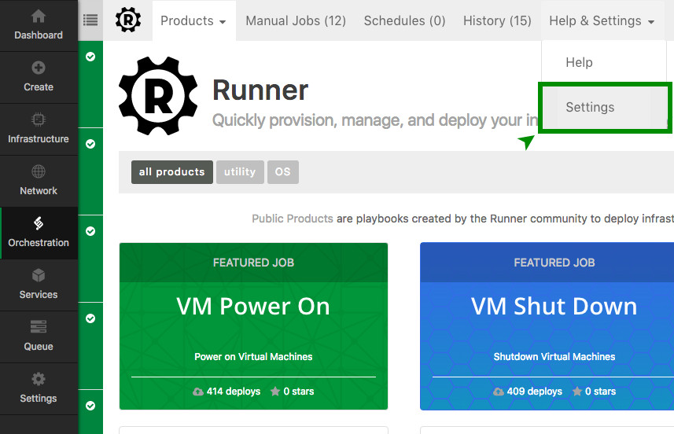
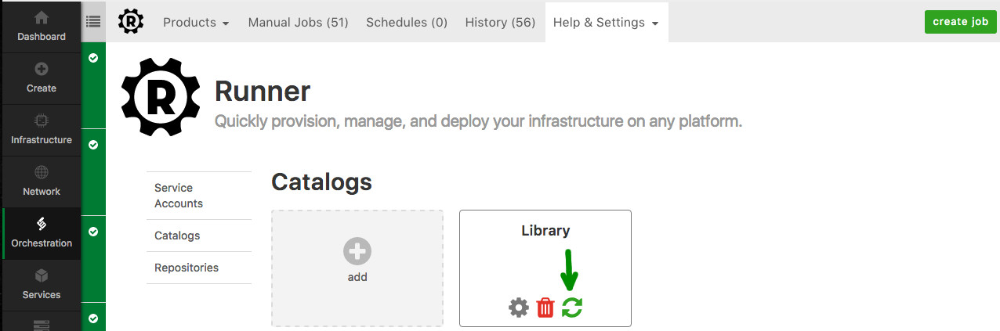

{{{
  "title": "Runner Catalogs & Products",
  "date": "03-30-2017",
  "author": "Justin Colbert",
  "attachments": [],
  "related-products" : [],
  "contentIsHTML": false,
  "sticky": true
}}}


### Audience

This article is to support customers of Runner, a product that enables teams, developers, and engineers to quickly provision, interact, and modify their environments anywhere - CenturyLink Cloud, third-party cloud providers, and on-premises.

### Catalog & Product Overview

A Runner product allows for a user to build a form around their Ansible playbooks to allow for dynamic user inputs at runtime. A Runner catalog is a git repository that contains a collection of products.

- [Create a Runner Catalog](#CreateCatalog)
- [Update a Runner Catalog](#UpdateCatalog)
- [Refresh a Runner Catalog](#RefreshCatalog)
- [Create a Runner Product](#CreateProduct)
- [Create Product config.yml](#CreateProductConfig)

### Create a Runner Catalog <a id="CreateCatalog">

A Runner Catalog is a github repository that contains one or more Runner proudcts. To create a Catalog, click the Help & Settings drop-down and select Settings.



On the left side, select Catalogs and this will bring up a view showing you all of your existing catalogs. Click on the add button and a form will appear where you can enter the required information.


* (1): Enter the name that you want to use to label this catalog.
* (2): Enter a description for this catalog
* (3): Enter the HTTPS git URL for the repo you are wanting to add as a catalog
* (4): Enter the branch you want this catalog to read from. (This needs to be compliant with github's API, so for branch "master" it is "heads/master")
* (5): Enter your github username. (This is only required if it is a private repository)
* (6): Enter your github password. (This is only required if it is a private repository)

Click the submit button and your catalog will be added. If you already have products configured in your repo they will start to show up in the private products section after several minutes.


### Update a Runner Catalog <a id="UpdateCatalog">

To update a Runner Catalog, go back to the Catlogs screen and hover over the catalog you want to update. Click the gear icon and it will open the edit form where you can edit any necessary details.


### Refresh a Runner Catalog <a id="RefreshCatalog">

Runner catalogs will refresh themselves every 5 minutes and scan your repository for new product directories. In the event that you need an immediate refresh or are not seeing your updates there is a manual refresh button that can be used. If you go to your catalogs, hover over the relevant catalog and hit the refresh button. This will trigger a forced reload of your catalog.




### Create a Runner Product <a id="CreateProduct">

In order to have a product be recognized by Runner, it must first be present in its own folder in an existing catalog. Inside the folder, there must be a minimum of three files; your main playbook yaml file, a README.md file, and a product.yml file.

In the below image, you can see the public Runner Library repository. Through the Runner interface, this repository is configured as a catalog and each folder that you see is a separate product within Runner.


#### README.md

As part of configuring a new product, your product folder must have a README.md file. This file should provide details about how your product works and the various options that are provided. The contents of this file are then rendered into the Runner UI when your product is loaded.

#### config.yml

The config.yml file tells Runner all the necessary details about your product and is also where you configure your product form. Below are the required fields that you must put in your config.yml in order to have your Runner product page render properly.

#### Required Elements:
parameter | comments
--- | ---
name | Name of your Product
shortDescription | A short description of your product
description | Description of your product
imagePath | URL to the image you would like to display with your product
version | Your version number
updateDate | The last date you updated your product
defaultPlaybook | The default playbook yaml file to run
author | Author Name
organization | Your company
organizationUrl | URL for your company website

#### Config Field Types

The config.yml file is used to not only provide information about your product, but can also be used to build dynamic forms to provide information to your playbook. Below are the various field types you can use to acquire information from the user and pass it to your playbook.

#### type:
- [datacenters](#datacenters)
- [groups](#groups)
- [servers](#servers)
- [textblock](#textblock)
- [toggle](#toggle)
- [slider](#slider)

#### datacenters <a id="datacenters">
The datacenters field will query the CenturyLink Cloud APIs and bring back all valid datacenters for an account alias.

##### Options
parameter | comments
--- | ---
name | The name of the variable to pass to Ansible
displayName | The field name to display in the UI
required | Is this item required for playbook execution (true / false)

##### Example
```yaml
fields:
  - type: datacenters
    name: my_datacenter
    displayName: Select a Datacenter
    required: true
```


#### groups <a id="groups">
The groups field will query the CenturyLink Cloud APIs and display all groups for an account alias. The output can be restricted to a specific datacenter if you include a `parent` option.

##### Options
parameter | comments
--- | ---
name | The name of the variable to pass to Ansible
displayName | The field name to display in the UI
multiple | Can you select multiple groups instead of just one (true / false)
parent | Can be used to restrict to only groups in a certain datacenter. (datacenters corresponding name)
required | Is this item required for playbook execution (true / false)

##### Example
```yaml
fields:
  - type: groups
    name: my_groups
    displayName: Select Your Groups
    multiple: true
    required: true
```
##### Parent Example
```yaml
fields:
  - type: datacenters
    name: my_datacenter
    displayName: Select a Datacenter
    required: true

  - type: groups
    name: my_groups
    displayName: Select Group
    parent: my_datacenter
    multiple: false
    required: true
```


#### servers <a id="servers">
The servers field will query the CenturyLink Cloud APIs and display all servers for an account alias.

##### Options
parameter | comments
--- | ---
name | The name of the variable to pass to Ansible
displayName | The field name to display in the UI
multiple | Can you select multiple groups instead of just one (true / false)
parent | Can be used to restrict to only groups in a certain datacenter. (datacenters corresponding name)
required | Is this item required for playbook execution (true / false)
inventory | Should the selected servers be added to your Ansible inventory (true / false)

##### Example
```yaml
fields:
  - type: servers
    name: my_servers
    displayName: Select your servers
    multiple: true
    required: true
    inventory: false
```

#### textblock <a id="textblock">
The textblock field can be used to display various types of information or warning type text on the product form.

##### Options
parameter | comments
--- | ---
name | The name of the variable to pass to Ansible
title | The title of your textblock
text | The text to display in your textblock
level | The level of textblock to display (info / warning / danger)

##### Example
```yaml
fields:
  - type: textblock
    name: text_block_warning
    title: "Warning"
    text: "This is showing you the warning text"
    level: warning
```

#### toggle <a id="toggle">
The toggle field generates a toggle button that can be used to send a true or false variable to Ansible

##### Options
parameter | comments
name | The name of the variable to pass to Ansible
displayName | The field text to display in the UI
default | The default state of the toggle button (true / false)

##### Example
```yaml
fields:
  - type: toggle
    name: toggle_field
    displayName: "Enable this feature?"
    default: true
```

#### slider
The slider field allows you to generate a numeric slider

##### Options
parameter | comments
name | The name of the variable to pass to Ansible
displayName | The field text to display in the UI
min | The minimum value that can be selected
max | The maximum value that can be selected
default | The default value the slider will be initially set at
required | Is this item required for playbook execution (true / false)

##### Example
```yaml
fields:
  - type: slider
    name: slider_value
    displayName: "How many things do you want?"
    min: 1
    max: 10
    default: 4
    required: true
```
