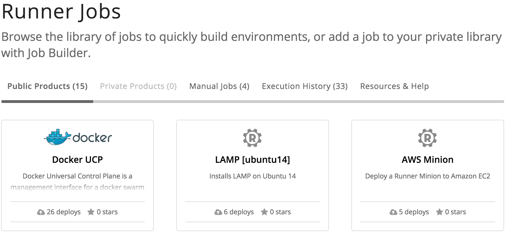
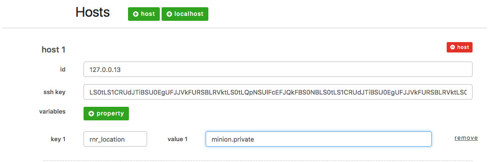

{{{
  "title": "The Runner Minion",
  "date": "05-12-2017",
  "author": "Justin Colbert",
  "attachments": [],
  "related-products" : [],
  "contentIsHTML": false,
  "sticky": true
}}}


### Audience

This article is to support customers of Runner, a product that enables teams, developers, and engineers to quickly provision, interact, and modify their environments anywhere - CenturyLink Cloud, third-party cloud providers, and on-premises.

### The Runner Minion

Runner supports multi-cloud execution of Runner Jobs.  Runner can execute your Jobs against an AWS cloud environment, an Azure cloud environment, or any other cloud environment. Runner can also execute your Jobs against on-premises systems and resources.

Runner is able to achieve this level of reach by utilizing a component we call the Runner Minion.  The Runner Minion is a small light weight component that you control, which runs in your non CenturyLink Cloud environments. When running, the Runner Minion calls back home to Runner Central via the Runner public API's asking for work for that particular environment.  Because the Runner Minion uses public API's via HTTPS to fetch and respond to work, your remote environments don't require any special configurations other then the ability to call out to the Internet.

You will need to install and run a Runner Minion in all non CenturyLink Cloud environments. At a minimum the Runner Minion needs to be installed in a network location where it can access all parts of your environment. From this location the Runner Minion will utilize ssh/winrm to communicate with systems and resources. Another approach, although a bit excessive, is to install a Runner Minion on each system or resource in your environment.

### How To Install
#### Amazon Environments
The Runner Minion is available as a push-button product installation into the Amazon environment. You can access the AWS Minion product using your CenturyLink Cloud account. The default Runner (Public Products) page will expose a Product Market Place.

- Locate and click on **AWS Minion** in the Public Products of the Runner Jobs page.

  

- Click on **run**, fill in the form data, and click **run** again.

The product installation will create a new server in your AWS account, then install, register, and launch the AWS Minion.

#### Other Environments
The Runner Minion is also available as a docker image.
The docker image is freely available from [DockerHub](https://hub.docker.com/r/centurylink/rnr-minion/).

#### Download the Runner-Minion
Execute a docker pull on the image to download it to your system.

```
docker pull centurylink/rnr-minion
```

### Register The Runner Minion
Register the Runner Minion to receive an access token. Please note that all calls to the Runner APIs require a valid CenturyLink Cloud bearer token.

#### URL
##### Structure
    POST https://api.runner.ctl.io/minions/{account-alias}/tokens

#### Request
##### URI Parameters
| Name | Type | Description | Req. |
| --- | --- | --- | --- |
| account-alias | string | Short code for a particular account | Yes |

##### Content Parameters
| Name | Type | Description | Req. |
| --- | --- | --- | --- |
| name | string | A unique name for the minion | No |
| description | string | A description for the minion | No |
| location | string | Location to associate with the minion. This will also be the queue name that the minion polls from | No |
| networks | array | CIDR Network blocks to associate the minion with | No |

#### Examples
##### JSON

    {
      "name":"private_minion",
      "description":"A private minion",
      "location":"minion.private"
      "networks":[ "127.0.0.1/24", "10.123.0.1/24" ]
    }


#### Response
##### Minion Definition
| Name | Type | Description |
| --- | --- | --- | --- |
| name | string | The minion name |
| description | string | The minion description |
| accountAlias | string | The CLC alias this minion is associated with |
| location | string | Location associated with the minion |
| requestQueue| string | The name of the minion requests queue |
| replyQueue| string | The name of the minion replies queue |
| networks | array | The networks associated with this minion |
| id | string | The minion ID |
| token | string | The minion startup token |

#### Examples
##### JSON
    {
      "name": "private_minion",
      "description": "A private minion",
      "accountAlias": "WFTC",
      "location": "minion.private",
      "providerType": null,
      "requestQueue": "minion.private",
      "replyQueue": "minion.private.reply",
      "networks": null,
      "id": "274a7833-....-....-....-...a867c4723",
      "token": "e4feb008-....-....-....-...9daf251a6"
    }


#### Launch The Runner Minion
The below command will then launch your new Runner minion

```
docker run -dit  centurylink/rnr-minion --token=<token>
```


#### Minion Specific SSH Key
One benefit of using your own Minion, is the ability for a user to set a private SSH key to use for all connections routed through their Minion. By starting a Minion with the below command, the specified SSH Private key will be used for all outbound connections unless a different set of credentials are manually specified in the job definition.

```
docker run -dit -v <path/to/ssh_key>:/data01/minion/ssh_key centurylink/rnr-minion --token=<token>
```

#### Making use of your new Minion
Once your Minion is up and running, there are two ways that you can use it. First, if you specified any networks whenever you registered your minion, Runner will automatically route traffic destined for those subnets to your Minion. Second, by adding a rnr_location property to any host like in the image below, you can tell Runner to route all tasks destined for that server through the specified Minion.


