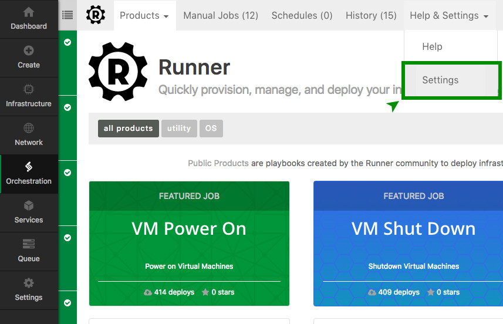
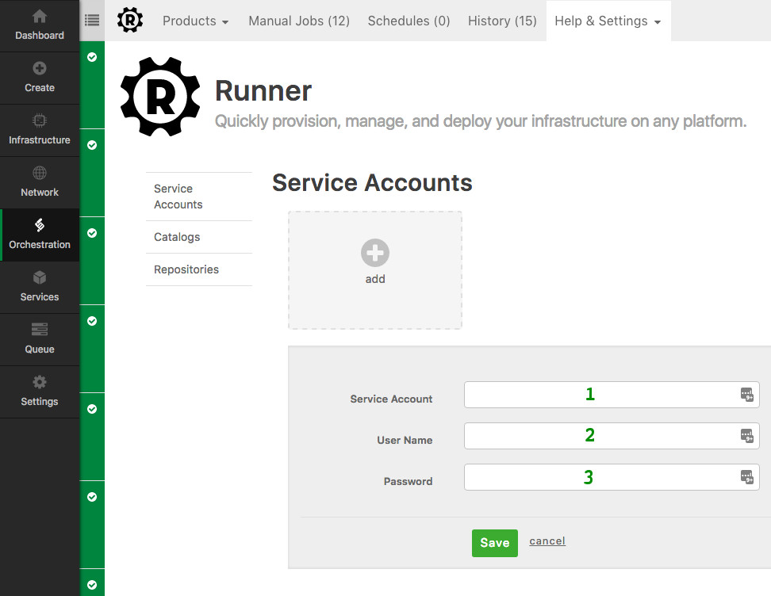

{{{
  "title": "Runner Service Account",
  "date": "03-24-2017",
  "author": "Justin Colbert",
  "attachments": [],
  "related-products" : [],
  "contentIsHTML": false,
  "sticky": true
}}}


### Audience

This article is to support customers of Runner, a product that enables teams, developers, and engineers to quickly provision, interact, and modify their environments anywhere - CenturyLink Cloud, third-party cloud providers, and on-premises.  Additionally, the responses in this FAQ document are specific to using the service through the Control Portal.


### Service Account Overview

The Service Account alias is a secure store of a users credentials. These credentials are associated with a Job and a Schedule. When the schedule fires these credentials will be used to authenticate to CenturyLink Cloud to retrieve the necessary tokens to execute the job. The credentials are stored in a secure format separate from the job definition and other account identifying elements.

 - [Create Service Account Via Runner UI](#CreateServiceAccountUI)
 - [Create Service Account Via Runner API](#CreateServiceAccount)
 - [Get Service Account Via Runner API](#GetServiceAccount)
 - [Update Service Account Via Runner API](#UpdateServiceAccount)


#### CREATE SERVICE ACCOUNT VIA RUNNER UI <a id="CreateServiceAccountUI">

To create a Service Account through the Runner UI, first click the Help & Settings drop-down and select Settings.



On the left side, select Service Accounts and this will bring up a view showing you
all of your existing Service Accounts. Click on the add button and a form will appear
where you can enter the required information.



* (1): Enter the Service Account Alias, this can be anything you want but it should be descriptive.
* (2): Enter the CenturyLink Cloud User Name that you want associated with this Service Account.
* (3): Enter the password that corresponds with the User Name you entered above.

Click the Save button and your service account will be created.

#### CREATE SERVICE ACCOUNT <a id="CreateServiceAccount"></a>

The Service Account alias is a secure store of a user's credentials. These credentials are associated with a Job and a Schedule. The credentials are stored in a secure format separate from the job definition and other account identifying elements. Calls to this operation must include a token acquired from the authentication endpoint. See the [Login API](https://www.ctl.io/api-docs/v2/#authentication-login) for information on acquiring this token.

**When to use it**

Use this API to create Service Account alias under your CenturyLink Cloud account and use this alias for executing scheduled jobs.

##### URL
**Structure**

`POST https://api.runner.ctl.io/serviceAccounts/{accountAlias}`

**Example**

`POST https://api.runner.ctl.io/serviceAccounts/XXXX`

##### Request
**URI Parameters**

| NAME | TYPE |	DESCRIPTION	| REQ.|
| --- | --- | --- | --- |
| accountAlias |	string |	Short code of your CenturyLink Cloud Account Alias. |	Yes |

**Entity Definition**

| NAME | TYPE |	DESCRIPTION	| REQ.|
| --- | --- | --- | --- |
| alias |	string |	Enter your Service Account Alias name. |	Yes |
| username |	string |	Your CenturyLink Cloud Account username. |	Yes |
| password |	string |	Your CenturyLink Cloud Account password. |	Yes |

##### Response

The response will list the details of the new Service Account alias created.

**Entity Definition**

| NAME | TYPE |	DESCRIPTION	|
| --- | --- | --- |
| id |	string |	ID of your new Service Account Alias. |
| accountAlias |	string |	Short code of your CenturyLink Cloud Account Alias. |
| alias |	string |	Your Service Account Alias name. |
| username |	string |	Your CenturyLink Cloud Account username. |
| password |	string |	Your CenturyLink Cloud Account password. |

**Example**

```
{
  "id": "729e3136-c474-42fb-976e-53786f5fb000",
  "accountAlias": "XXXX",
  "alias": demo-account-service-account1,
  "username": "your-username",
  "password": "your-password"
}
```


#### GET SERVICE ACCOUNT <a id="GetServiceAccount"></a>

The Service Account alias is a secure store of a users credentials. These credentials are associated with a Job and a Schedule. The credentials are stored in a secure format separate from the job definition and other account identifying elements. See the [Login API](https://www.ctl.io/api-docs/v2/#authentication-login) for information on acquiring this token.

**When to use it**

Use this API to view all the Service Account alias under your CenturyLink Cloud account alias.

##### URL
**Structure**

`GET https://api.runner.ctl.io/serviceAccounts/{accountAlias}`

**Example**

`GET https://api.runner.ctl.io/serviceAccounts/XXXX`

##### Request
**URI Parameters**

| NAME | TYPE |	DESCRIPTION	| REQ.|
| --- | --- | --- | --- |
| accountAlias |	string |	Short code of your CenturyLink Cloud Account Alias. |	Yes |

##### Response

The response will provide an array of all Service Account alias created under your CenturyLink Cloud Account.

**Entity Definition**

| NAME | TYPE |	DESCRIPTION	|
| --- | --- | --- |
| accounts |	array |	List of Service Account Alias created. |

**Example**

```
{
    "accounts": [
        "demo-account-service-account1",
        "demo-account-service-account2",
        "demo-account-service-account3",
        "demo-account-service-account4"
  ]
}
```


#### UPDATE SERVICE ACCOUNT <a id="UpdateServiceAccount"></a>

The Service Account alias is a secure store of a users credentials. These credentials are associated with a Job and a Schedule. The credentials are stored in a secure format separate from the job definition and other account identifying elements. See the [Login API](https://www.ctl.io/api-docs/v2/#authentication-login) for information on acquiring this token.

**When to use it**

Use this API to update your existing Service Account alias credentials under your CenturyLink Cloud account.

##### URL
**Structure**

`PUT https://api.runner.ctl.io/serviceAccounts/{accountAlias}/{serviceAccountAlias}`

**Example**

`PUT https://api.runner.ctl.io/serviceAccounts/XXXX/demo-account-service-account1`

##### Request
**URI Parameters**

| NAME | TYPE |	DESCRIPTION	| REQ.|
| --- | --- | --- | --- |
| accountAlias |	string |	Short code of your CenturyLink Cloud Account Alias. |	Yes |
| alias |	string |	Your Service Account Alias name to be updated. |	Yes |

**Entity Definition**

| NAME | TYPE |	DESCRIPTION	| REQ.|
| --- | --- | --- | --- |
| username |	string |	Your CenturyLink Cloud Account username. |	Yes |
| password |	string |	Your CenturyLink Cloud Account password. |	Yes |

##### Response

The response will contain the updated Service Account alias details.

**Entity Definition**

| NAME | TYPE |	DESCRIPTION	|
| --- | --- | --- |
| id |	string |	ID of your new Service Account Alias. |
| accountAlias |	string |	Short code of your CenturyLink Cloud Account Alias. |
| alias |	string |	Your Service Account Alias name. |
| username |	string |	Your CenturyLink Cloud Account username. |
| password |	string |	Your CenturyLink Cloud Account password. |

**Example**

```
{
  "id": "729e3136-c474-42fb-976e-53786f5fb000",
  "accountAlias": "XXXX",
  "alias": demo-account-service-account1,
  "username": "Updated - username",
  "password": "Updated - password"
}
```
