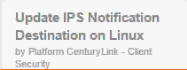
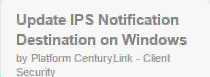
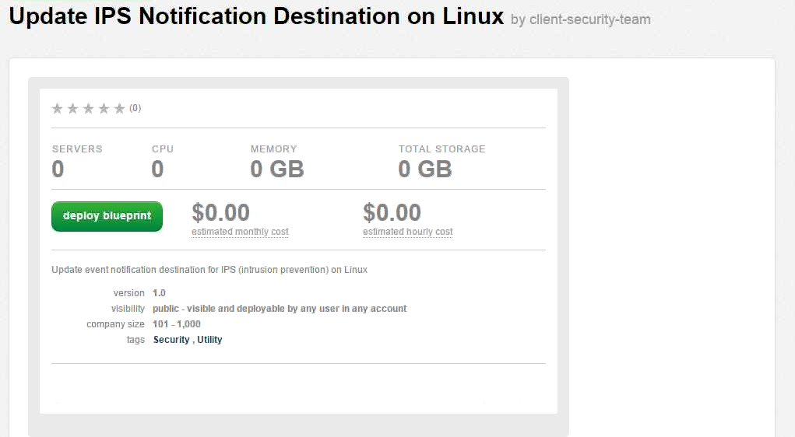

{{{
  "title": "Configuring Intrusion Prevention System (IPS) Notifications",
  "date": "10-22-2015",
  "author": "Client-Security",
  "attachments": [],
  "related-products" : [],
  "contentIsHTML": false,
  "sticky": false
}}}

### Overview

The Platform CenturyLink IPS utilizes an Agent installed on your Virtual Machine (VM) that will monitor that VM for suspicious activity. If suspicious activity is found, the Agent will log it and may block or stop the activity, and will report it based on the IPS policy. There is a default policy associated to each VM that is automatically tuned based on the host operating system and installed applications.

The Blueprint allows a customer that has purchased the IPS service from Platform CenturyLink to modify how they would like to be notified regarding IPS security events. This Blueprint will only change **Slack** notification settings for the server it is run against.

Our API allows for a customer to set notification destinations for either **Slack** or **Sys Log**.  

### Prerequisites

* A CenturyLink Cloud Account
* Virtual Machine with CenturyLink Intrusion Prevention Agent installed
* Slack channel & WebHook URL [(See Utilizing SLACK for IPS Event Notifications)](utilizing-slack-for-ips-event-notifications.md)

### Configuration Process via Blueprints

1. Search for **IPS Notification** in the Blueprint library. Then, click on the desired Operating System blueprint to configure Notifications.

  

   

2. Click on the **deploy blueprint** button.

  

3. Select the appropriate Virtual Machine to execute on.

  * Enter and confirm User Password
  * Provide WebHook URL [(See "Utilizing SLACK for IPS Event Notifications")](utilizing-slack-for-ips-event-notifications.md)
  * Click **next: step 2.**

  

4. Review the blueprint parameters and select **deploy blueprint**.

  

5. The Blueprint log will show each step taken and its status during provisioning.

  

6. An email notification will be sent to the initiator of the Blueprint for both queuing and completion.

### Configuration Process via our API

Sets a destination for all IPS event notifications to be sent to. Calls to this operation must include a token acquired from the authentication endpoint. See the [Login API](https://www.ctl.io/api-docs/v2/#authentication-login) for information on acquiring this token.

#### URL

##### Structure

>PUT http://api.client-security.ctl.io/ips/api/notifications/{accountAlias}/{serverName}
>
>'[
>   {
>       "url":{some URL},
>       "typeCode":{endpoint type}
>   }
>]'

#### Request

##### URI Parameters

| **Name**     | **Type** | **Description**                                               | **REQ.**|
|--------------|----------|---------------------------------------------------------------|---------|
|accountAlias  |String    |Short code for a particular account                            |Yes      |
|serverName    |String    |The name of the server that the destination should be set for. |Yes      |

##### Content Properties

| **Name**                | **Type** | **Description**                      | **REQ.** |
|-------------------------|----------|--------------------------------------|----------|
|notificationDestinations |array     | List of Notification Destinations    |Yes       |       

##### Notification Destination Definition 

| **Name**  | **Type**  | **Description**                                           | **REQ.** |
|-----------|-----------|-----------------------------------------------------------|----------|
|url        |String     |The URL endpoint for WEBHOOK or SLACK notification.        |No        |
|typeCode   |String     |This is the type of destination.                           |Yes       |
|sysLogSettings|SysLogSettings|This contains all of the options for SYSLOG          |No        |
|emailAddress|String    |This object will contain options for an EMAIL notification |No        |

TypeCode currently consists of: SYSLOG, EMAIL, WEBHOOK and SLACK

##### SysLogSettings Definition
| **Name**  | **Type**  | **Description**                                                 | **REQ.**  |
|-----------|---------- |-----------------------------------------------------------------|-----------|
|ipAddress  |String     |The IP address of customers syslog server                        |Yes        |
|udpPort    |Integer    |The port the syslog is listening on                              |Yes        |
|facility   |Integer    |This is an Integer, 16-23, for descriptions see below.           |Yes        |

Facility is to set the type of program logging messages. The options are 16-23 for descriptions follow the link: [https://en.wikipedia.org/wiki/Syslog](https://en.wikipedia.org/wiki/Syslog) 

##### Example

>PUT http://api.client-security.ctl.io/ips/api/notification/ALIAS/VA1ALIASMYSVR01
>
>'[
          {
              "url": "http://my.slack.webhook",
              "typeCode": "SLACK"
          },
          {
               "url": "http://my.generic.webhook",
               "typeCode": "WEBHOOK"
               },
          {
              "typeCode": "SYSLOG",
              "sysLogSettings": {
                  "ipAddress": "12345",
                  "udpPort": "8081",
                  "facility": "16"
              }
          },
          {
              "typeCode": "EMAIL",
              "emailAddress": "youremail@site.com"
              }
      ]'
      
If you are using the generic "WEBHOOK" type for your notifications the following key-value pair are to be expected in return when an event is triggered
##### Response Object
| **Name** | **Type** | **Description**                                                                     |
|----------|----------|-------------------------------------------------------------------------------------|
|packetSize|int       |Size of the packet which triggered the event                                         |
|rank      |int       |Name of the DPI filter which triggered the event                                     |
|driverTime|Long      |Epoch time the Agent driver recorded at the time of the event                        |
|startTime |Date      |Start time of the event if repeated multiple times                                   |
|endTime   |Date      |End time of the event if repeated multiple times                                     |
|action    |String    |Resulting action of the triggered event                                              |
|data      |String    |Any captured packet data in Base64 encoded format                                    |
|destinationIP|String |Destination IP Address                                                               |
|destinationMAC|String|Destination MAC Address                                                              |
|destinationPort|String|Destination Port                                                                    |
|direction |String    |Direction of the event                                                               |
|eventOrigin|String   |Origin of the event                                                                  |
|flags     |String    |Data packet flags                                                                    |
|flow      |String    |Flow of the packet the log was recorded for in relation to the connection direction  |
|hostName  |String    |HostTransport Name of the computer where the event was triggered                     |
|iface     |String    |Name of the physical network interface where the event was triggered                 |
|protocol  |String    |Protocol of the connection                                                           |
|reason    |String    |Name of the DPI filter which triggered the event                                     |
|sourceIP  |String    |Source IP Address                                                                    |
|sourceMAC |String    |Source MAC Address                                                                   |
|sourcePort|String    |Source Port                                                                          |
|tags      |String    |Name of any event tags assigned to this event                                        |
|severity  |String    |Severity                                                                             |

### Frequently Asked Questions

**What is a WebHook?**

WebHook is an HTTP callback: an HTTP Post that occurs when something happens.

**Are there other formats or WebHooks available?**

Not at this time. If you would like to recommend another, please send request details to [features@cti.io](mailto:features@ctl.io).

**Do you retain the data after the event notification is sent?**

Yes, we retain the data for 60 days.  If you need a longer data retention period, we are working on additional add-on functionality to store this data.  If you are interested, please send request details to [features@ctl.io](mailto:features@ctl.io).

**Are you storing the full payload in another location?**

Yes, we retain the data in another location for 60 days.

**Do you support a text message or paging service?**

No, but we are happy to review any request sent to [features@ctl.io](mailto:features@ctl.io).