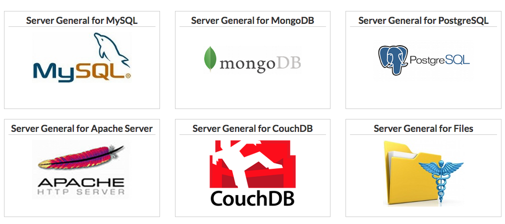

{{{
"title": "Encryption made easy with Server General",
"date": "06-10-2016",
"author": "Eric Schubert",
"contentIsHTML": false,
"sticky": false
}}}

### Linux Database and File Encryption made easy with Server General

Encryption is a hot topic. Fortunately, CenturyLink has a couple of partners that specialize in encrypting cloud based environments.

One of these partners is Vormetric. You can read a very in-depth configuration guide here: [CenturyLink Vormetric Guide](../Security/centurylink-cloud-guide-to-vormetric-dsm.md). One of the issues with encryption services like Vormetric is that there are so many options and variables it can be overwhelming and difficult to configure.

Enter Server General, who has recognized the need for encryption services but also the difficulty in implementing them and taken a different approach. Instead of offering every available option and configuration, Server General is for a particular use case: Specific Linux based applications and files. Server General takes this use case and set up some pre-configuration that makes it very easy to get your critical data encrypted.

At this point in the article, if your needs are Windows based or more full featured than you may want to stop here and explore Vormetric. If, however, your needs are to encrypt Linux based data then read on and we’ll share how easy it was to configure the product and our own experience encrypting a MySQL database.

### Supported Options
Server General supports the following applications and data sets:

Each of these applications has a preset configuration file with defaults already set. Make a few changes to match your unique environment, apply and your critical data is encrypted.

### Easy Setup

There are 4 main components to setting up Server General:

1.	Run the blueprint to install – Follow instructions here: [CenturyLink Getting Started with Server General Guide](../Ecosystem Partners/Marketplace Guides/getting-started-with-server-general-blueprint.md)
2.	Secure the SGadmin user. The install will create a user called SGadmin along with a public and private key. In order to log on with this user and configure Server General SGadmin will need to be secured by copying the private key to a secure location and then deleting it off of the server.
3.	Set up a Security Officer role (An authorized entity who manages Data Administrators) and a Data Administrator role (An authorized entity who is trusted with management of sensitive data sets).
4.	Using preset examples provided edit and apply an applicable Security Policy (example: security_policy_mysql).

Done! MySQL data is now encrypted and only authorized users can access it. Root is blocked from access to encrypted files so if the system is ever comprised the data will remain secure.

### Real world testing

Our own experience with the product was that it performed as advertised. For our test environment we used [Runner](../Runner/getting-started-with-runner.md) to set up an Ubuntu server and layer on Apache, MySQL and PHP.

With our server ready to go, we then ran through the above 4 steps to encrypt the MySQL database. To test it, we logged out sgadmin and logged back on as root. We then tried to access the MySQL data directories at /var/lib/mysql/ and to root it appeared that the directories were empty as root did not have access to even view the files in their encrypted form.

### Pros:
* Easy and fast set up
* Configuration user requires off server private key to logon
* Pre-configured policies make configuring approved data sets simple
* Root is blocked so even a comprised machine remains secure
* Customer controls keys

### Cons:
* Linux only
* No central admin UI, configuration is per server

### Final thoughts:
As a CenturyLink Cloud customer, if you need to quickly and effectively encrypt your Linux based systems, Server General is a great option and yet another tool in the ever growing set of CenturyLink security solutions. Get started [here](../Ecosystem Partners/Marketplace Guides/getting-started-with-server-general-blueprint.md).

### Frequently Asked Questions

**Q:** How does pricing work?

**A:** Server General is a subscription based service. Customers pay on a monthly basis.

**Q:** What other services are included with a subscription?

**A:** Highly redundant and secure key management infrastructure including key rotation and revocation capabilities.
