{{{
  "title": "Lumen Cloud Guide to Vormetric DSM",
  "date": "07-22-2017",
  "author": "Chris Little",
  "attachments": [],
  "contentIsHTML": false,
  "sticky": false
}}}

### Table of Contents

* [Vormetric DSM Overview](#vormetric-dsm-overview)
* [Prerequisites](#prerequisites)
* [General Notes](#general-notes)
* [DNS Services](#dns-services)
* [Network Connectivity](#network-connectivity)
* [Data Security Manager Configuration](#data-security-manager-configuration)
* [Account Hierarchy and VDS Domains](#account-hierarchy-and-vds-domains)
    * [Account Hierarchy Single VDS Domain](#account-hierarchy-single-vds-domain)
    * [Account Hierarchy Multiple VDS Domains](#account-hierarchy-multiple-vds-domains)
* [Host Agent Installation](#host-agent-installation)
* [Creating Encryption Keys](#creating-encryption-keys)
* [Creating Policies and Applying Guardpoints](#creating-policies-and-applying-guardpoints)
    * [Creating Policies](#creating-policies)
    * [Creating GuardPoints](#creating-guardpoints)
* [Encrypting Existing Data](#encrypting-existing-data)
* [High Availability](#high-availability)
* [DSM Automatic Backup](#dsm-automatic-backup)
* [Server Backup and Recovery](#server-backup-and-recovery)

### Vormetric DSM Overview
Vormetric provides enterprise encryption and key management services that enable corporations to protect their data. Vormetric addresses industry compliance mandates and government regulations globally by securing data in physical, virtual, and cloud infrastructures through Data Encryption, Key Management, Access Policies, Privileged User Control, and Security Intelligence.  Customers should refer to our Knowledge Base article titled [Getting Started with Vormetric Data Security Manager](../Marketplace/Getting Started Guides/getting-started-vormetric-data-security-manager.md) for more information.

### Prerequisites
* A Lumen Cloud Account
* Vormetric DSM Licenses
* Vormetric DSM Deployed into your account in a [dedicated network vlan](../Network/CenturyLink Cloud/creating-and-deleting-vlans.md). Customers leveraging an account hierarchy are advised to place the DSM in the parent account as multi-tenant capabilities of the DSM allow for logical separation of policies, key, security administrators.

### General Notes
* Vormetric customers should always refer to vendor product documentation and [online support](//help.vormetric.com) tools. This guide is focused on delivering Lumen Cloud specific considerations and steps with video tutorials for the baseline configuration of a DSM appliance.

### DNS Services
DNS resolution is crucial to a successful implementation as all communications between the DSM and every agent, and between the DSM and failover DSM units relies on DNS resolution. Ensure assigned hostnames and DNS records exists for DSMs and server systems in all associated DNS servers and that the fully qualified domain name for the DSMs and server systems are entered in the DSM units and servers systems during the Vormetric setup and/or configuration. **DNS names are case sensitive. It is imperative that this is taken into account when registering hosts and configuring DNS services.**

### Network Connectivity
Customers are encouraged to place their DSM in a secure isolated vlan on the Lumen Cloud. This provides maximum security and control of inbound and outbound TCP and UDP ports used in the delivery of encryption services.

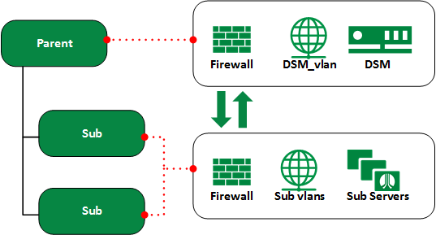

The table below provides a map of the DSM and Host Agent TCP and UDP ports required for encryption services.

**Source**|**Destination**|**Port**
----------|---------------|--------
DSM|DNS Server(s)|TCP/53<br>UDP/53
DSM|Host Agents<sup>1</sup>|PING<br>TCP/7024
Host Agents|DSM|PING<br>HTTP(8080)<br>TCP/8443<br>TCP/8444<br>TCP/8446<br>TCP/8447

<sup>1</sup>*Windows Servers require an incoming firewall rule to permit TCP/7024 inbound. You can apply this change to all domain members or specific workgroup servers using a group policy. Execute the following command (or use the Group Policy Editor) on the Domain Controller or workgroup server:*

**Domain Controller:**

```
New-NetFirewallRule -DisplayName “Vormetric DSM to Agent” -Direction Inbound –Protocol TCP –LocalPort 7024 -Action Allow –PolicyStore "FQDN\gpo_name"
```

**Workgroup Server:**

```
New-NetFirewallRule -DisplayName “Vormetric DSM to Agent" -Direction Inbound –Protocol TCP –LocalPort 7024 -Action Allow
```

### Data Security Manager Configuration

1. Use the [Getting Started with Vormetric DSM](../Marketplace/Getting Started Guides/getting-started-vormetric-data-security-manager.md) guide to deploy your DSM Appliance into a Lumen Cloud Data Center.

2. Connect securely via [IPSEC](../Network/CenturyLink Cloud/creating-a-self-service-ipsec-site-to-site-vpn-tunnel.md) or [Client VPN](../Network/CenturyLink Cloud/how-to-configure-client-vpn.md) and use SSH to login as **cliadmin**. Tip: Per the Getting Started Guide, the default password is **Vormetric123$**. It is advised you modify this as shown later in this KB.

    ```
    login as: cliadmin
    cliadmin@10.101.44.12's password:
    Last login: Mon Aug  3 15:40:21 2015 from 10.100.96.231
    ```
3. Set the DNS Servers for your DSM appliance. DNS resolution as noted earlier is one of the most important components to a successful implementation. Using name servers that house records for all hosts you wish to encrypt is required.

    ```
    vormetric$ network
    network$ dns dns1 10.100.98.13
    DNS SUCCESS
    network$ dns dns2 10.100.98.14
    DNS SUCCESS
    network$ dns show
    search name.here.com
    nameserver 10.100.98.13
    nameserver 10.100.98.14
    DNS show SUCCESS
    ```

4. Set NTP for your DSM Appliance.

    ```
    network$ up
    vormetric$ maintenance
    maintenance$ ntpdate add 0.north-america.pool.ntp.org
    ntpdate SUCCESS
    maintenance$ ntpdate show
    Total ntpdate server number  : 1
    ntpdate server [1] : 0.north-america.pool.ntp.org
    maintenance$ ntpdate on
    ntpdate SUCCESS
    maintenance$ ntpdate sync
    ntpdate SUCCESS
    ```

5. Set timezone and validate date/time (from NTP) for your DSM Appliance.

    ```
    maintenance$ gmttimezone set America/New_York
    Set timezone SUCCESS. Please restart server software to pick up the changes
    maintenance$ date
    month=Aug day=26 year=2015
    Show system date SUCCESS
    maintenance$ time
    hour=16 min=02 sec=12 zone=EDT
    Show system time SUCCESS
    ```

6. Set a hostname (FQDN) for your DSM Appliance.

    ```
    maintenance$ up
    vormetric$ system
    system$ setinfo hostname CA3CCVADSM01.CCVA.COM
    SUCCESS: The host name has been changed (CA3CCVADSM01.CCVA.COM).
    system$ setinfo show
    hostname = CA3CCVADSM01.CCVA.COM
    UUID = 422D7C13-1F3C-EBE2-565F-8C26C5699EFB
    serial number = XXXXXXXXXXX
    part number = 30-1010005-01
    uptime =  16:02:38 up 69 days,  7:11,  1 user,  load average: 0.06, 0.03, 0.00 on virtual machine = true
    ssh banner = Welcome to the Vormetric Data Security Manager.
    Show setinfo SUCCESS
    ```
7. Generate the DSM Certificate Authority. **Document the data you input in this step as it will be used, should you implement high availability.**

    ```
    system$ security genca
    WARNING: All Agents and Peer node certificates will need to be re-signed after CA and server certificate regenerated, and the security server software will be restarted automatically!
    Continue? (yes|no)[no]:yes
    This computer may have multiple IP addresses. All the agents will have to connect to Security Server using same IP.
    Enter the host name of this computer. This will be used by Agents to talk to this Security Server.
    This Security Server host name[CA3CCVADSM01.CCVA.COM]:
    Please enter the following information for key and certificate generation.
    What is the name of your organizational unit? []:Lumen Cloud
    What is the name of your organization? []:Lumen
    What is the name of your City or Locality? []:Bellevue
    What is the name of your State or Province? []:WA
    What is your two-letter country code? [US]:US
    Regenerating the CA and server certificates now...

    SUCCESS: The CA and security certificates are re-generated and the Security Server software is restarted.

    Regenerating CA will make certificates at failover servers and agents invalid. You may need to:
        - Re-sign certificates at each failover server
        - Cleanup and re-register each agent
    ```

8. Modify the **cliadmin** password for your DSM Appliance.

    ```
    system$up
    vormetric$ user
    user$ modify cliadmin passwd
    Enter old password  : XXXXXXXXXXX
    Enter new password  : XXXXXXXXXXX
    Enter password again: XXXXXXXXXXX
    Modify user SUCCESS
    user$
    ```

### Account Hierarchy and VDS Domains
A VDS domain is a group of one or more protected hosts with associated encryption keys and policies. VDS domains enable different business units, application teams, or geographical locations to share the DSM’s protection without having access to security configurations of the others. The VDS domain is a logical entity that separates administrators and the data they access from other administrators. Only DSM administrators assigned to a specific VDS domain can perform security work on the hosts in that domain. Administrative tasks are done in each VDS domain based on each administrator’s assigned type and role. The benefits of administrative domains are:
* Segregation of data for increased security
* Separation of responsibilities
* No one administrator has complete control over Vormetric Data Security and the data it protects

Customers are encouraged to review the video tutorial [Creating Domains and Administrators.](//vimeo.com/136652121)

**Create IT-as-a-Service**

[Lumen Cloud](//www.ctl.io) makes it easy to define a master "parent" account and then spin up independent sub-accounts that are managed and billed separately. Create users, resources (servers and networks), create policies, define permissions, and select payment methods for each account and sub-account.

##### Account Hierarchy Single VDS Domain
Unified management of encryption policies and keys by Centralized IT is applied to all parts of an organization. IT controls and applies policies in line with corporate standards in a uniform approach.  This capability is a great benefit for organizations where policies apply to all parts of the product or service lines and the number of exceptions are limited.

  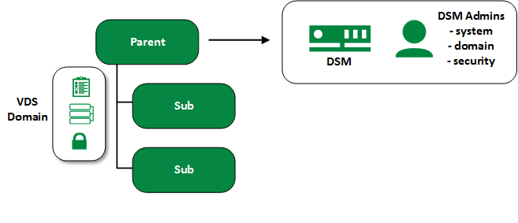

##### Account Hierarchy Multiple VDS Domains
Implement decentralized management with business or product owners of practice areas defining encryption policies, standards and keys. This capability is a great benefit for organizations with product or service lines that have very diverse compliance and encryption needs.

  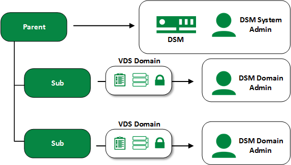

### Host Agent Installation
Lumen Cloud customers should leverage our automated blueprint engine to deploy Host Agents across their account hierarchy. The orchestration software makes it easy for users to deploy solutions, reducing operational support costs, and speed up time to implementation.

* [Deploy Vormetric Host Agent](//www.ctl.io/marketplace/partner/VRSJ/product/Vormetric%20Encryption%20Agent)
* [Video Tutorial](//vimeo.com/136635748)

### Creating Encryption Keys
Encryption keys encrypt and decrypt data. Once encryption is applied, you must keep track of the encryption keys that you are using. Encrypted data is unusable without the proper keys. A key’s attributes and the policies you apply to a host determine if a constant connection is required between the DSM and File System Agent. Hosts with their keys Stored on DSM Server require a constant connection to the DSM. As long as the DSM and host are connected, the policies stay in effect. When the network connection is interrupted, users cannot access encrypted data. Users can resume access after the network connection is re-established. Hosts with the keys Cached on Host are a different matter. The policies stay in effect as long the DSM and host are connected. When the network connection is interrupted, data access is interrupted. However, users can still access encrypted data by requesting a temporary password from a security administrator.

You can create a single data encryption key for each GuardPoint, for each server, for all the servers in your company, or anything in between. Additionally, there can be one key for each of the major environments, for example, your production and non-production environments. Choose an approach that strikes the balance between maximizing security and minimizing the administrative overhead of the periodic key rotations. More keys can create more security at the cost of more complexity and overhead.

Customers are encouraged to view the video tutorial [Creating Encryption Keys](//vimeo.com/136635752).

1. In the DSM Management Console, navigate to **Keys > Agent Keys > Keys**.

    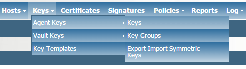

2. Click **Add** to display the Add Agent Key window. Enter a key name, description, and security algorithm. Once complete click **OK**.

    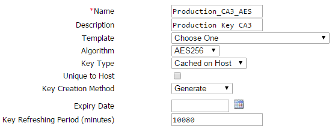

    * **Name:** Name of key. 64 character limit.
    * **Description:** Optional key description. 265 character limit.
    * **Template:** A key template with a set of pre-defined attributes. To create a Microsoft SQL Server TDE agent asymmetric key, choose Default_SQL_Asymmetric_Key_Template and do not change any of the custom attribute values.
    * **Algorithm:** Algorithm used to create the key.
    * **Key Type:** Location for the encryption key. Stored on Server keys are downloaded to non-persistent memory on the host. Each time the key is needed, the host retrieves the key from the DSM. Cached on Host downloads and stores (in an encrypted form) the key in persistent memory on the host. The cached keys are used when there is no network connection between the host and DSM. All hosts using the same encryption key can access encrypted data on other hosts that use the same key. The Unique to Host checkbox is displayed when Cached on Host is selected.
    * **Unique to Host:** When enabled with Cached on Host, makes the encryption key unique. The key is downloaded to the host, encrypted using the host password, and stored. These keys are used for locally attached devices, as files encrypted by them can be read only by one machine. Do not enable this checkbox for cloned systems, RAID configurations, clustered environments, or any environment that uses host mirroring. This requires that Key Creation Method is set to Generate.
    * **Key Creation Method:** Select to generate a key using a random seed (Generate) or by Manual Input.
    * **Expiry Date:** Date the key expires.
    * **Key Refreshing Period (minutes):** Used only with the Oracle Database TDE and Microsoft SQL Server TDE Key Agent. Set the minutes you want the key in the local key cache before it is refreshed.

### Creating Policies and Applying GuardPoints

##### Creating Policies
The DSM Security Administrator creates policies to protect data. Policies employ two mechanisms to do this:

* Data encryption - Specify that data written to a particular directory (called a GuardPoint) is encrypted, and that data will only be decrypted by specified protected host users. Anyone else who tries to access it will only get useless, unencrypted data.
* Access control - Specify which protected host users can access which files and directories in a GuardPoint. Policies can specify which executables and actions can be used, and at what times.

Policies govern file access and encryption in VTE-protected directories called GuardPoints. Policies can enable auditing such that each time a protected host user accesses a GuardPoint, a log message is created with all the details. As seen in the visual below, a VTE policy consists of a set of rules that control how GuardPoint data can be accessed by protected host users and processes. A GuardPoint is the starting point on a particular host (often a file directory) at which to apply a policy. The File System Agent runs on the protected host and retrieves the list of GuardPoints and associated policies from the DSM to which it is registered. The agent intercepts all attempts to access data inside the GuardPoint and applies the rules of the policy.

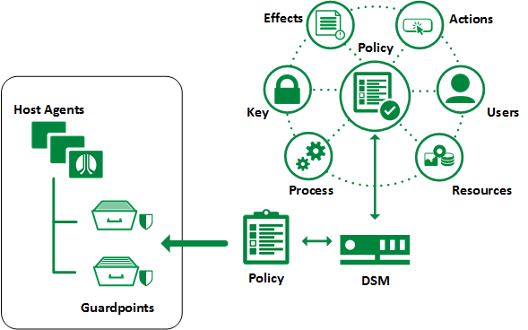

We recommend customers view the Online Tutorials for a walk through of creating example policies as these tutorials provide a more meaningful walkthrough of the process and considerations to be taken.
* [Creating Policies Part 1: Simple Unstructured Encryption Policy](//vimeo.com/136635757)
* [Creating Policies Part 2: Creating Effective Policies with Microsoft SQL Server](//vimeo.com/136635758)

Each Policy rule consists of five **criteria** and an **effect**.

**Criteria**|**Action**
------------|----------
Resource|Specifies which files and/or directories in a GuardPoint are to be protected. Example: /secure_dir/financials. Default is All.
User|Specifies which user(s) or groups can access protected data. Default is All.
Process|Specifies which executables can access protected data. Default is All.
When|Specifies the time range when protected data can be accessed. Default is All.
Action|Specifies the allowed action(s) on the protected data. Example: read, write, remove, rename, make directory. Default is All.

Each time a host user or application attempts to access a GuardPoint file, the access attempt passes through each rule of the policy until it finds a rule where all the criteria are met. When a rule matches, the Effect associated with that rule is enforced. Effect can have the following values:
* Permit or Deny - Specifies whether access to protected data is permitted or denied.
* Apply Key - Specifies that data going in or coming out of a GuardPoint must be encrypted.
* Audit - Specifies that data access attempts be recorded and logged.

---
**Example Microsoft SQL Server Policy**

**Policy**|**Resource**|**User**|**Process**|**Action**|**Effects**
----------|------------|--------|-----------|----------|-----------
**1**|&#42;|&#42;|SQL_Server_Set|&#42;|Permit<br>Apply Key
**2**|&#42;|Admin_Set|&#42;|Read|Permit<br>Audit
**3** |&#42;|&#42;|&#42;|&#42;|Deny<br>Audit

Policy Summary:

1. Only the SQL server process using the verified sqlservr.exe process has full read/write and automatic encrypt/decrypt access to the protected SQL database objects.

2. Privileged Administrator accounts are allowed to manage the protected data without seeing the sensitive contents.

3. All other SQL data requests are denied and audited.

---
**Example Unstructured Data Policy**

**Policy**|**Resource**|**User**|**Process**|**Action**|**Effects**
----------|------------|--------|-----------|----------|-----------
**1**|&#42;|Trust_Set|&#42;|&#42;|Permit<br>Apply Key
**2**|&#42;|&#42;|Backup_Set|Read/Write|Permit
**3** |&#42;|&#42;|&#42;|&#42;|Deny<br>Audit

Policy Summary:

1. Only authorized Users/Groups have full read/write and automatic encrypt/decrypt access to the protected data.

2. The Backup software (agent based) can read and write data files.

3. All other data requests to the protected data are denied and audited.

---
##### Creating GuardPoints
When your policy is applied to a directory, that directory is called a GuardPoint. Once the policy is applied and, if necessary, tuned, the data is protected. This section describes how to create GuardPoints.

**Note: If the directory on which you want to apply a GuardPoint already contains data, you must first encrypt that data.** See [Encrypting Existing Data](#Encrypting-Existing-Data).

  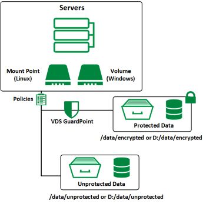

1. Log on to the Management Console as an administrator of type All, or as a Security Administrator with Key and Policy roles. Switch to the domain containing the host you want to protect.

2. In the Management Console, click **Hosts > Hosts**. The Hosts window opens.

3. Click the protected host name in blue where you will create the GuardPoints. The Edit Host screen opens.

    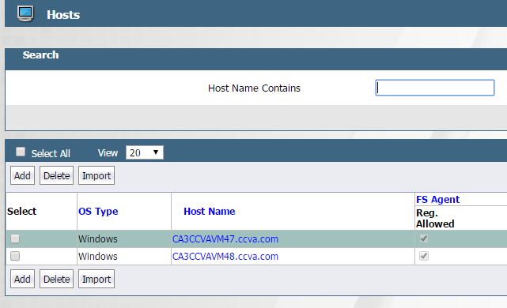

4. Click the Guard FS (File System) tab. The host’s GuardPoints, if any, are displayed. Click **Guard** to create a new GuardPoint.

    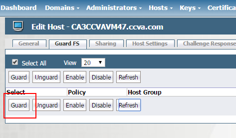

5. The Guard File System panel opens.

6. Choose the Policy, Directory, and Path for this GuardPoint.
  * For Policy, choose the policy name you want to apply to the directory.
  * For Type, use Directory (Auto Guard) for directories.
  * For Path, enter the GuardPoint directory. Optionally, click Browse to browse and highlight the GuardPoint directory. Browse will not work if the host was registered with One-way Communication.

    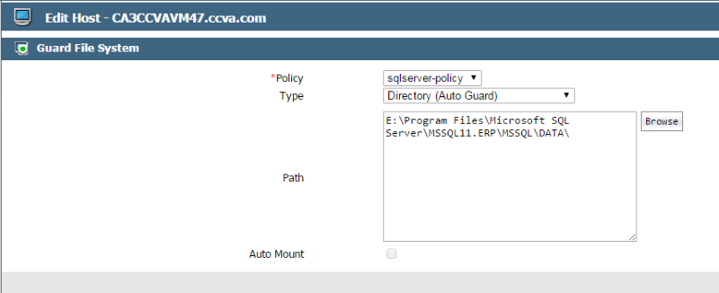

7. Click **OK** to apply the policy to the GuardPoint. The Edit Host panel opens with the new GuardPoint. Repeat this process for each folder you want to protect. A red status indicator means that the policy hasn't taken effect. It may take a minute for the policy to take effect. When it does, the Status will turn green and the policy is now activated.

    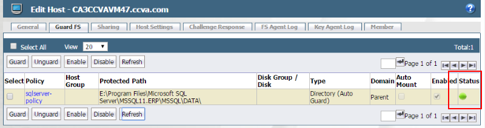

### Encrypting Existing Data
VTE provides three encryption methods to encrypt existing data: Copy, Restore, and dataxform methods. Customers should carefully review the Vormetric documentation in choosing the proper method for their production deployment. For illustration purposes, we will use the dataxform method which encrypts data in place using the built in 'dataxform' tool.  The data sets will be Microsoft SQL Server databases.  We recommend customers review the [Encrypting Data Online Tutorial](//vimeo.com/136635755) beginning at 12:55 for a guided tutorial using the dataxform process below.

**Tip: Windows 64-bit Servers the dataxform tool is located in C:\Program Files\Vormetric\DataSecurityExpert\agent\vmd\bin**

1. [Create a dataxform policy for the GuardPoint on this directory](//vimeo.com/136635755).

2. Use the dataxform tool to estimate the time required for encryption. Make sure to disable all read/write access to the GuardPoint you wish to estimate a time to encrypt.

    ```
    dataxform --deep_scan --print_stat --gp <path>
    ```

    ```
    Estimated data transformation time for E:\Program Files\Microsoft SQL Server\MSSQL11.ERP\MSSQL\DATA is 0h 0m 6s
    -- This is an estimated time using simulated data transformations on test files
    -- The actual transformation time may be more or less than this estimate
    The data transform operation took 0 hours, 0 minutes and 4 seconds
    The data transform program ran from Mon Aug 31 05:29:09 2015 until Mon Aug 31 05:29:13 2015
    ```

3. [Run dataxform on the directory and cleanup process](//vimeo.com/136635755). After completion, the data in the GuardPoint is encrypted.

    ```
    dataxform --rekey --gp "E:\Program Files\Microsoft SQL Server\MSSQL11.ERP\MSSQL\DATA"
    ```

    ```
    Checking if E:\Program Files\Microsoft SQL Server\MSSQL11.ERP\MSSQL\DATA is a guard point with a rekey policy applied
    E:\Program Files\Microsoft SQL Server\MSSQL11.ERP\MSSQL\DATA is a guard point with a rekey policy applied
    About to perform the requested data transform operation
    -- Be sure to back up your data
    -- Please do not attempt to terminate the application
    If Shadow Copy was used on your system, you must back up your data before attempting to run dataxform. Once DataXform has been completed, you may restart Shadow Copy.  Note, however, that all  Shadow Copy backups made prior to running dataxform will be unusable and should be discarded.
    Attempting to restore your cleartext Shadow Copy backups made prior to running dataxform into your encrypted data will result in data corruption.
    ```

    ```
    Do you wish to continue (y/n)?Y
    ```

    ```
    Scan found 8 files (30 MB) in 1 directories for guard point E:\Program Files\Microsoft SQL Server\MSSQL11.ERP\MSSQL\DATA
    Transformed 8 files (30 MB) of 8 files (30 MB) for guard point E:\Program Files\Microsoft SQL Server\MSSQL11.ERP\MSSQL\DATA
    The data transform operation took 0 hours, 0 minutes and 1 seconds
    The data transform program ran from Mon Aug 31 05:51:52 2015 until Mon Aug 31 05:51:53 2015
    Data transform for guard point E:\Program Files\Microsoft SQL Server\MSSQL11.ERP\MSSQL\DATA finished
    ```

    ```
    dataxform --cleanup --gp "E:\Program Files\Microsoft SQL Server\MSSQL11.ERP\MSSQL\DATA"
    ```

    ```
    About to remove the data transformation status files
    Do you wish to continue (y/n)?y
    Removal of data transformation status files completed
    ```

4. Remove the dataxform policy on the GuardPoint and replace it with a production policy.

5. Open access to the directory.

### High Availability
Clusters are a staple of any HA environment. DSM appliances are configured as primary appliances by default. This is not an issue in a standalone environment. However, in a clustered DSM environment, there can be only one primary DSM at a time. Additional DSMs added to that environment must be configured as failover appliances and receive their configuration from the primary. To make changes to the configuration, a Vormetric System Administrator connects to the primary server and edits the configuration. The changes are then replicated to the failover servers.

Replication occurs from the primary to the failover server(s) only. It consists of the latest configuration database running on the primary server. The configuration database contains all the policies, host configurations, and keys that are used in the VDS Management Console. Log files are not a part of the information replicated.

Lumen Cloud customers can implement DSM high availability in various approaches to meet business requirements.

In a single site topology, DSM high availability is provided by two (2) virtual appliances in the same physical location. Host Agents maintain access to their encryption services in the event of the primary DSM appliance having an interruption.

  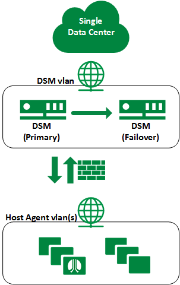

In multisite topologies, DSM high availability spans physical locations and leverage our [Cross Data Center Firewall Services](../Network/CenturyLink Cloud/creating-cross-data-center-firewall-policies.md). This allows DR Host Agents to maintain access to their encryption services even in the event of a total data center interruption.

  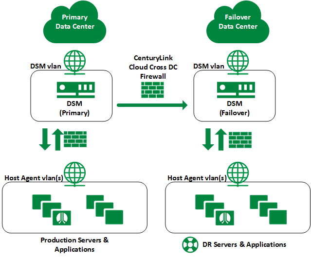

The following table provides a list of required TCP network ports for the operation DSM failover:

**Source**|**Destination**|**Type**|**Port**
----------|---------------|--------|--------
DSM (Primary)|DSM (Failover)|Bidirectional|UDP/7025<br>TCP/8080<br>TCP/8445<br>TCP/8448<br>TCP/50000
DSM (Primary)|DSM (Failover)|One Way|TCP/50000

##### Steps to Implement High Availability

1. Follow Steps 1-6 in the [Data Security Manager Configuration](#Data-Security-Manager-Configuration) section of this KB.

2. Validate DNS resolution between DSM's and all Host Agents to the failover DSM.

3. Log into the **Primary** Management Console as an administrator of type System Administrator or All.

4. Select **High Availability** from the menu bar.

    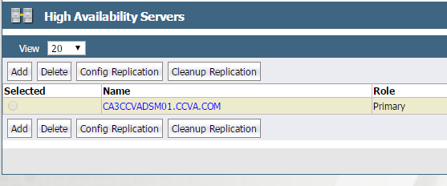

5. Click **Add**. Enter the Server Name for the new failover DSM and click **OK**. The failover server is shown below the primary and the Role column entry will read Failover. The Registered and Configured checkboxes are unchecked.

6. Connect securely to our **failover DSM** via [IPSEC](../Network/CenturyLink Cloud/creating-a-self-service-ipsec-site-to-site-vpn-tunnel.md) or [Client VPN](../Network/CenturyLink Cloud/how-to-configure-client-vpn.md) and use SSH to login as **cliadmin**.

7. Enter the following commands:

    ```
    login as: cliadmin
    cliadmin@10.135.34.14's password:
    Last login: Fri Aug 28 10:05:41 2015 from 10.100.96.231
    ```

    ```
    vormetric$ ha
    ha$ convert2failover
    WARNING: We will now convert this server to failover server.
    Please make sure the primary server is running and has this server on its failover server list.
    This may take several minutes. After HA setup please make sure all the cluster server nodes are in the same suiteb mode.
    Continue? (yes|no)[no]:yes
    ```

    ```
    Primary Security Server host name:CA3CCVADSM01.CCVA.COM
    Primary Security Server system administrator name:admin
    Primary Security Server system administrator password: XXXXXXXXXXX
    This computer may have multiple IP addresses. All the agents will have to connect to Security Server using same IP.
    Enter the host name of this computer. This will be used by Agents to talk to this Security Server.
    This Security Server host name[VA1CCVADSM01.CCVA.COM]:
    Please enter the following information for key and certificate generation.
    What is the name of your organizational unit? []:Lumen Cloud
    What is the name of your organization? []:Lumen
    What is the name of your City or Locality? []:Bellevue
    What is the name of your State or Province? []:WA
    What is your two-letter country code? [US]:US
    ```

    ```
    WARNING: The following information you entered will be used to convert this server to failover server, please make sure the information is correct

    Primary Security Server host name:CA3CCVADSM01.CCVA.COM
    Primary Security Server system administrator name:admin
    Primary Security Server system administrator password:xxxxxxxx

    This Security Server host name[VA1CCVADSM01.CCVA.COM]:
    The name of your organizational unit:Lumen Cloud
    The name of your organization:Lumen
    The name of your City or Locality:Bellevue
    The name of your State or Province:WA
    Your two-letter country code[US]:US

    Continue? (yes|no)[no]:yes
    ```

    ```
    Primary_Server=CA3CCVADSM01.CCVA.COM CAs_Fingerprint=B7:7A:43:45:B0:59:AD:3B:E5:A5:A6:6A:7D:05:BC:7D:B0:FE:83:4E
    Ensure the fingerprint listed above matches the one on the primary
    Security Server web console dashboard.
    SUCCESS: convert server to failover server. The server is started. Please verify
    the fingerprint
    ha$
    ```

8. Compare the CA Fingerprint value you see on the screen with the value displayed in the Dashboard window of the primary server. They should match.

9. Log on to the **Primary** DSM Management Console as an administrator of type System Administrator or All.

10. Select **High Availability** from the menu bar. The failover DSMs will now have the Registered checkbox enabled, indicating that the failover and primary DSM servers have mutually authenticated.

11. Click the radio button in the Selected column for the failover server.

12. Click **Config Replication**. It will take several minutes to completely replicate the primary DSM configuration to the new failover. Once replication completes, the checkbox should have an entry indicating successful replication of the configuration.

    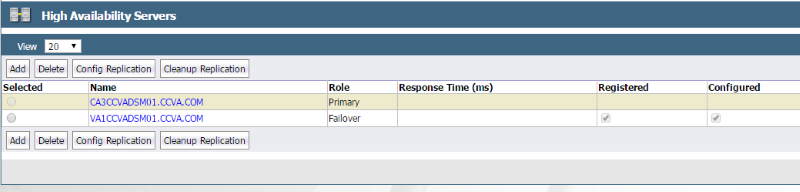

### DSM Automatic Backup
Set up the Automatic Backup feature to protect the configuration settings as well the encryption keys and policies. To do this, you must access a File Server (a UNIX or Windows host) that is [network accessible](../Network/CenturyLink Cloud/connecting-data-center-networks-through-firewall-policies.md) by the DSM to store the backup files. Automatic DSM database backup is configured in the Automatic Backup window.

1. Open the Automatic Backup window in the Management Console by selecting **System > Backup and Restore > Automatic Backup**.

    

2. Fill in the settings for Automatic Backup Schedule and the External File Server where the backup files will be stored.  **Tip: Use the FQDN for the Network Host.**

    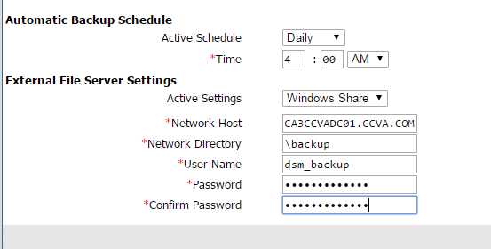

3. Click **Backup Now**.

4. After a successful backup, look in the specified Target Directory on the Target Host to see the backup files.

    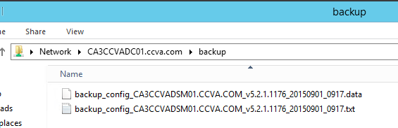

### Server Backup and Recovery
Lumen Cloud customers, depending on their technical requirements, implement various backup and recovery solutions. Both the backup and restoration of encrypted data sets are handled differently depending on the solution in place.

**Backup Method**|**Approach**
-----------------|------------
[Simple Backup Service](//www.ctl.io/simple-backup-service)|The Simple Backup Service leverages a client agent to backup and restore data to the server. As part of policy creation a security rule must be put in place that **permits** the backup agent executable **read/write** to the GuardPoint. Agent based backups are the only situation in which a security rule should permit read/write to a GuardPoint. It's important to note that should you restore data using the agent to a location outside of the GuardPoint policy configuration, changes will be required in order to permit access to this new location and apply the encryption key. An example policy that includes a security rule for a backup agent can be seen below.
[Managed Backup](//www.ctl.io/managed-services/backup)|Managed Backup services leverage client agents similar to Simple Backup Services. As such, the rules and approach would mirror the process already detailed.
[Snapshots](../Servers/creating-and-managing-server-snapshots.md)|While a snapshot is not technically a backup, it does facilitate the restoration of an entire virtual server to a previous state. Using this service with encrypted data sets should be transparent during a snapshot or revert snapshot action as the entire virtual server is impacted. Host agents will communicate with the Vormetric DSM and receive the same policy with key access even if you revert a snapshot to a previous state.

**Example Unstructured Data Policy**

**Policy**|**Resource**|**User**|**Process**|**Action**|**Effects**
----------|------------|--------|-----------|----------|-----------
**1**|&#42;|Trust_Set|&#42;|&#42;|Permit<br>Apply Key
**2**|&#42;|&#42;|Backup_Set|Read/Write|Permit
**3** |&#42;|&#42;|&#42;|&#42;|Deny<br>Audit

Policy Summary:

1. Only authorized Users/Groups have full read/write and automatic encrypt/decrypt access to the protected data.

2. The Backup software (agent based) can read and write data files.  For example, for a Windows 2012 R2 using Simple Backup Services, the agent executable is:
  * C:\Program Files\SimpleBackupService\srvany.exe

3. All other data requests to the protected data are denied and audited.
