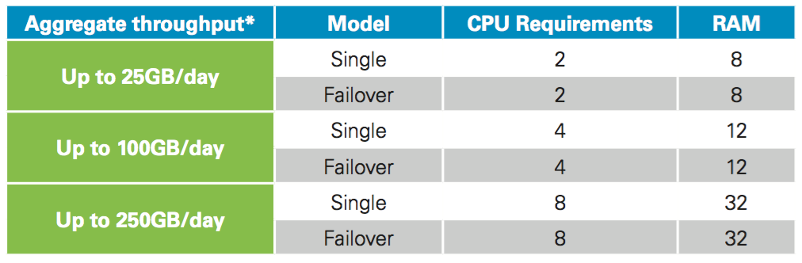

{{{
"title": "MSSP - Pre-install Guide for Security Log Monitoring",
"date": "05-23-2017",
"author": "",
"attachments": [],
"related-products" : [],
"contentIsHTML": false,
"sticky": false
}}}

This guide provides an overview of the activities required of customers during the pre-installation and installation process for the CenturyLink Security Log Monitoring (SLM) Service. This service requires the installation of a log collection platform (LCP/”FALCON” device) inside the customer premise or data center environment. CenturyLink supplies a software-based log collection probe to collect premise-based system logs, which are automatically and securely transmitted to the CenturyLink® Managed Security Service SIEM Platform. Hardware (i.e., the server) needed to run the log collection platform is not included. (Additional technical details and requirements are defined in the CenturyLink Service Guide (“SG”) for Security Log Monitoring, which is supplied to customers post-sale.)

The following describes the steps customers need to take to help ensure successful implementation of the Security Log Monitoring service.

1. Customer works with CenturyLink Sales Engineer to complete onboarding questionnaire.

    **Pre-install information needed from customer:**

    * Contact details for customer point of contact for service deployment and configuration
    * Types of customer appliances that will utilize this service
      * Need appliances, vendors, etc. (Ex. Juniper SRX Firewall, Cisco ASA. Include all Microsoft and Linux servers, next-generation firewalls, WAFs, IDS/IPS, databases, applications, etc.)
    * Approximate quantity of each device type listed above and inventory of DNS, AD/LDAP, Email & Web servers
    * Compliance standards customer is held to, if any (ex. PCI, HIPAA, FISMA) and any compliance reporting requirements

    **Additional information needed from customer at time of install:**

    * Contact details for customer personnel requiring portal access (name, email address)
    * Incident escalation procedures, if any
    * Location for where the probe(s) will be installed on customer’s network
    * Does customer plan on using static or dynamically assigned IP’s?
    * If static, provide IPv4 address being used, as well as gateway address
    * If device will also use an IPv6 address, provide IPv6 address being used, gateway address, and pre x length (0-128)
    * Hostnames & IP Addresses of DNS servers probe will use (if not assigned by DHCP)

2. Customer provides necessary hardware for the log collection platform.

    Log Collection Platform (LCP) - Hardware Requirements

    

3. Customer provides necessary network connectivity for the log collection platform.

    Log Collection Platform (LCP) - Network Connectivity Requirements

    

4. Customer works with CenturyLink Implementation to customize the log collection platform.

    Customers are required to provide credentials and IP details to CenturyLink in order to customize the log collection platform for customer network (IP settings, listening services, db connection settings). CenturyLink then performs the customization of the log collection platform device(s).

5. Customer configures their internal devices (log forwarding & firewall rules).

    Customers are required to configure the technology transmitting or being connected to collect logs. This includes firewall configuration to allow log collection platform to receive log data. Customer firewall rule requirements include:

    * CenturyLink MSSP appliance listens for logs on TCP/UDP 514, TCP 601 and TCP 6514 depending on the type of syslog being sent. Any firewalls between the source devices and the appliance should be opened for those ports.
    * TCP 6514, TCP 6515, and TCP 443 need to be opened for the appliance to communicate with the MSSP portal (mss.centurylink.com/174.140.132.59), but only the appliance initiates the connection.
    * UDP 53 needs to be opened from the appliance to the DNS servers speci ed in the appliance setup wizard.
