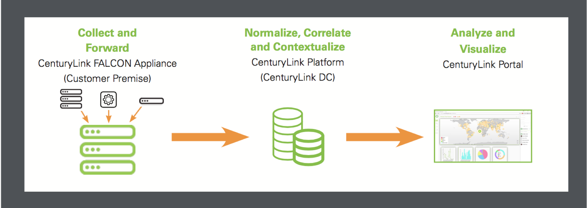

{{{
"title": "MSSP - Security Log Monitoring with Trending and Threat Analysis",
"date": "05-23-2017",
"author": "",
"attachments": [],
"related-products" : [],
"contentIsHTML": false,
"sticky": false
}}}

Security Log Monitoring with Trending and Threat Analysis collects and tracks incidents in near real-time, categorizing them by severity and sending them to an expert team of CenturyLink Service Organization Control (SOC) analysts for review. Our security experts then cull the data and prioritize events into the top incidents that require greater analysis or immediate action.

CenturyLink’s advanced platform takes an industry best-practice approach to automation that weeds out a greater number of false positives than standard systems. It does this by combining log data from the risk profiles of each customer asset with near real-time threat intelligence data from CenturyLink’s global corporate network and partner threat intelligence feeds.

### How It Works

1. CenturyLink-built FALCON log collection and forwarding appliance is installed in your environment and receives logs from your devices and applications, including existing log management systems, SIEMs, and on-premise, hosted and/or cloud devices. Supports all syslog standards.

2. A secure connection from the FALCON appliance terminates into CenturyLink’s platform where your data is normalized, correlated and enriched with threat intelligence, risk profiles and trending information, and indexed for accessing, viewing, manipulating, searching and reporting.

3. The CenturyLink Managed Security Service Portal is the single pane of glass that allows you to visualize correlated events and the severity and priority of incidents in near real-time, leveraging role-based access to give analysts, executives, incident responders, admins and auditors the right level of access, information, and tools needed to do their jobs. CenturyLink SOC analysts use the portal to continuously monitor your environment and notify you of alerts requiring attention.
