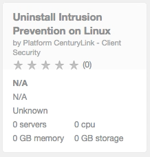
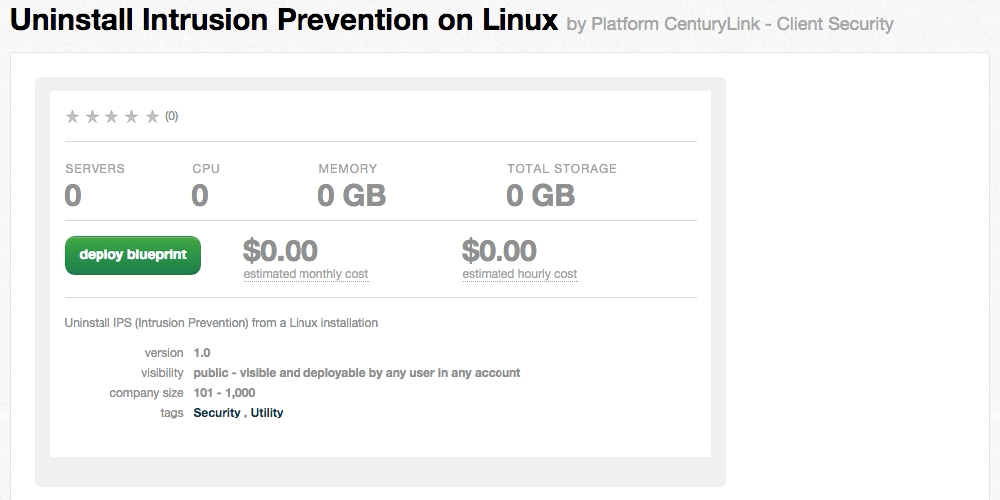
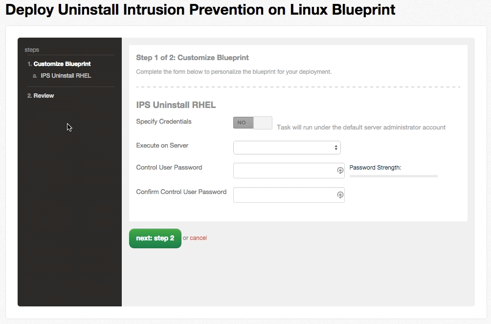
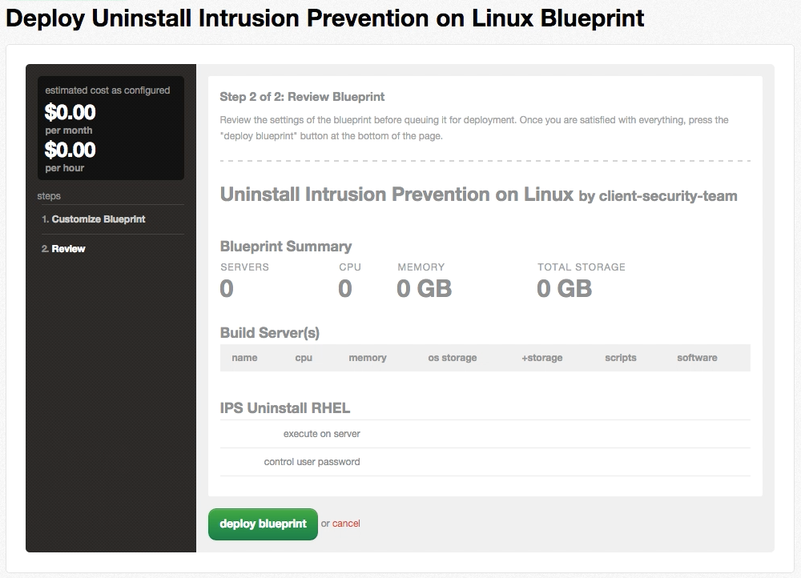
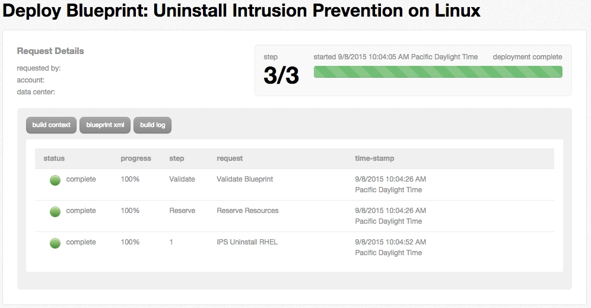

{{{
  "title": "Removing Intrusion Prevention System (IPS)",
  "date": "09-24-2015",
  "author": "Stephanie Wong",
  "attachments": [],
  "contentIsHTML": false,
  "sticky": false
}}}

### Overview

The Platform CenturyLink IPS utilizes an Agent installed on your Virtual Machine (VM) that monitors the VM for suspicious activity. If suspicious activity is found, the Agent logs the activity, which it may block or stop, and reports the incident based on the IPS policy. There is a default policy associated with each VM that is automatically tuned based on the host operating system and installed applications.

This Blueprint is for the removal and deactivation of the IPS service on the VM.

### Prerequisites
* A CenturyLink Cloud Account
* IPS currently running on the VM

### Uninstallation Process

1. Go into the **Blueprints Library**.

  

2. Search for **Uninstall Intrusion Prevention** in the Refine Results section. Then, click **Uninstall Intrusion Prevention on Linux**.

  

3. Click the **deploy blueprint** button.  

  

4. From the **Execute on Server** drop down list, select the appropriate virtual machine.  Enter and confirm the User Password. Click the **next: step 2** button.  

  

5. Review the Blueprint parameters and click **deploy blueprint**.  

  

  **Note:** The Blueprint displays each step taken and its status during provisioning.  

  

6. An email notification is sent to the initiator of the blueprint for both queuing and completion.

### Agent Billing & Deactivation

Once the IPS Agent is uninstalled via this blueprint, the hourly charge will cease.

**Note:** If a VM is to be decommissioned, the agent MUST be deactivated via this blueprint to avoid on-going charges.

### Support

If you need assistance, please send initial contact to [help@ctl.io](mailto:help@ctl.io). You will receive an automated reply with step-by-step instructions on setting up a Zendesk user account. The Zendesk account will allow for future engagements with customer service.

**Note:** If you do not setup a Zendesk user account, support requests may get filtered as spam in the ticketing system.

### Frequently Asked Questions

**How to know that IPS is deactivated and off of my VM?**

Please contact us at [help@ctl.io](mailto:help@ctl.io). We will be able to ensure that IPS is turned off in our system and the agent is removed from your VM.
