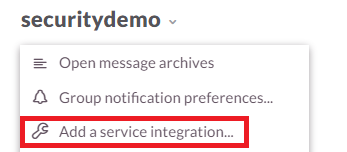
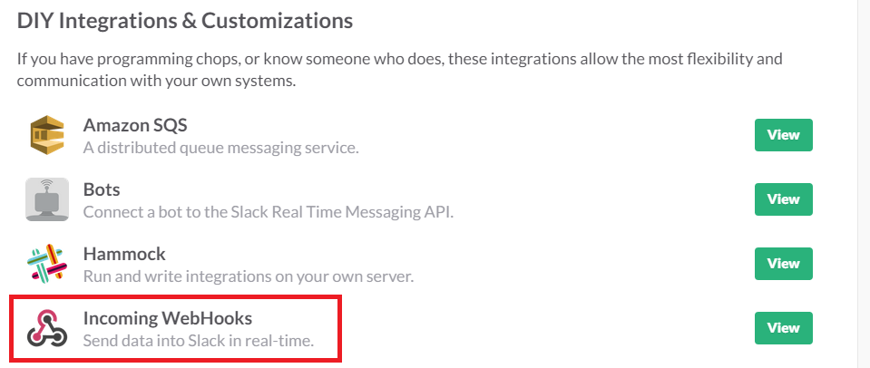
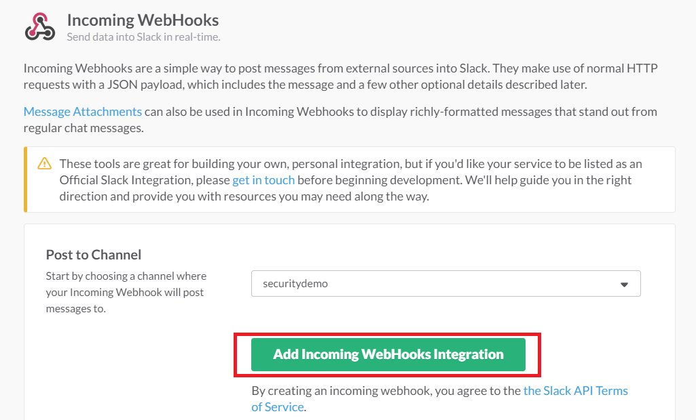
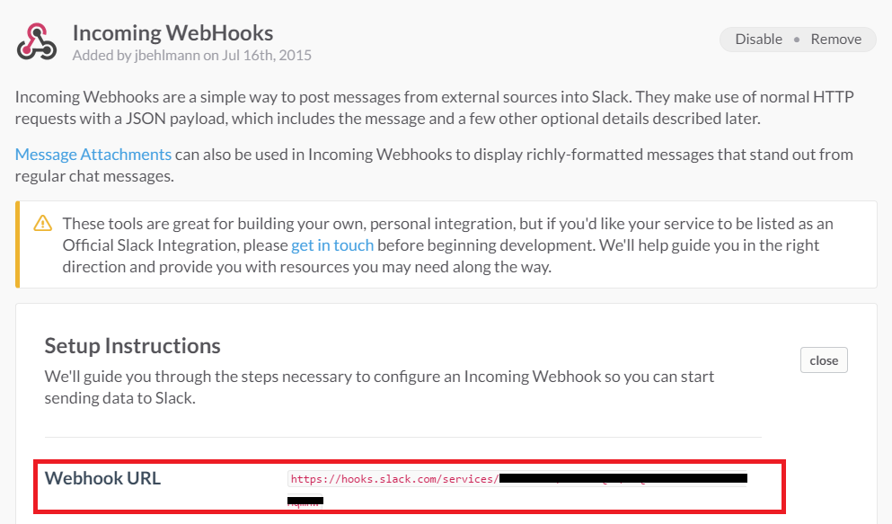
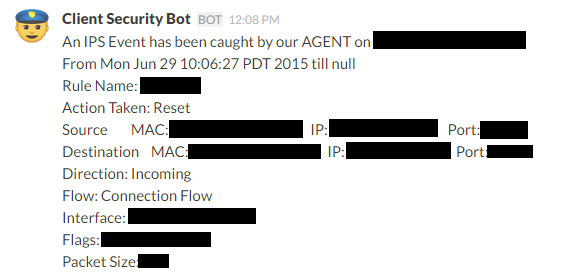

{{{
  "title": "Utilizing SLACK for IPS Event Notifications",
  "date": "08-11-2015",
  "author": "Stephanie Wong",
  "attachments": [],
  "related-products" : [],
  "contentIsHTML": false,
  "sticky": false
}}}

### Overview

Slack is a team collaboration tool that offers persistent chat rooms organized by topic and also has private groups and direct messaging capabilities. Slack is available as long as you want and can be utilized with an unlimited number of people.

Our Intrusion Prevention System (IPS) provides real-time event notifications that can be integrated with Slack messaging. Using the Slack integration for “Incoming WebHooks”, our IPS can be set up to send event details on the rule triggered, source and destination information to a Slack channel so it can be quickly reviewed by your team or archived for review at a later time.

### Signing Up for Slack

Utilize the link below to sign up and get started with Slack!

[https://slack.zendesk.com/hc/en-us/articles/206480347-Getting-started-with-Slack](https://slack.zendesk.com/hc/en-us/articles/206480347-Getting-started-with-Slack)

### Creating a Slack Channel

Utilize the link below to set up a specific Slack channel to receive IPS Event Notifications.

[https://slack.zendesk.com/hc/en-us/articles/201402297-Creating-a-channel](https://slack.zendesk.com/hc/en-us/articles/201402297-Creating-a-channel)

### Creating Webhook URL

Setting up a WebHook will allow the IPS Event Notifications to be posted directly into your chosen Slack channel.

1. Once your IPS Event Notifications Slack channel has been designated, you will need to click on the channel name drop-down and select **Add a service Integration…**.  

  

2. Scroll to the bottom of the Integrations page and select **Incoming WebHooks**.  

  

3. Now select the desired Slack Channel from the drop-down and click **Add Incoming WebHooks Integration**.  

  

4. The system will generate a **Webhook URL**. Please copy and store this in a secure location. You will need this URL when setting up the Event Notifications.
  (See *Next Steps*: **Configuring CLC IPS Notifications**)  

  

5. Once completed, scroll down to the bottom of the page and select **Save Settings**.  

  

### Next Steps

See the "Configuring CLC IPS Notifications" KB

### Incoming Webhooks Support

The below link provides an overview of WebHook options with Slack.

[https://api.slack.com/incoming-webhooks](https://api.slack.com/incoming-webhooks)

### Example Slack Notification

Below is an example Slack Event Notification providing the pertinent details for an event that is triggered on a VM protected by IPS.  

  

### Slack’s Service Terms

Slack offers free and paid versions. Utilize the below link to review Slack’s Terms & Conditions.
[https://slack.com/pricing](https://slack.com/pricing)

### Frequently Asked Questions

**Is Slack the only WebHook I can utilize?**

Slack is currently the only WebHook we’ve tested and integrated with. If you would like to recommend another, please send request details to [features@ctl.io](mailto:features@ctl.io)

**Do you provide long term storage of events and notifications?**

We retain 13 weeks worth of events and notifications. We are investigating additional features, such as an automated database for longer retention times. If you would be interested in a feature for longer retention, please send request details to [features@ctl.io](mailto:features@ctl.io)
