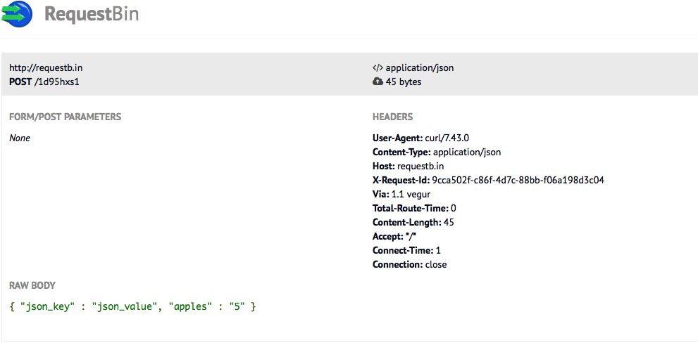
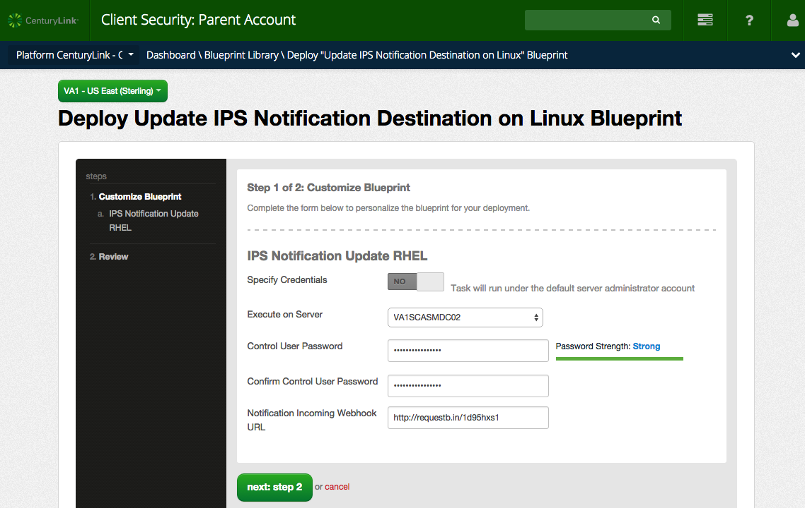
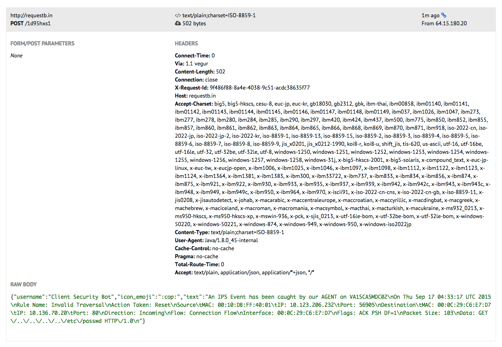

{{{
  "title": "Verify CenturyLink Cloud IPS Install",
  "date": "09-15-2015",
  "author": "Matthew Close",
  "attachments": [],
  "related-products" : [],
  "contentIsHTML": false,
  "sticky": false
}}}
#### Overview

Deploying IPS is an important part of a every security policy. However, understanding if the IPS is really functioning as expected is difficult. An IPS is often deployed deep within the network, possibly behind firewalls, making alerts infrequent. Or perhaps IPS is being installed for the first time in a new environment. In either case, it's essential to verify that your IPS is properly configured and will notify you an event has occurred. This document will cover the necessary steps to test your IPS and notification setup.

#### Requirements

+ A CenturyLink Cloud host running the IPS service. To get started with IPS, please follow the instructions in [Getting Started with Intrusion Prevention System (IPS)](../Security/getting-started-with-ips.md)
+ curl
+ nc/netcat

#### Getting Started

1. **Create a RequestBin.** For this example, we will use a free service to inspect HTTP requests from [requestb.in](http://requestb.in). RequestBins are short lived and should not be used for production data. To begin, visit [requestb.in](http://requestb.in) and click "Create a RequestBin." Now we'll send a simple JSON POST to our endpoint to make sure it's working. You should use the [requestb.in](http://requestb.in) URL that was randomly generated for you in the curl request below.

    ```
    $ curl -X POST -H 'Content-Type: application/json' http://requestb.in/1d95hxs1 -d '{ "json_key" : "json_value", "apples" : "5" }'
    ```

1. Reload the RequestBin page and you should see the JSON content that you posted in the previous step.

  

#### Instructions for your IPS test

For this test you will need two hosts, one with IPS and a webserver installed and another with netcat installed. Most distros don't include netcat by default so you will need to install it.

1. **IPS install.** IPS should already by installed on your host, if this is not the case please install IPS. For detailed instructions on installing CenturyLink Cloud IPS, please refer to [Getting Started with Intrusion Prevention System (IPS)](../Security/getting-started-with-ips.md).

1. **Configure IPS notification.** You should enable IPS notifications on your host using the RequestBin URL that was generated in the previous section. For detailed instructions on setting up IPS notifications with Blueprints please refer to [Configuring Intrusion Prevention System (IPS) Notifications](../Security/configuring-ips-notifications.md). For example, I used `http://requestb.in/1d95hxs1` as the Notification Incoming Webhook URL.

    

1. **Install a service to test IPS.** In order to test an IPS rule you need a service that is listening for connections. Typically, rules cannot be triggered without a listening service (HTTP, FTP, SMTP, IMAP, etc). In this example, we are testing against a webserver listening on port 80. You can install any webserver. I have chosen to use NGINX in this example.

1. **Use netcat with a valid request.** We will first test then "attack" our web server from a different host. Let's start with a normal connection. In this example 10.136.70.20 is my webserver and I'm running netcat from another host on the local network.

    ```
    $ nc 10.136.70.20 80
    GET / HTTP/1.1
    ```

    You should type `GET / HTTP/1.1` followed by two newlines. The web server should respond with something similar to what is below.

    ```
    HTTP/1.1 400 Bad Request
    Server: nginx/1.0.15
    Date: Thu, 27 Aug 2015 03:37:18 GMT
    Content-Type: text/html
    Content-Length: 173
    Connection: close

    <html>
    <head><title>400 Bad Request</title></head>
    <body bgcolor="white">
    <center><h1>400 Bad Request</h1></center>
    <hr><center>nginx/1.0.15</center>
    </body>
    </html>
    ```

    With most webservers, you'll end up getting an error because you didn't include a `Host:` header. However, this doesn't really matter for our purposes. All we really want is some response from the web server.

1. **Use netcat to trigger an event.** Now we will trigger an event using netcat.

    ```
    $ nc 10.136.70.20 80
    GET /../../../../etc/passwd HTTP/1.1
    $
    ```

    This time after running netcat you should enter `GET /../../../../etc/passwd HTTP/1.1` followed by a newline.  You'll notice this time that you can't even enter the second newline that is required by HTTP to process your request. The connection has already been dropped by the IPS on the webserver. Because this looked like a [directory traversal attack](https://en.wikipedia.org/wiki/Directory_traversal_attack), the IPS disconnected you and your `GET` never made it to the web service.

1. **Verify you got a notification.** Now if you switch back to your web browser and reload your RequestBin page, you should be able to see an IPS event. If you don't see your event, wait two minutes. This is the maximum time it should take to process your event and send to your webhook.

  

#### Conclusion

At this point, you should have gotten positive feedback that your IPS is running and notifications are working. You might be tempted to try other attacks on your web server. However, do not expect every attack to generate an event. Just because you send a packet with a known attack doesn't always mean an event will be triggered. A number of conditions need to be met for this to work. As I already mentioned, a service has to be listening for an attack to even be possible in most cases. Any intervening firewalls between your attacking host and the target need to allow the traffic. Finally, your attack must match a signature that has been applied to your host.
