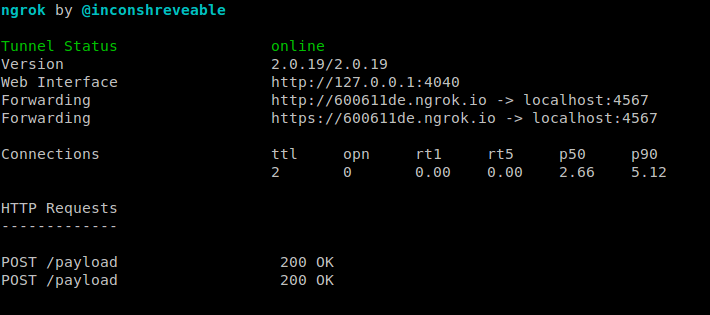
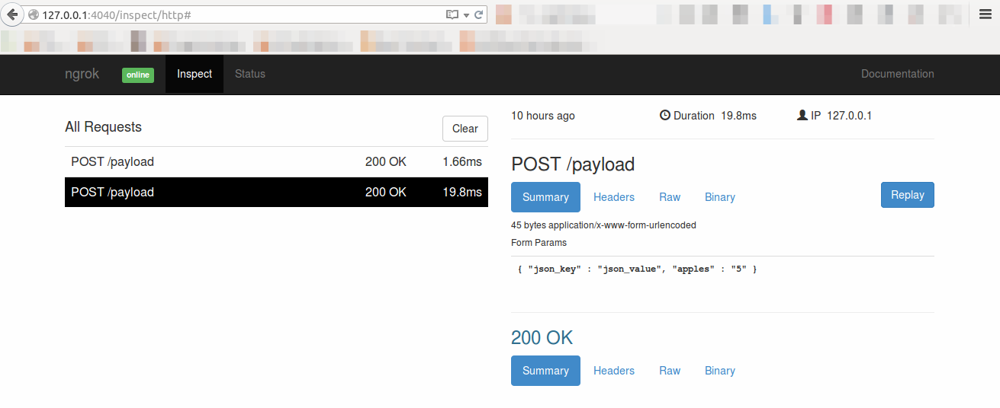
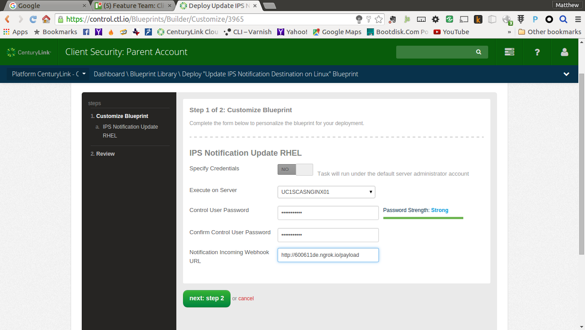

{{{
  "title": "Verify IPS Install from the Command Line",
  "date": "09-15-2015",
  "author": "Matthew Close",
  "attachments": [],
  "related-products" : [],
  "contentIsHTML": false,
  "sticky": false
}}}

### Verify IPS Install from the Command Line

#### Overview

This tutorial will show how to trigger a CenturyLink Cloud IPS rule and view the notification using webhooks.

#### Requirements

+ A CenturyLink Cloud host running the IPS service. To get started with IPS, please follow the instructions in [Getting Started with Intrusion Prevention System (IPS)](../Security/getting-started-with-ips.md)
+ ruby
+ sinatra
+ ngrok
+ curl

**Note:** It is possible to complete this test without installing ruby, sinatra, and ngrok by using other HTTP request inspectors. For example, you could use [requestb.in](http://requestb.in). If you choose to use another inspector, you can skip to the second section. However, please be sure to use the URL provided by [requestb.in](http://requestb.in) instead of the ngrok URL.

#### Instructions for setting up your webhook listener

Notifications for IPS events are sent via webhooks. You can think of a webhook as a callback via an HTTP POST when an event occurs. For example, when an IPS alerts comes in a POST will be sent to a a URL of your choice.  We'll cover the basic steps to setup up a listener to process these types of POSTs.

1. **Install ruby.** If you don't already have ruby installed, there are many differnet ways to install ruby; however, for this tutorial, you can start with the most basic by consulting, [Installing Ruby](https://www.ruby-lang.org/en/documentation/installation/).

1. **Install Sinatra and Thin webserver.** Sinatra is a great tool for quickly creating web applications in ruby. We'll use sinatra to listen for the incoming POSTs from IPS notifications. You can find more info on sinatra [here](http://www.sinatrarb.com/).

    ```shell
    $ gem install sinatra
    $ gem install thin
    ```

1. **Create a simple listener with Sinatra.** This listener will accept POSTs to our endpoint at /payload and show them on the console output.

    ```ruby
    require 'sinatra'
    require 'json'

    post '/payload' do
      push = JSON.parse(request.body.read)
      puts "JSON: #{push.inspect}"
    end
    ```

    Place the above code in a file called `ips-hook.rb` and run it.

    ```
    $ ruby ips-hook.rb
    == Sinatra (v1.4.6) has taken the stage on 4567 for development with backup from Thin
    Thin web server (v1.6.3 codename Protein Powder)
    Maximum connections set to 1024
    Listening on localhost:4567, CTRL+C to stop
    ```

    Sinatra is now listening on http://localhost:4567/payload for incoming POSTs.

1. **Install and run ngrok.** Ngrok is a simple tool to expose services behind a firewall to external traffic. For example if you have an internal app behind a firewall, you can use ngrok to generate a publicly accessible URL. Even better, it allows you to analyze and replay traffic. Ngrok is a great tool to have in your app development arsenal. To obtain and install ngrok, follow these [instructions](https://ngrok.com/download). Once installed, expose your ruby app for external traffic. Please note that with the free service ngrok endpoint URLs change every time you run the `ngrok` command.

    ```shell
    $ ngrok http 4567
    ```

    

    The screenshot shows that traffic to http://600611de.ngrok.io will be redirected to port 4567 on your simple sinatra app. You will need this temporary URL from ngrok for setting up notifications in a later step.

#### Testing your endpoint to make sure it works.

1. **Test your ngrok endpoint with curl.** We'll now send a simple JSON POST to our endpoint to make sure it's working. You should use the ngrok URL that was randomly generated for you in the HTTP request.

    ```
    $ curl -X POST http://600611de.ngrok.io/payload -d '{ "json_key" : "json_value", "apples" : "5" }'
    ```

1. **Verify output in sinatra.** You should see your JSON POST show up in your ruby app. If you don't, make sure you have the proper ngrok URL and that your app is still running.

    ```
    $ ruby ./ips-hook.rb
    == Sinatra (v1.4.6) has taken the stage on 4567 for development with backup from Thin
    Thin web server (v1.6.3 codename Protein Powder)
    Maximum connections set to 1024
    Listening on localhost:4567, CTRL+C to stop
    JSON: {"json_key"=>"json_value", "apples"=>"5"}
    108.19.42.235 - - [26/Aug/2015:22:23:39 -0500] "POST /payload HTTP/1.1" 200 - 0.0046
    ```

1. **View test POST in ngrok console**. The great thing about ngrok is that it provides a console to view and replay HTTP connections. You should also be able to see your test in the ngrok console by visiting http://127.0.0.1:4040.

    

#### Instructions for your IPS test host.

For this test you will need two hosts, one with IPS and a webserver installed and another with netcat installed.

1. **IPS install.** IPS should already by installed on your host, if this is not the case please install IPS. For detailed instructions on installing CenturyLink Cloud IPS, please refer to [Getting Started with Intrusion Prevention System (IPS)](../Security/getting-started-with-ips.md).

1. **Configure IPS notification.** You should enable IPS notifications on your host using the ngrok URL that was generated in the previous section. To enable notifications you need to deploy a blueprint that will route IPS events to your webhook receiver. For detailed instructions on setting up IPS notifications please refer to [Configuring Intrusion Prevention System (IPS) Notifications](../Security/configuring-ips-notifications.md). In the example below, I used http://600611de.ngrok.io/payload as the Notification Incoming Webhook URL.

    

1. **Install a service to test IPS.** In order to test an IPS rule you need a service that is listening for connections. Typically, rules cannot be triggered without a listening service (HTTP, FTP, SMTP, IMAP, etc). In this example, I have installed nginx on my server that has IPS enabled.

1. **Use netcat with a valid request.** We will first test then "attack" our web server from a different host. Let's start with a normal connection. In this example 10.126.155.23 is my webserver and I'm running netcat from another host on the local network.

    ```
    $ nc 10.126.155.23 80
    GET / HTTP/1.1
    ```

    You should type `GET / HTTP/1.1` followed by two newlines. The web server should respond with something similar to what is below.

    ```
    HTTP/1.1 400 Bad Request
    Server: nginx/1.0.15
    Date: Thu, 27 Aug 2015 03:37:18 GMT
    Content-Type: text/html
    Content-Length: 173
    Connection: close

    <html>
    <head><title>400 Bad Request</title></head>
    <body bgcolor="white">
    <center><h1>400 Bad Request</h1></center>
    <hr><center>nginx/1.0.15</center>
    </body>
    </html>
    ```

    With most webservers, you'll end up getting an error because you didn't include a `Host:` header. However, this doesn't really matter for our purposes. All we really want is some reponse from the web server.

1. **Use netcat to trigger an event.** Now we will trigger an event using netcat.

    ```
    $ nc 10.126.155.23 80
    GET /../../../../etc/passwd HTTP/1.1
    ```

    This time after running netcat you should enter `GET /../../../../etc/passwd HTTP/1.1` followed by a newline.  You'll notice this time that you can't even enter the second newline that is required by HTTP to process your request. The connection has already been dropped by the IPS on the webserver. Because this looked like a [directory traversal attack](https://en.wikipedia.org/wiki/Directory_traversal_attack), the IPS disconnected you and your `GET` never made it to the web service.

#### Verify your sinatra app got a POST

1. Now if you switch back to your sinatra app you should see a new POST to /payload. If you don't see your event, wait two minutes. This is the maximum time it should take to process your event and send to your webhook.

    ```
    JSON: {"username"=>"Client Security Bot", "icon_emoji"=>":cop:", "text"=>"An IPS Event has been caught by our AGENT on VA1SCDVMDC101\nOn Thu Aug 27 03:37:02 UTC 2015\nRule Name: Invalid Traversal\nAction Taken: Reset\nSource\tMAC: 6E:58:E3:7A:D3:1E\tIP: 10.126.155.231\tPort: 48478\nDestination\tMAC: 00:0C:29:F3:6D:AE\tIP: 10.126.155.23\tPort: 80\nDirection: Incoming\nFlow: Connection Flow\nInterface: 00:0C:29:F3:6D:AE\nFlags: ACK PSH DF=1\nPacket Size: 103\nData: GET /../../../../etc/passwd HTTP/1.1\n"}
    64.15.180.20 - - [26/Aug/2015:22:40:05 -0500] "POST /payload HTTP/1.1" 200 - 0.0006
    ```

#### Conclusion

At this point, you should have gotten positive feedback that your IPS is running and notifications are working. You might be tempted to try other attacks on your web server. However, do not expect every attack to generate an event. Just because you send a packet with a known attack doesn't always mean an event will be triggered. A number of conditions need to be met for this to work. As I already mentioned, a service has to be listening for an attack to even be possible in most cases. Any intervening firewalls between your attacking host and the target need to allow the traffic. Finally, your attack must match a signature that has been applied to your host.
